## Countably Infinite $F$?

$$
Pr\Bigg(R[f] - \hat{R}[f] \geq \sqrt{\frac{\log(\frac{1}{\delta(f)})}{2m}}\Bigg) \leq \delta(f)
$$

... where we're free to choose (varying) $\delta(f)$ in $[0,1]$ 
- Union bound "works" (sort of) for this case

$$
Pr\Bigg(\exists f \in F, R[f] - \hat{R}[f] \geq \sqrt{\frac{\log(\frac{1}{\delta(f)})}{2m}}\Bigg) \leq \sum_{f \in F} \delta(f)
$$

- Choose confidences to sum to constant $\delta$, then this works
	- E.g. $\delta(f) = \delta \times p(f) \text{ where } 1 = \sum_{f \in F} p(f)$ 
- By inversion: w.h.p $1 - \delta$, for all $f$, $R[f] \leq \hat{R}[f] + \sqrt{\frac{\log(\frac{1}{p(f)}) + \log(\frac{1}{\delta})}{2m}}$

## Ok Fine, but General Case?
- Much of ML has continuous parameters
	- Countably infinite covers only discrete parameters
- Our argument fails!
	- $p(f)$ becomes a density
	- It's zero for all $f$. No divide by zero!
	- Need a new argument!
 
 ![[divide_zero.png]]
 
- Idea introduced by **VC theory**: intuition
	- Don't focus on whole class $F$ as if each $f$ is different
	- Focus on differences over sample $Z_1, ..., Z_m$ 

### My Explanation
What this means is that if we think of the probabilities of different functions $f$ occurring, $p(f)$, then we can think of it much like a Gaussian distribution. Since the probability of part of a Gaussian curve relies on the area under the curve, since just the probability of one function has 0 width, the probability of a function occurring becomes zero. This doesn't really make sense and is therefore an ill-posed problem.
# Growth Function
_Focusing on the size of model families on data samples_

## Bad Events: Unreasonably Worst Case?
- Bad event $B_i$ for model $f_i$ 

$$
R[f_i] - \hat{R}[f_i] \geq \epsilon \text{ with probability } \leq 2 \exp(-2m\epsilon^2)
$$

- Union bound: bad events don't overlap!?

$$
Pr(B_1 \text{ or } B_{|F|}) \leq Pr(B_1)+... + Pr(B_{|F|}) \leq 2|F|\exp(-2m\epsilon^2)
$$

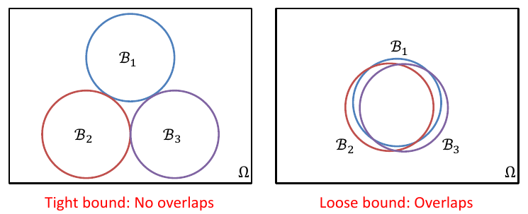

## How Do Overlaps Arise?

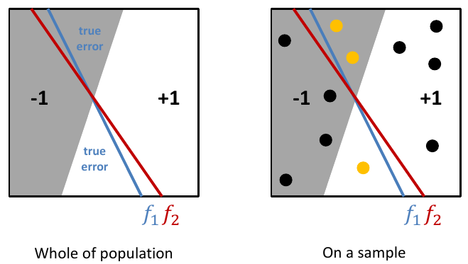

Significantly **overlapping** events $B_1$ and $B_2$ 

VC theory focuses on the pattern of labels any $f \in F$ could make

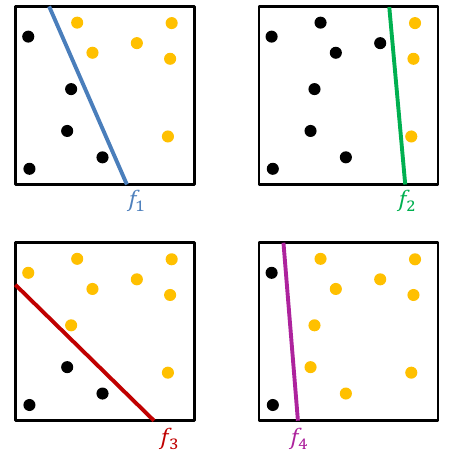

## Dichotomies and Growth Function

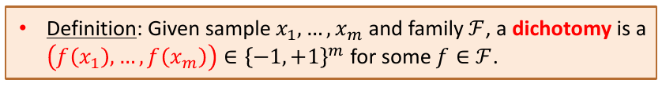

- **Unique dichotomies** $F(x) = \{(f(x_1), ..., f(x_m)): f \in F\}$, patterns of labels with the family
- Even when $F$ infinite, $|F(x)| \leq 2^m$ (why?)
	- Because it is binary
- And also (relevant for $F$ finite, tiny), $|F(x) | \leq |F|$ (why?)
	- Because $|F|$ is infinity
- Intuition: $|F(x)|$ might replace $|F|$ in union bound? How remove $x$? 

## $S_F(3)$ for $F$ linear classifiers in 2D

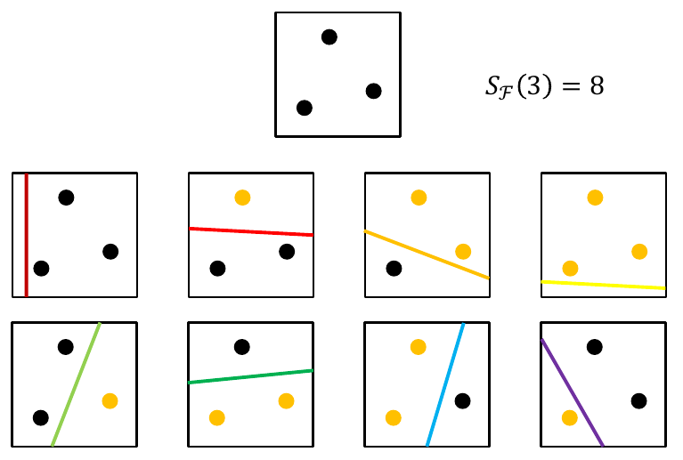

$|F(x)| = 6$ but still have $S_F(3) = 8$ because as proven in the previous example, we can have an example with 3 samples that has a **dichotomy** of 8.

![[f6-sf-8.png]]

## $S_F(4)$ for $F$ Linear Classifiers in 2D
- What about $m = 4$ points?
- Can never produce the criss-cross (XOR) dichotomy

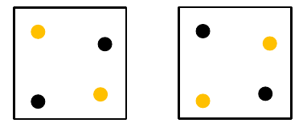

- In fact $S_F(4) = 14 < 2^4$ 
	- This is because if we exclude these two _impossible classifications with a linear model_, we will have $2^8 - 2$ dichotomies for 4 samples, which results in $S_F(4) = 14$  
- Guess/exercise: What about general $m$ and dimensions
	- dimensions + 1

## PAC Bound with Growth Function

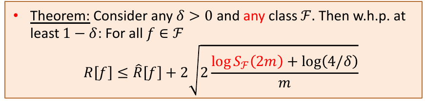

- Compare to PAC bounds so far
	- A few negligible extra constants (the 2s, the 4)
	- **$|F|$ has become $S_F(2_m)$** 
	- $S_F(m) \leq |F|$, not "worse" than union bound for finite $F$ 
	- $S_F(m) \leq 2^m$, **very bad for big family with exponential growth** function gets $R[f] \leq \hat{R}[f] + \text{ Big Constant}$. Even $R[f] \leq \hat{R}[f] +1$ meaningless!!

# The VC Dimension
_Computable, bounds growth function_

## Vapnik-Chervonenkis Dimension

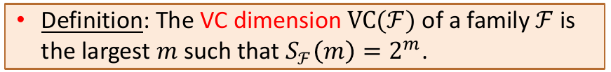

- Points $x = (x_1, x_m)$ are **shattered** by $F$ if $|F(x)| = 2^m$ 
- So $VC(F)$ is the size of the largest set shattered by $F$ 
- Example: linear classifiers in $\mathbb{R}^2$, $VC(F)=3$

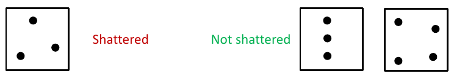

## Example: $VC(F)$ From $F(x)$ on Whole Domain
- Columns are _all_ points in domain
- Each row is a dichotomy on entire input domain
- Obtain dichotomies on a subset of points $x' \subseteq \{x_1, ... x_2\}$ by columns, drop dupe rows
- $F$ shatters $x'$ if number of rows is $2^{|x'|}$ 

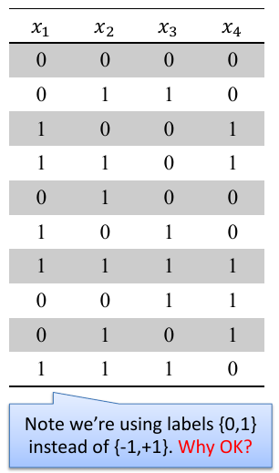

This example:
- Dropping column 3 leaves 8 rows behind: $F$ shatters $\{x_1,x_2,x_4\}$ 
- Original table has $< 2^4$ rows: $F$ doesn't shatter more than 3
- $VC(F) = 3$

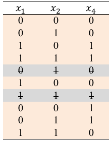

### My Explanation
What this means is that this function $F$ for 4 samples only has a dichotomy of 10, which is less than $2^4$ and thus cannot shatter $m=4$, so what we do instead is we then check if it can shatter $m=3$, which turns out has $2^3$ dichotomies once the duplicate rows were removed. We can therefore say that for this function, $VC(F)=3$, which means that this function can shatter up to $m=3$. 
## Sauer-Shelah Lemma

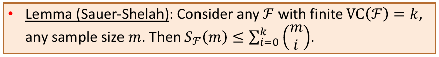

- From basic facts of Binomial coefficients
	- Bound is $O(m^k)$: finite VC $\implies$ eventually polynomial growth!
	- For $m \geq k$, it is bounded by $(\frac{em}{m})^k$ 

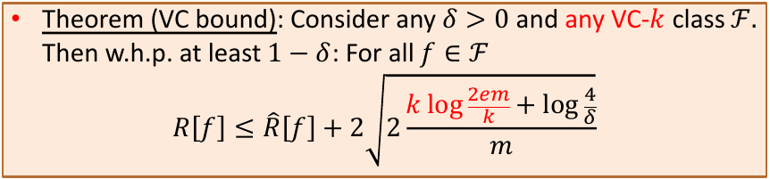

### My Explanation
What the above basically means is that we can consider growth function as being bounded a _combination_ in the mathematical term of $k$ shatterable samples of function $F$ and $m$ total samples. However, we should remember that a combination is bounded by $m^k$, simply because it will always be bigger. 

So according to some derivations that we can overlook, we can claim that given that number of samples is greater than or equal to the number of samples that a function can shatter, we can claim the bottom formula as the bound between the true risk of the function and the measured risk. 
## VC Bound Big Picture

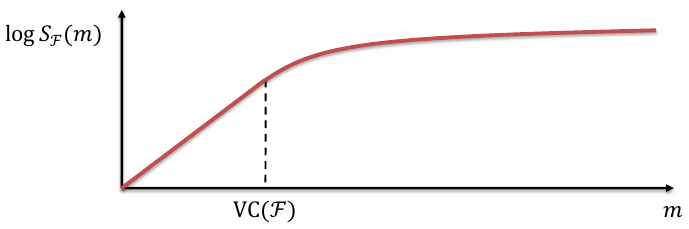

This above graph shows that even if $m$ continues to increase past the $VC(F)$, the number of dichotomies that the function can have becomes lower and lower (as you can imagine with the above examples).

- (Uniform) difference between $R[f], \hat{R}[f]$ is $O(\sqrt{\frac{k\log m}{m}})$ down from $\infty$, where $k$ is the VC dimension. Where $k$ is the VC dimension.
- Limiting complexity of $F$ leads to better generalisation
- VC dim, growth function measure "effective" size of $F$ 
- VC dim doesn't count functions, but uses geometry of family: projections of family members onto possible samples
- Example: linear "gap-tolerant" classifiers (like SVMs) with "margin" $\Delta$ have $VC = O(1/\Delta^2)$. Maximising "margin" reduces VC-dimension.

# Exercises
## Exercise 1
Why might _VC-dimension based PAC learning theory_ lead to very large or impractical _risk bounds for deep neural networks_ with non-linear activations and multiple hidden layers? 

- VC-dimension based PAC learning goes by the assumption of the VC dimension which is _shatterable_, i.e. the number of samples which a model can find every unique combination for. 
- Since deep neural networks are universal approximators, they can actually create any function and thus is capable of breaking the previous notion of bounding by the VC-dimension. 
- Thus we would need to bound by $2^m$ which is too large for risk bounds.

## Exercise 2
(a) Consider an input domain of five points x1 , . . . , x5 , and binary classifier family G defined by the table of dichotomies given below. Calculate VC(G) and show a corresponding shattered set of points. 

![[vc_dimension_q32023s1.png]]

VC-dimension = 2

| $x_1$ | $x_2$ |
|-------|-------|
| 0     | 0     |
| 1     | 0     |
| 0     | 1     |
| 1     | 1     

(b) In class we saw that the family of linear classifiers in $R^2$ (the 2D plane) have VC dimension 3. This question asks you to consider VC dimension of an unrelated family of classifiers also in the plane. Consider the family $F$ of rectangle classifiers parametrised by reals $a, b, c, d$ where $a < b$ and $c < d$: for any instance $x \in R2$ we have the classifier

![[q3formula-20230s1.png]]

or in words, a rectangle classifier predicts +1 if the instance lies within the rectange, and -1 if the instance falls outside the rectangle. What is the VC dimension of $F$, and why?

VC dimension is 4, because if we set up 4 points diagonally like a diamond, we can get every single combination with a rectangle

![[rectangle_dichotomy.png]]

(c) If you answered some number $d$ to Part (a), prove that $V C(F) < d + 1$ in this part by arguing why there can be no set of $d + 1$ points that can be labelled in all ways by classifiers in $F$. 

If we add an extra point in the centre of the above drawing, there is no way we can completely isolate a combination with the new point, it will always overlap with another point.

## Exercise 3
(h) _Probably approximately correct (PAC)_ learning theory aims to _upper bound_ the _true risk $R[f]$_ of a learned model $f \in F$ by the _empirical risk_ $\hat{R}[f]$ of that model plus an error term that might involve a sample $m$, VC-dimension $VC(F)$, confidence parameter $\delta$, etc. Why do PAC bounds hold only "with high probability $1 - \delta$", and not deterministically? 

- Because we can only provide a confidence parameter, as data is not deterministic. If we have little data, we are naturally less confident that we are close to the true risk $R[f]$, hence we will have a larger $\delta$. If we have more data, we can be more confident that we are close to the true risk, and thus have a lower $\delta$. 

## Exercise 4
(a) Consider any binary classifier family $F$ of classifiers that output labels in $\{0, 1\}$. For any classifier $f ∈ F$ define its complementary classifier as $f = 1 − f$. That is, for any input $x$,

![[q5-2022-s2.png]]

Then define a new family $\bar{F}$ as being made up of all the complementary classifiers of family $F$. That is, $F = \{\bar{f} : f ∈ F\}$. How are $VC(F)$ and $VC(\bar{F})$ related, and why? 

- They are related because they have the same VC dimensions. This is because the number of samples that $F$ can shatter is the same number of samples that $\bar{F}$ can shatter.

(b) Consider any finite input domain $X = \{x_1, . . . , x_n \}$ and a family of binary classifiers $F_{n,k}$ containing all classifiers that output +1 on at most $k < n$ inputs from $X$. That is, this family contains: the classifier outputting all -1; the $n$ classifiers outputting +1 on only one input and otherwise -1; and so on up to classifiers outputting +1 on $k$ inputs and -1 on $n − k$ inputs. What is the VC dimension of this family for general $n$ and $k < n$? Why? 

- Because it can only ever output a sequence of $k$ 0's and $k$ 1's

$VC(F_{n,k}) = k$ 

## Exercise 5
A model family $F$’s growth function $SF (m)$ could potentially be $2^m$, growing exponentially larger with increasing sample size $m$. Why would this be bad news for the PAC bound with growth function for $F$? 

Because this is the upper bound of the growth function. Our confidence threshold will essentially be rendered meaningless with such large numbers.

## Exercise 6
The two parts of this question are related to the VC dimension but are otherwise unrelated and can be answered separately.

(a) Consider an input domain of five points x1, . . . , x5, and binary classifier family F defined by the table of dichotomies given below. Calculate VC(F) and show a corresponding shattered set of points. 

![[q3-2022-s1-exam.png]]

3

The middle 3 columns

(b) For any $t ∈ [0, 1]$, define the function It on $x ∈ [0, 1]$ to be

![[formula-q3-2022-s1.png]]

What is the Vapnik-Chervonenkis dimension of the family $F = \{I_t : t ∈ [0, 1]\}$ and why? 

1, because we can have $x_1 < t < x_2$, $x_1 < x_2 < t$, $t < x_1 < x_2$, these can give us [0,1], [1,1], [0, 0], but it does not give us the last one

(c) Referring to the functions defined in the previous part, what is the Vapnik-Chervonenkis dimension of family $F^′ = F ∪ \{1 − I_t : t ∈ [0, 1]\}$ and why? (Hint: function $1 − I_t$ outputs 0 on inputs $x ≥ t$, and 1 otherwise.) 

Also one, because it will have the same combinations as above.

## Exercise 7
Consider an input domain of six points $x_1, . . . , x_6$, and binary classifier family $F$ defined by the table of dichotomies given below.

![[2021-s1-q16.png]]

a) Calculate $VC(F)$ and show a corresponding shattered set of points. 

$VC(F) = 3$

b) List all shattered sets of points. How many are there in total? 

![[IMG_9852.jpg]]
m1 =

m2 =

m3 = [x1, x3, x4], [x1, x3, x6]

## Question 8
(a) Consider an input domain of five points $x_1, . . . , x_5$, and binary classifier family $F$ defined by the table of dichotomies given below. Calculate $VC(F)$ and show a corresponding shattered set of points. 

![[2020-q7.png]]

$m_3 = [x_2, x_4, x_5]$
$m_2 = [x_1, x_2], [x_1, x_3], [x_2, x_3], [x_2, x_4], [x_2, x_5], [x_3, x_5], [x_4, x_5]$
$m_1 = [x_1], [x_2], [x_3], [x_4], [x_5]$

(b) Consider a family $F$ of _classifiers_ mapping a finite domain of $n$ instances $\{x_1, ..., x_n\}$ into _binary labels_ $\{-1,+1\}$; and a second family $G$ of classifiers acting on a _distinct_ domain of $m$ instances $\{x_{n+1}, ..., x_{n+m}\}$. Now define a new _product family_ $H$ that can act on the _combined domain_ $\{x_1, ..., x_{n_m}\}$, where for every pair $f \in F$, $g \in G$, we define an $h \in H$ such that, for each instance $x_i \in \{x_1, x_{n_m}\}$, it outputs classification

![[2020-q7-b.png]]

What is $VC(H)$ in terms of $VC(F)$, $VC(G)$? (Hint: it may be helpful to think of families $F$, $G$ as becoming tables of unique dichotomies in rows, with columns being instances $x_1, ..., x_n$ and $x_{n+1}, ..., x_{n+m}$ respectively. Then $H$ is a table with columns $x_1, ..., x_{n+m}$)

$VC(H) = VC(F) + VC(G)$

## Question 9
A model family $F$’s growth function $SF (m)$ could potentially be $2^m$ , growing exponentially larger with increasing sample size $m$. Why would this be bad news for the PAC bound with growth function for F? 

Because it means that our confidence value is so large that it renders our bound for the true risk and measured risk useless