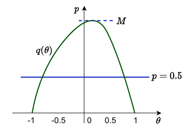
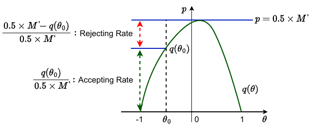

## How to Apply Bayesian View to Discrete Data?
- First off consider models which _generate_ the input
	- c.f. _discriminative_ models, which _condition_ on the input
	- i.e. $p(y|x)$ vs $p(x,y)$, Logistic Regression vs Naive Bayes
- For simplicity, start with most basic setting
	- $n$ coin tosses, of which $k$ were heads
	- Only have $x$ (sequences of outcomes), but no 'classes' $y$
- Methods apply to **generative models** over discrete data
	- e.g., topic models, generative classifiers (Naive Bayes, mixture of multinomials)

## Discrete Conjugate Prior: Beta-Binomial
- Conjugate priors also exist for discrete spaces
- Consider $n$ coin tosses, of which $k$ were heads
	- let $p(head) = q$ from a single toss (**Bernoulli dist**)
	- Inference question is the coin biased, i.e., is $q \approx 0.5$ 
- Several draws, use _**Binomial dist**_ 
	- And its conjugate prior, **_Beta dist_**

## Beta Distribution

## Beta-Binomial Conjugacy

## Uniqueness Up to Normalisation
- A trick used many times:
	_When an unnormalised distribution is proportional to a recognised distribution, we say it must be that distribution_
- If $f(\theta) \propto g(\theta)$ for $g$ a distribution, $\frac{f(\theta)}{\int_{\theta}f(\theta)d\theta}=g(\theta)$ 
- <u>Proof</u>: $f(\theta) \propto g(\theta)$ means that 

$f(\theta)  = C \cdot g(\theta)$   

$\int_{\theta} f(\theta)d \theta = C \int_{\varTheta} g(\theta) d(\theta) = C$ 

and the result follows from LHS1/LHS2 = RHS1/RHS2

## Laplace's Sunrise Problem
_Every morning you observe the sun rising. Based solely on this fact, what's the probability that the sun will rise tomorrow?_

- Use Beta-Binomial, where $q$ is the Pr(sun rises in the morning)
	- posterior        $[(q|k,n)] = \text{Beta}(q;k+\alpha, n - k + \beta)$ 
	- $n = k =$ observer's age in days
	- let $\alpha = \beta =1$ (_uniform_ prior)
- Under these assumptions

Consider human-meaningful period

Effect of prior diminishing with data, but _never disappoints completely_

### My Explanation
Our equation above is $\frac{k+1}{k+2}$ because in our above equation $Beta(q;k+1,1)$, this is the equivalent of $\frac{k+1}{k+1+1}$. $n$ and $k$ are equal because we know that every $n$ days, the sun will rise every time, so therefore we can say that $n = k$. 

And then if you look at the graph, as the number of days increases, the probability will approach 1 but never reach it. This  is because of the $\frac{k+1}{k+1+1}$, if $k$ increases, the denominator will always be 1 greater than the numerator

## Suite of Useful Conjugate Priors

# Bayesian Logistic Regression
_Discriminative classifier, which conditions on inputs. How can we do Bayesian inference in this setting?_

## Now for Logistic Regression
- Similar problems with parameter uncertainty compared to regression
	- Although predictive uncertainty in-built to model outputs

## No Conjugacy
- Can we use conjugate prior? E.g.
	- Beta-Binomial for _generative_ binary models
	- Dirichlet-Multinomial for multiclass (similar formulation)
- Model is _**discriminative**_, with parameters defined using logistic sigmoid*

$$
p(y|q,x) = q^y(1-q)^{1-y}
$$

$$
q = \sigma (x'w)
$$

- need prior over $w$, not $q$
- **No known conjugate prior** (!), thus use a Gaussian prior
- Approach to inference: **Monte Carlo sampling**

## Approximation

## How to Approximate the Posterior
- To see how to approximate the posterior, we need to go back to Bayes Theorem

$$
p(\theta|y) = \frac{p(y|\theta)}{p(y)}
$$

- Of the quantities in (1), what would you know analytically?
	- $p(\theta)$ and $p(y|\theta)$
- What purpose do the quantities that you do not know analytically serve?

## How to Approximate the Posterior
- To see how to approximate the posterior, we need to go back to Bayes Theorem

$$
p(\theta|y) = \frac{p(y|\theta) p(\theta)}{p(y)}
$$

- Of the quantities in (1), what would you know analytically?
	- $p(\theta)$ and $p(y)$
- What purpose do the quantities that you do not know analytically serve?
	- $p(y)$ is a normalising constant. This is why people write,

$$
p(\theta|y) \propto p(y|\theta)p(\theta)
$$

- Hence to approximate the posterior, we often work with an un-normalised density $q(\theta|y)$, which must satisfy $q(\theta|y) = c(y)p(y|\theta)p(\theta)$, where $c(y)$, $d(y)$ are functions of $y$ but not $\theta$

## Stochastic Methods of Posterior Approximation
- Let's first look at the hist graph (frequency of samples) and the probability density function
- Now let's look at the hist graph and the probability density function

- What can we do if our interested function $q(\theta)$ is like this?

- Let's scale the $q(\theta)$!

- Let's show our samples back

### My Explanation
What this basically means is that we have a probability density function that is a bit tricky to sample from, and to encapsulate it, we need another function with a factor of this probability density function to scale it accordingly

## Rejection Sampling
- Maybe we can reject/delete some samples

- Can we reject/delete one sample $\theta$

- Sure. After we sample $\theta_0$, we can just sample a number $x$ from $U(0,1)$. If $x <$ the accepting rate, then we keep $\theta_0$. Otherwise, we reject $\theta_0$ 

- It is also clear that, if we have a $\theta_1$ such that $q(\theta_1) = 0.5 \times M$, then we will never reject $\theta_1$, because the accepting rate of $\theta_1$ is 1 = 100%

- This is the well-known Monte Carlo (MC) method!

### My Explanation
What the above means is that to sample a complicated probability function like the one above, we can encapsulate it with another probability density function that we can easily sample, such as the uniform probability function. 

From there, we can just create a rejection and acceptance rates for the samples, where the decision boundary is the line of the complicated probability density function. As the formulas show, it's simply just according to the function of the PDF, the function of the uniform density function, and then some constant. This will give us an accurate sample for our PDF.

## Rejection Sampling (More General Descriptions)
- The idea behind rejection sampling is to find a density function $g(\theta)$ that completely encases the posterior $p(\theta|y)$, or in practice the un-normalised density $q(\theta|y)$, or equivalently

$$
\frac{q(\theta|y)}{g(\theta)} \leq M' \ \ \ \  \forall \theta
$$

such that it is straightforward to sample from $g(\theta)$. In our previous figures, $g(\theta)=0.5$. Specifically, we sample thetas from $U(-1,1)$
- The generalisation of draws from the posterior then proceeds as follows:
	- Sample $\theta^s$ from $g(\theta)$
	- Sample $x$ from a standard uniform $U(0,1)$
	- If $x \leq \frac{q(\theta^s|y)}{M' g(\theta^s)}$, accept $\theta^s$, otherwise reject

## Example of Rejection Sampling
- Assume $y|p \thicksim Bin(n,p)$ and that the prior distribution for $p$ is $Be(\alpha, \beta)$ 
- We know that the posterior distribution $p|y$ is $Be(y + \alpha, n - y + \beta )$, but lets assume you cannot sample directly from this distribution
- We also know that $p$ is bounded on $[0,1]$, so a simple choice for $g(p) = 1$, the standard uniform distribution. Then $M$ would correspond to the maximum of the posterior, which occurs at $p_{max} = \frac{y + \alpha - 1}{n + \alpha + \beta - 2}$ with 

$$
M = \frac{\Gamma(n + \alpha + \beta)}{\Gamma(y + \alpha)\Gamma(n - y + \beta)}p_{max}^{y+\alpha-1}(1-p_{max})^{n-y+\beta-1}
$$

## Rejection Sampling Comments
- The challenge of rejection sampling is picking $g(\theta)$ such that $q(\theta|y) \leq Mg(\theta) \ \ \  \forall \theta$ while minimising the proportion of candidate samples being rejected

- In the case of the beta posterior example, as $y$ $n$ increases, the probability of any $\theta^s$ being accepted (area in red below dashed line in figure) declines

- Now, based on what you know about asymptotic theory, a normal distribution based on the posterior mode truncated at $[0,1]$ might be a better choice for $g(p)$

- As before, and also for ease of calculation, we choose $M$ so that $\max_p p(p|y) = M \max_p g(p)$ matched. While the choice of $g(p)$ looks better, especially for larger $n$, it turns out that $p(P|y)/g(p) \leq M$ does not hold $\forall p$ 

### My Explanation
Imagine taking uniform samples for the very skinny bell curves compared to the fat bell curves, you would have to reject many more samples from the skinny bell curve since there's less area under the curve than compared to the area under the uniform density curve. This is something that you have to consider when you are picking the probability function that will encapsulate the PDF in question - you want to pick one that quite closely encapsulate it. But this problem is difficult to get right, as the bottom figure shows, some functions go underneath the function, or too far away from the function. 