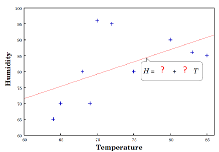

## Training == Optimisation (?)
Stages of learning & inference:
- Formulate model
**Logistic Regression**

$$
p(y|x) = \text{sigmoid}(x'w)
$$

**Linear Regression**

$$
p(y|x) = \text{Normal}(x'w;\sigma^2)
$$

- Fit to parameters to data

$$
\hat{w} = \text{argmax}_w p(y|X,w)p(w)
$$

- Make prediction
**Logistic Regression**

$$
p(y_*|x_*) = \text{sigmoid}( x_*' \hat{w})
$$

**Linear Regression**

$$
E[y_*] = x'_* \hat{w}
$$

**$\hat{w}$ referred to as a 'point estimate'**

## Bayesian Alternative
Nothing special about $\hat{w}$... use more than one value?
- Formulate model

$$
p(y|x) = \text{sigmoid}(x'w)
$$

**Logistic Regression**

$$
p(y|x) = \text{sigmoid}(x'w)
$$

**Linear Regression**

$$
p(y|x) = \text{Normal}(x'w;\sigma^2)
$$

- Consider the **space of likely parameters** - those that fit the training data well

$$
p(w|X,y)
$$

- Make '**expected**' prediction
**Logistic Regresssion**

$$
p(y_*|x*) = E_{p(w|X,y)}[\text{sigmoid}(x_*'(w))]
$$

**Linear Regression**

$$
p(y_*|x_*) = E_{p(w|X,y)}[\text{Normal}(x_*'w, \sigma^2)]
$$

### My Explanation
For the above example of logistic and linear regression, we just find an optimal set of weights to make our predictions, as discussed in previous sections. For the Bayesian alternative, however, we consider the fact that there may be a series of set of weights that can also have as good, if not better results, and this we should consider all the different combinations of weights when we predict the test data, weighted by the probability of how likely they are with the test sample.

# Uncertainty
_From small training sets, we rarely have complete confidence in any models learned. Can we quantify the uncertainty, and use it in making predictions?_

## Regression Revisited
- Learn model from data
	- Minimise error residuals by choosing weights $\hat{w} = (X'X)^{-1}X'y$ 
- But... how confident are we
	- in $\hat{w}$?
	- in the predictions?

**Linear regression**: $y = w_0 + w_1x$ (here $y$ is humidity and $x$ is temperature)

## The Bayesian View
_Retain and model all unknowns (e.g., uncertainty over parameters) and use this information when making inferences_

## A Bayesian View
- Could we reason over _all_ parameters that are consistent with the data?
	- Weights with a better fit to the training data should be more probable than others
	- Make predictions with all these weights, _scaled by their probability_
 - This is the idea underlying **Bayesian** inference

## Uncertainty Over Parameters
- Many reasonable solutions to objective
	- Why select just one?
- Reason under _all_ possible parameter values
	- Weighted by their _posterior probability_
- More robust predictions
	- Less sensitive to overfitting, particularly with small training sets
	- Can give rise to more expressive model class (Bayesian logistic regression becomes non-linear!)

## Frequentist vs Bayesian "Divide"
- **Frequentist**: learning using _point estimates_, regularisation, $p$-values
	- Backed by sophisticated theory on simplifying assumptions
	- Mostly simpler algorithms, characterises much practical machine learning research
- **Bayesian**: maintain _uncertainty_, marginalise (sum) out unknowns during inference
	- Some theory
	- Often more complex algorithms, but not always
	- Often (not always) more computationally expensive

# Bayesian Regression
_Application of Bayesian inference to linear regression, using Normal prior over $w$_

## Revisiting Linear Regression
- Recall probabilistic formulation of linear regression
- Bayes rule:

- Gives rise to penalised objective (ridge regression)

- Rewind one step, consider full posterior

- Can we compute the denominator (**marginal likelihood** or **evidence**)?
	- If so, we can use the full posterior, not just its mode

### My Explanation
The denominator in the second derivation is actually known as the **evidence**, and we can actually consider this as a constant with respect to $w$. Therefore, we can say that the probability function is proportional to the numerator and we can ignore the denominator when finding the MAP.

## Bayesian Linear Regression (cont)
- We have two Normal distributions
	- Normal likelihood $x$ prior
- Their product is also Normal distribution
	- **Conjugate prior**: _when product of likelihood $x$ prior results in the same distribution as the prior_
	- _evidence_ can be easily computed using the normalising constant of the Normal distribution

$$
p(w|X,y,\sigma^2) \propto \text{Normal}(w|0,\gamma^2I_D)\text{Normal}(y|Xw,\sigma^2I_N)
$$

$$
 p(w|X,y,\sigma^2) \propto \text{Normal}
 (w|w_N,V_N)
$$

_closed form solution for posterior!_

$$
p(w|X,y,\sigma^2) \propto \text{Normal}(w|0,\gamma^2I_D)\text{Normal}(y|Xw,\sigma^2I_N)
$$

$$
 p(w|X,y,\sigma^2) \propto \text{Normal}
 (w|w_N,V_N)
$$

Where:

$$
w_N = \frac{1}{\sigma^2}V_NX'y
$$

$$
V_N = \sigma^2(X'X+\frac{\sigma^2}{\gamma^2}I_D)^{-1}
$$

## Bayesian Linear Regression Example

## Sequential Bayesian Updating
- Can formulate $p(w|X,y, \sigma^2)$ for given dataset
- What happens as we see more and more data?
	1. Start from prior $p(w)$
	2. See new labelled datapoint
	3. Compute posterior $p(w|X,y,\sigma^2)$
	4. The _**posterior now takes role of prior**_ & repeat from step 2

## Sequential Bayesian Updating
- Initially know little, many regression lines licensed
- Likelihood constrains weights such that regression is close to point
- Posterior becomes more refined/peaked as more data introduced
- **Approaches a point mass**

## Stages of Training
1. Decide on model formulation & prior
2. Compute _posterior_ over parameters $p(w|X,y)$

## Prediction with Uncertain $w$
- Could predict using sampled regression curves
	- Sample $S$ parameters, $w^{(S)}, s \in \{1,...,S\}$
	- For each sample compute prediction $y_*^{(s)}$ at test point $x_*$ 
	- Compute the mean (and var.) over these predictions
	- This process is known as **Monte Carlo Integration**
- For Bayesian regression there's a simpler solution
	- Integration can be done analytically, for

$$
p(\hat{y_*}|X,y,x_*, \sigma^2) = \int p(w|X,y, \sigma^2)p(y_*|x_*,w, \sigma^2)dw
$$

### My Explanation
what the above equation is saying is that: for the last part, given a set of samples and some weights, what is the probability of a certain label. The first part is saying given the datapoints and labels, what is the probability of the weights

## Prediction (cont.)
- Pleasant properties of Gaussian distribution means integration is tractable

$p(y_*|x_*, X, y, \sigma^2) = \int p(x|X,y, \sigma^2)p(y_*|x_*,w,\sigma^2)dw$

$\ \ \ \ \ \ \ \  \ \ \ \ \ \ \ \ \ \ \ \ \ \ \ \ \ \ \ \ = \int \text{Normal}(w|x_N,V_N) \text{Normal}(y_*|x_*w, \sigma^2)dw$      

$\ \ \ \ \ \ \ \  \ \ \ \ \ \ \ \ \ \ \ \ \ \ \ \ \ \ \ \ = \int \text{Normal}(y_*|x'_*w_N, \sigma^2_N(x_*))$       

- Additive variance based on $x_*$ match to training data
- **c.f. MLE/MAP estimate, where variance is a fixed constant**

## Bayesian Prediction Example

## Caveats
- Assumptions
	- Known data noise parameter, $\sigma^2$ 
	- Data was drawn from the model distribution