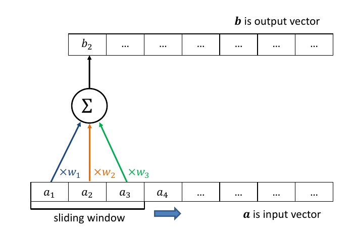

## Motivating Example
- Image classification
	- Instance is matrix of pixels

- How can we apply a neural net?
	- Flatten into vector, then use fully connected network
 

## Fully-Connected Net, No Spatial Invariane
- Disadvantage: must learn same concept again & again!

- **Translation invariance**: architecture that activates on the same pattern even if "translated" spatially

## Use More Depth?
- **Inefficent**, requires huge number of parameters with more hidden layers. Could **overfit**

- In computer vision, **filters** are small square patterns such as line segments or textures, used as features
- Need ways to: match filters against image (**next**); learn filters
- Key idea: learn **translation invariant** filters - parameter sharing

# Convolution Operator
_Allows us to match a small filter across multiple patches of a 2D image or range of a 1D input_

## Convolution
- Concept from signal processing, with wide-spread application
	- Defined as
 
$$
(f * g)(t) = \int^{\infty}_{-\infty}f(\tau)g(t-\tau)d\tau
$$

- Measures how the shape of one function matches the other as it **slides** along
- **ConvNets** use this idea applied to **discrete** inputs

## Convolution in 1D

## Convolution on 2D Images

## Convolution in 2D
- Use filter/kernel to perform element-wise multiplication and sum for every local patch

## Image Decomposes into Local Patches
- Different local patches include different patterns
	- We can first extract local featurs (local patterns) and then combine features for classification

## Convolution Filters (aka Kernels)
- Filters/kernels can identify different patterns

- When input and kernel have the same pattern high activation response

## Different Kernels Identify Different Patterns

## Convolution in 2D Example (MNIST)
- Response (Feature map) for single kernel

- Different kernels identify different patterns: use several filters in each layer of network

## Convolution Parameters
- **Filters are parameters** themselves to be learned (next)
- Key **hyperparameters** in convolution
	- Kernel size: size of the patches
	- Number of filters: depth (channel) of the output
	- Stride: how far to "slide" patch across input
	- Padding of input boundaries with zeros (black here)

## Convolution on Multiple-Channel Input

# Convolutional Neural Networks (CNN)
_Deep networks combining convolutional filters, pooling and other techniques_

## CNN for Computer Vision
- LeNet-5 sparked modern deep models of vision
	- "C" = convolutional, "S" = down-sampling,
	- "F" = fully connected
 

## Components of a CNN
- **Convolution** layers
	- Complex input representations based on convolution operation
	- Filter **weights are learned** from training data
- Downsampling, usually via **Max Pooling**
	- Re-scales to a smaller resolution, limits parameter explosion
- **Fully connected** parts and output layer
	- Merges representations together

## Downsampling via Max Pooling
- Special types of processing layer. For an $m\times m$ patch 

$$
v = \max(u_{11}, u_{12}, ..., u_{mm})
$$

- Strictly speaking, not everywhere differentiable. Instead, gradient is defined according to "sub-gradient"
	- Tiny changes in values of $u_{ij}$ that is not max do not change $v$
	- If $u_{ij}$ is max value, tiny changes in that value change $v$ linearly
	- Use $\frac{\delta v}{\delta u_{ij}}=1$ if $u_{ij} = v$, and $\frac{\delta v}{\delta u_{ij}}=0$ otherwise
- Forward pass records maximising element, which is then used in the backward pass during back-propagation

## Convolution + Max Pooling $\rightarrow$ Translation Invariance
- Consider shift input image
	- Exact same kernels will activate, with same response
	- Max-pooling over the kernel outputs gives same output
	- Size of max-pooling patch limits the extent of invariance
- Can include padding around input boundaries

## Convolution as a Regulariser

## Conv Nets Learn Hierarchical Patterns
- Stacking several layers of convolution: larger size receptive field (more of input is seen)

## Inspecting Learned Kernels

## ConvNets in Computer Vision
- ResNet represents modern state-of-the-art
	- Up to 151 layers (!)
	- Mixture of convolutions, pooling, fully connected layers
- Critical innovation is the "**residual connection**"
	- Linear copy of input to output
	- Easier to optimise despite depth, solving gradient vanishing problem
- Standard practise to _**pretrain**_ big model on large dataset, then _**fine-tune**_ (continue training) on small target task

## ConvNets for Language
- Application of 1d kernels to word sequences
	- Capture patterns of nearby words

# Exercises
## Exercise 1
(a). What are two benefits of _max pooling_? [5 marks]
- Max pooling is when the dimensions of trainable parameters are reduced by aggregating the max value in the previous layer in an $n\times n$ space, most often $2\times 2$. Two benefits of max pooling are:
	1. Reduction in training parameters while still maintaining meaningful information about the data as aggregating the image by its max value manages to maintain most of its valuable information.
	2. Translation Invariance. It allows the CNN to learn patterns in an image by patterns that exist in an image despite their position. This allows models to extract much more meaningful information out of our images.

## Exercise 2
Consider the following toy convolutional neural network (CNN): a single-channel 32×32 pixel input image (first blue square) is first fed into a convolutional layer (first black square) resulting in a 15 × 15 output (second blue square), which is then fed into a max-pooling layer (second black square) resulting in an output (third blue square) of unknown dimension.

![[q5_cnn-question2023.png]]

Prior to the convolutional layer , each of the four sides of the image is padded by 1 pixel. This layer has
a single 5 × 5 filter/kernel with some unknown stride. The max pooling layer uses a 2 × 2 pool size, with 2 × 2 stride and no padding.
(a) What is the convolutional layer’s missing stride value? 
- $width_{o} = \frac{width_{i} - width_{k} }{stride}+1$ 
- $15 = \frac{32 + 2 - 5 }{x}+1$
- $14x = {29}$ 
- $stride = x = 2$ 
(b) What is the missing final feature map dimension? 
- $width_o = \frac{width_i - width_k}{stride} + 1$ 
- $width_o = \frac{15 - 2}{2}+1$
- $width_o = 7$
- Therefore feature map = 7x7

## Exercise 3
Explain how _convolutional neural networks (CNNs)_ can produce _translation invariant_ representations when applied to vector or matrix inputs 
- CNNs comprise of stacks of kernels that act as a sliding window over input data. This means that each kernel is focused on patterns that exist in the image, which leads to the model learning translation invariant features.
- Max pooling layer helps with translation invariance

## Exercise 4
Consider a simple Convolutional Neural Network for processing 3 × 3 images, with a single filter of size 2 × 2, applied with no padding and stride of 1 × 1. The next step is global max-pooling, which takes the filter output (size 2 × 2) to produce a single output.

1. What mathematical function is defined by the network, relating its output y to its input $x_{1,1}$ , $x_{1,2}, . . . , x_{3,3}$ ? You will need to introduce new variables for the model’s parameters. 

$a_{ij} = \sum^2_{i=0} \sum^2_{j=0} w_{i+k,j+l} \times x_{i+k,j+l}$ for $k \in \{0, 3\}, l \in \{0, 3\}$ 

$output = max(A)$ 

2. Explain how a loss gradient at the output is back-propagated through the network, and show the mathematical form of the loss gradient with respect to the model parameters. 

[Unsure]

## Exercise 5
Consider the following simple Convolutional Neural Network. The input is a RGB image (3 channels) with width and height equal to 224. The setting of the layers are shown in the figure. There are 32 filters in the convolutional layer and each filter has a size of 11 × 11.

![[cnn-q6-2021-s1.png]]

(a) Compute the number of parameters in the convolutional layer (show the formula and give the final result) 

To calculate the learnable parameters here, all we have to do is just multiply the by the shape of width m, height n, previous layer’s filters d and account for all such filters k in the current layer. Don’t forget the bias term for each of the filter. Number of parameters in a CONV layer would be : ((m * n * d)+1)* k), added 1 because of the bias term for each filter

$32 \times ((11 \times 11 * 3)+1) = 11648$

(b) In order to reduce the number of parameters of the convolutional layer in the figure, while keeping the receptive field the same, one possible method is to stack one 3 × 3 convolutional layer and one 9 × 9 convolutional layer. Describe five different possible stackings, i.e., different combinations of multiple (can be two or more than two) convolutional layers. (Note: changing the order of the multiple convolutional layers is counted as the same stack, e.g., “Stacking a 9 × 9 and a 3 × 3 convolutional layer” is counted as the same stack as “Stacking a 3 × 3 and a 9 × 9 convolutional layer”.) 

9 x 9 and 5 x 5
7 x 7 and 5 x 5
7 x 7 and 5 x 5 and 3 x 3
9 x 9 and 3 x 3
9 x 9 and 7 x 7

## Exercise 6
How many _parameters_ does the following _convolutional neural network_ have (exclude the bias)? Show your working.

![[2023-sample-q5.png]]

**Acceptable**: The convolutional network has 3 matrix-valued parameters, adding up the sizes gives  3 + 5 · 4 + 4 · 5 = 43 parameters in total (assuming that biases are not included).  

## Exercise 7
Explain in words how a convolutional neural network (CNN) image classifier makes translation invariant classifications 

Because stacks of kernel filters are each learning patterns that exist throughout the image by scanning a window over the image, rather than each neuron learning one pixel. This allows for translation invariance by learning patterns existing throughout the image 