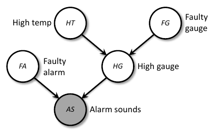

# Probabilistic Inference on PGMs
_Computing marginal and conditional distributions from the joint of a PGM using Bayes rule and marginalisation_

_This deck: how to do it effectively_

## Two Familiar Examples
- Naive Bayes **(frequentist/Bayesian)**
	- Chooses most likely class given data
	- $Pr(Y|X_1, ..., X_d) = \frac{Pr(Y, X_1, ..., X_d)}{Pr(X_1, ..., X_d)} = \frac{Pr(Y, X_1, ..., X_d)}{\sum_y Pr(Y=y, X_1, ..., X_d)}$ 

- Data $X|\theta \thicksim N(\theta, 1)$ with prior $\theta \thicksim N(0, 1)$ **(Bayesian)**
	- Given observation $X = x$ update posterior
	- $Pr(\theta|X) = \frac{Pr(\theta, X)}{Pr(X)} = \frac{Pr(\theta, X)}{\sum_{\theta}Pr(\theta, X)}$  

- **Joint + Bayes rule + marginalisation $\rightarrow$ anything**

## Nuclear Power Plant
- Alarm sounds; meltdown?!
- $Pr(HT|AS = t) = \frac{Pr(HT, AS=t)}{Pr(AS=t)}$ 
- $\frac{\sum_{FG, HG, FA} Pr(AS=t, FA, HG, FG, HT)}{\sum_{FG, HG, FA, HT'}Pr(AS=t, FA, HR, FG, FG, HT')}$ 

- Numerator (denominator similar) 
	- expanding out sums, joint _summing once over 2^5 table_
 
	$= \sum_{FG}\sum_{HG} \sum_{FA} Pr(HT) Pr(HG|HT, FG)Pr(FG)Pr(AS=t|FA, HG)Pr(FA)$ 
 
	- distributing the sums as far down as possible _summing over several smaller tables_	
	
	$=Pr(HT)\sum_{FG}Pr(FG)\sum_{HG} Pr(HG|HT, FG)\sum_{FA}Pr(FA)Pr(AS=t|FA = t | FA, HG)$

### My Explanation
To get the conditional probability of $Pr(HT|AS = t) = \frac{Pr(HT, AS=t)}{Pr(AS=t)}$, we need to sum out all the other parameters that aren't part of the condition probability as shown in the fraction equation above. 

What we notice when we start to sum out the the parameters, as shown in the second last summation equation, it is wasteful in terms of time complexity to perform the summation over the entire combination as many of the combinations don't contain that probability. Take for example $FA$, $Pr(HT|AS=t)$ doesn't contain this parameter so there is no need to iterate over this when performing the summation. Therefore we separate our summations as shown in the bottom equation.

## Nuclear Power Plant (Cont.)

### My Explanation
In the above slide, the general procedure is to:
1. Eliminate the child node by summing it out and turning it into a message of the parents (as shown in $m_{AS}(FA, HG)$)
2. Eliminate the parent nodes one by one (as shown in the next steps)

This is done with matrix multiplications, as described in the above slide. The bottom-left corner is showing that to eliminate $FA$, we must perform $m_{FA}(HG) = Pr(FA) \cdot m_{AS}(FA, HG)$. This gives us a result of a $2 \times 1$ matrix, which we will use for the next step.

Once we complete this process, we are left with our last node, as shown on the bottom line of the slide.

Also note that the parent nodes are connected each time we eliminate their child node, this is necessary to complete the procedure.

## Elimination Algorithm

## Runtime of Elimination Algorithm

- Each step of elimination
	- Removes a node
	- Connects node's remaining neighbours
		- **forms a clique** in the "reconstructed" graph (_cliques are exactly r.v.'s involved in each sum_)
- Time complexity **exponential in largest clique**
- Different complexity **exponential in largest clique**
	- **Treewidth**: minimum over orderings of the largest clique
	- Best possible time complexity is exponential in the treewidth e.g. $O(2^{tw})$ 

## Probabilistic Inference by Simulation
- Exact probabilistic inference can be expensive/impossible
	- Integration may not have analytical solution!
- Can we approximate numerically?
- Idea: **sampling methods**
	- Approximate **distribution** by **histogram of a sample**
	- We can't trivially sample: (1) only know desired distribution up to a (normalising) constant (2) naive sampling approaches are inefficient in high dimensions

## Gibbs Sampling

1. Given: D-PGM on $d$ random variables
2. Given: evidence values $x_E$ over variables $E \subset \{1, ..., d\}$ 
3. Goal: many approximately independent samples from joint conditioned on $x_E$ 

1. Initialise with a string starting $X^{(0)} = \big(X_1^{(0)}, ..., X_d^{(0)} \big)$ with $X_E^{(0)} = x_E$ 
2. Repeat many times
	1. Pick non-evidence node $X_j$ uniformly at random (all nodes in white)
	2. Sample single node $X_j' \thicksim p(X_j | X_1^{(i-1)}, ..., X_{j-1}^{(i-1)}, X_{j+1}^{(i-1)}, ..., X_d^{(i-1)})$ 
	3. Save entire joint sample $X^{(i)} = \big( X_1^{(i-1)}, ..., X_{j-1}, \textcolor{red}{X_j'}, X_{j+1}^{(i-1)}, ..., X_d^{(i-1)} \big)$ 
- Exercise: Why always $X_E^{(i)} = x_E$?
	- Because we always ignore the evidence node, so we can call it this.
- Need not update nodes in random order, e.g. **parents first order**. But do need to be able to **sample from conditionals** (e.g. conjugacy)

## Markov Blanket
- Intuition: all nodes that you directly depend on. _Not just your parents/children_!
- Consider node $X_i$ in D-PGM on nodes in $N = \{1, ..., d\}$ 
- Markov blanket MB(i) of $X_i$: 
	- Nodes $B \subseteq N \backslash \{i\}$ such that...
	- $X_i$ independent of $X_{\bar{B} \backslash \{i\}}$ given $X_B$
	- $p(X_i | X_1, ..., X_{i-1}, X_{i+1}, ..., X_d) = p(X_i | MB(X_i))$ 
- In D-PGM Markov blanket is:
	- Parents of $i$, children of $i$, parents of children of $i$
	- $p(X_i | MB(X_i)) \propto p(X_i | X_{\pi_i}) \prod_{k:i \in \pi_k} p(X_k | X_{\pi_k})$ 

## Markov Chain Monte Carlo (MCMC)

## Initialising Gibbs: Forward Sampling

## Now What??
- With our $X^{(1)}, ..., X^{(T)}$ in hand after running Gibbs for a while with burn-in and thinning...
- These form "i.i.d." sample of $p(X_{\bar{E}}|X_E = x_E)$ 
- We can do heaps!
	1. Can approximate the distribution via a histogram of these samples (make bins, form counts)
	2. Marginalising out variables == Dropping components from samples
	3. Expectations: Estimating by sample mean of samples
- Posterior $p(w|X_{tr}, y_{tr})$ combine (a) and (b). Mean posterior point estimate, combine with (c)

# Statistical Inference on PGMs
_Learning from data - fitting probability tables to observations (eg as a frequentist; a **Bayesian would just use probabilistic inference** to update prior to posterior)_

## Have PGM, Some Observations, No Tables

## Fully-Observed Case in "Easy"
- Max-Likelihood Estimator (MLE) says
	- If we observe _all_ r.v.'s $X$ in a PGM independently $n$ times $x_i$
	- Then maximise the _full_ joint
		$\underset{\theta \in \Theta}{\text{argmax}} \prod^n_{i=1}\prod_j p(X^j = x_i^j | X^{parents(j)} = x_i^{parents(j)})$  

- Decomposes easily, leads to counts-based estimates
	- Maximise log-likelihood instead; becomes sum of logs
		$\underset{\theta \in \Theta}{\text{argmax}} \sum^n_{i=1} \sum_j \log p (X^j = x_i^j | X^{parents(j)} = x_i^{parents(j)})$ 
		Big maximisation of all parameters together, **decouples into small independent problems**
- Example is training a naive Bayes classifier

## Example: Fully-Observed Case

## Presence of Unobserved Variables Trickier
- But most PGMs you'll encounter will have latent, or unobserved, variables
- What happens to the MLE?
	- Maximise likelihood of observed data only
	- Marginalise full joint to get to desired "partial" joint
	- $\underset{\theta \in \Theta}{\text{argmax}} \prod^n_{i=1} \sum_{\text{latent} j} \prod_j p(X^j = X_i^j | X^{parents(j)} = x_i^{parents(j)})$
	- This won't decouple - oh no's!!
- Use **EM algorithm**!

# Exercises
## Exercise 1
Consider the following directed probabilistic graphical model (PGM) with Boolean-valued random variables

![[directed_pgms_2023s1.png]]

(a) What is the _Markov blanket_ of node $A$? 
- [B, C, F, E, H, D]

(b) Consider now _eliminating_ two nodes from the original _directed PGM_, first $A$ then $E$. Compared to the original directed PGM, how many additional edges does the _reconstructed graph_ (aka _moral graph_) have? Explain how you arrived at your answer. 
1. Moralise the graph, which connects A and H
2. Remove A, which makes B, C, F, H and E all connected
3. Remove E, which makes B, C, F, H and I connected
4. When reconstructed, all these connected nodes plus the removed nodes become one clique

(c) Consider the reconstructed graph from the previous question part. List all of its largest maximal cliques. (Hint: a maximumal clique is a clique that cannot be made larger by adding more nodes while still being a clique. Largest means there are no larger cliques in the graph.) [5 marks]
- [B, C, A, F, H, E, I]
### Exercise 2
Given the following directed _probabilistic graphical model_ over binary random variables:

![[pgm-2022-s1-exam.png]]

(a) For the alphabetical elimination order $A, B, C, . . . , F$ show the resulting graph after running the elimination algorithm. 

![[IMG_9881.jpg]]

(b) What is the time complexity of the elimination algorithm for the graph with alphabetical elimination order, as given above? Explain your answer. 

Given that the minimum tree width will be the minimum value of the largest clique (in this case 3), we can say that the time complexity is $2^{(O(tw))}$, where $O(tw)$ is 5.

(c) What is the Markov blanket of $B$? Recall that the Markov blanket relates to the conditional distribution of B given the rest of the variables, and is defined as the minimal set of other variables needed to evaluate the conditional distribution. Explain your answer. 

[E, A, C, D]

This is because $C$ is the child, and its parent is $D$, and then $A$ and $E$ are the parents of $B$.

### Exercise 3
Can the independence assumptions of all directed probabilistic graphical models be represented by undirected probabilistic graphical models? Why or why not? 

Yes, if we have a conditional probability such as $Pr(A|B,C)$, we can also represent this for an u-pgm like $\psi Pr(A,B,C)$ and a normalising factor $Z$. 

### Exercise 4
Consider the following directed probabilistic graphical model (PGM) with Boolean-valued random variables

![[q2-2022-s1.png]]

(a) What is the reconstructed graph (aka moral graph) of this PGM, for alphabetical elimination ordering leaving just $H$. I.e., $A, B, C, D, E, F, G$? 

![[signal-2023-10-26-204905.jpeg]]

(b) What is the maximum clique size in the reconstructed graph? 

4

(c) Write the runtime complexity of the elimination algorithm, eliminating the nodes in the given order, in terms of the maximum clique size. 

$2^{O(tw)}$ where $O(tw)$ in this case is 4, since that is the minimum value of the largest clique size.

## Exercise 5
Consider the conditional distribution
$$
P(A,B,C,D,E,F) P(A)P(B)P(C|A)P(D|A,B)P(E|D)P(F|C,E),
$$
where $A,B,...,G$ are binary values random variables

(a) Draw the corresponding _directed probabilistic graphical model_ (PGM) 

![[IMG_9851.jpg]]

(b) When performing Gibbs sampling, state the distribution used to resample the value of $E$. Simplify as much as possible 

We need to multiply the the conditional probability of the evidence node and its parents, which is the first probability below. And then we need the parents of the children of the evidence node. Which is the second part of the below formula.

$P(E|D,C,F) \propto P(E|D) \times P(F|E,C)$

(c) Instead of implementing $P(D|A,B)$ as a large conditional probability table, we decide to use a logistic regression model, with three parameters (one for each of the two conditioning variables, and a bias term). Besides reducing the number of parameters, state another important consequence of this change 

- But most PGMs you'll encounter will have latent, or unobserved, variables
- Use **EM algorithm**!

## Exercise 6
In words, define the _tree width_ of a directed graph $G$. 

The tree width is the minimum value of the largest clique in a directed PGM

## Exercise 7
The Maximum a Posteriori (MAP) method is sometimes referred to as referred to as "poor man's Bayes." Explain how MAP is different to full Bayesian inference, and describe a situation in which the two methods will produce different predictions 

MAP aims to find the most of the posterior distribution, but it does not capture the full uncertainty of its parameters

Full Bayesian inference captures the entire posterior distribution of its parameters, allowing for capturing the uncertainty of its parameters

In a situation where complex modelling is required and accurate modelling of uncertainties is required for the task. MAP may fail to capture all the information required for the task