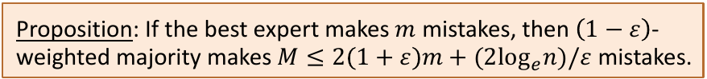

# An Infallible Expert and the Majority Algorithm
_Warming up example_

## Warm-Up: Case of the Infallible Expert
- **Experts** $E_1,...,E_n$ predict the stock market daily 
	- Each expert prediction is binary: stocks will go up/down

[

- Learner's game, daily: 
	- Observe predictions of all experts 
	- Make a prediction of its own - Observe outcome (could be anything!) - Goal: minimise number total mistakes - **Infallible expert** assumption:
		- 1 or more experts make no mistakes
	
## Infallible Expert Algorithm: Majority Vote
1. Initialise set of experts who haven't made mistakes $E = \{1, ..., n\}$ 
2. Repeat per round
	1. Observe predictions $E$ for all $i \in \{1,...,n\}$
	2. Make **majority prediction** $\text{argmax}_{y \in \{-1,1\}} \sum_{i \in E} 1[E_i = y]$ 
	3. Observe correct outcome
	4. **Remove mistaken experts** from E

## Mistake Bound for Majority Vote

**Proof**
- Loop invariant: If algorithm makes a mistake, then at least $|E|/2$ experts must have been wrong
- i.e. for every incorrect prediction, $E$ reduced by at least half. i.e. after $M$ mistakes, $|E| \leq n/2^M$ 
- By infallibility, at all times $1 \leq |E|$
- Combine to $1 \leq |E| \leq n/2^M$, then solve for $M$

## How is This "Online-Learning"?
**Learning**
- **Weights on which experts** are worth listening to
- (Infallible case: 0/1 weights)
- Making predictions/taking actions
- Incurring loss (so far 0/1)
- IID "Distribution" replaced by **adversarial outcomes**

**Online**
- A **repeated game**

# Imperfect Experts and the Halving Algorithm
_Similar proof techniques; similar algorithm; much more interesting setting_

## No One's Perfect
- No more guarantee of an infallible expert
- What breaks?
	- We could end up with $E = \emptyset$, how to predict then?
	- No sense: "Zero tolerance" dropping experts on a mistake
- Very general setting / very few assumptions
	- Not assuming anything about expert error rates
	- Not assuming anything about correlation of expert errors
	- Not assuming anything about outcome observations. Not even stochastic (could be adversarial!)

## Imperfect Experts: Halving Algorithm
1. Initialise $w_i = 1$ weight of expert $E_i$
2. Repeat per round
	1. Observe predictions $E_i$ for all $i \in \{1,...,n\}$
	2. Make **weighted majority prediction** $\text{argmax}_{y \in \{-1,1\}}\sum_{i \in E} w_i1[E_i=y]$ 
	3. Observe correct outcome
	4. **Downweigh each mistaken expert** $E_i$
		  $w_i \leftarrow w_i/2$ 

## Mistake Bound for Halving

Proof
- Invariant: If algorithm makes a mistake, then weight of wrong expert is at least half the total weight $W = \sum_{i=1}^n w_i$ 
- Weight of wrong experts reduced by 1/2, therefore total weight reduced by at least 3/4. i.e. after $M$ mistakes, $W \leq n(3/4)^M$ 
- Best expert $E_i$ has $w_i = (1/2)^m$
- Combine to $(1/2)^m=w_i \leq W \leq n(3/4)^M$ 
- Taking logs $-m \leq \log_2 n + M \log_2(3/4)$, solving $M \leq \frac{m+\log_2n}{\log_2(4/3)}$ 

## Compare, Compare: What's Going On?
- Price of imperfection (vs. infallibility) is $O(m)$
	- Infallible case: $M \in O(\log n)$ 
	- Imperfect case: $M \in O(m + \log n)$ 
- Scaling to many experts is no problem
- Online learning vs. PAC frameworks

# From Halving to Multiplying to Multiplying Weights by 1 - $\epsilon$ 
_Generalising weighted majority_

## Useful (but Otherwise Boring) Inequalities

## Weighted Majority Vote Algorithm
1. Initialise $w_i = 1$ weight of expert $E_i$
2. Repeat per round
	1. Observe predictions $E_i$ for all $i \in \{1,...,n\}$ 
	2. Make weighted majoritu prediction $\text{argmax}_{y \in \{-1,1\}} \sum_{i \in E}w_i1[E_i = y]$ 
	3. Observe correct outcome
	4. Downweigh each mistaken expert $E_i$ $w_i \leftarrow \textcolor{red}{(1-\epsilon)}w_i$ 

## Mistake Bound

**Proof**
- Whenever learner mistakes, at least half of total weight reduced by factor of $1 - \epsilon$. So after $M$ mistakes, $W \leq n(1 - \epsilon/2)^M$ 
- Best expert $E_i$ has $w_i = (1 - \epsilon)^m$
- Combine to $(1 - \epsilon)^m = w_i \leq W \leq n(1 - \epsilon/2)^M$
- Taking logs: $m\log_e(1 - \epsilon) \leq \log_e n + M \log_e(1 - \epsilon/2)$ 
- Lemma 1 replaces both $\log_e(1 - \epsilon)$: $-m(\epsilon + \epsilon^2) \leq \log_e n - M\epsilon / 2$ 
- Solving for $M$ proves proves the bound

## Dependence in $m$ **Provably Near Optimal**!
- New to lower bounds? Example shows an analysis or even an algorithm can't do better than some limit
- Weighted majority almost achieves $2m$ dependence, with $2(1+\epsilon)m$ (considering no. experts fixed)
- Example with $M = 2m$
	- Consider $n = 2$ with $E_1$ ($E_2$) correct on odd (even) days
	- Then best expert makes mistakes half the time
	- But after $1^{st}$ round, for any $\epsilon$, majority vote is wrong all the time, as incorrect expert gets more than half weight
- Consequence? Can't improve the constant 2 factor in $m$

# The Probabilistic Experts Algorithm
_Wherein randomisation helps us do better!_

## Probabilistic experts algorithm
- <u>Change 1</u> from mistakes: **Loss** $l_i^{(t)} \in [0,1] \text{ of } E_i$, round $t$
- <u>Change 2</u>: Randomised algorithm means, bounding **expected losses** (sound familiar? It should... a risk!)
1. Initialise $w_i = 1$ weight of expert $E_i$
2. Repeat per round
	1. Observe predictions $E_i$ for all $i \in \{1, ..., n\}$
	2. Predict $E_i$ of expert $i$ **with probability** $\frac{w_i}{W}$ where $W = \sum^n_{i=1}w_i$ 
	3. Observe **losses**
	4. Update each weight $w_i \leftarrow (1-\epsilon)^{\textcolor{red}{l_i^{(t)}}}w_i$ 

## Probabilistic Experts: Expected Loss Bound

- Proof: next, follows similar "potential" pattern
- Beats deterministic! **Shaves off optimal constant 2**
- Generalises in many directions. Active area of research in ML, control, economics, in top labs

## Proof: Upper Bounding Potential Function
- Learner's round $t$ expected loss: $L_t = \frac{\sum_{i=1}^nw_i^{(t)}l_i^{(t)}}{W(t)}$ 
- By Lemma 2, since losses are $[0,1]$:
	updated $w_i^{(t+1)} \leftarrow (1 -  \epsilon)^{l_i^{(t)}}w_i^{(t)} \leq (1 - \epsilon l_i^{(t)})w_i^{(t)}$ 
- Rearrange to obtain recurrence relation:

$$
W(t+1) \leq \sum_{i=1}^n(1-\epsilon l_i^{(t)})w_i^{(t)} = \sum^n_{i=1}w_i^{(t)}\Bigg(1 - \epsilon \frac{\sum^n_{i=1}w_i^{(t)}l_i^{(t)}}{\sum^n_{i=1}w_i^{(t)}} \Bigg)
$$

- Initialisation gave $W(0)=n$, so telescoping we get:

$$
W(T) \leq n \prod^T_{t=1}(1-\epsilon L_t)
$$

## Proof: Lower Bounding Potential, Wrap Up
- Proved upper bound: $W(T) \leq n \prod^T_{t=1}(1- \epsilon L_t)$
- Lower bound from best expert total loss $L^*$:

$$
W(T) \geq (1 - \epsilon)^{L^*}
$$

- Combining bounds and taking log's:

$$
L^*(1-\epsilon) \leq log_e n + \sum^T_{t=1} \log_e (1 - \epsilon L_t)
$$

- By Lemma 1: $-L^*(\epsilon + \epsilon^2) \leq \log_e n - \epsilon \sum^T_{t=1}L_t$
- Linearity of expectation $L = \sum^T_{t=1}L_t$, rearranging:

$$
L \leq \frac{\log_e n}{\epsilon} + (1 + \epsilon)L^*
$$
