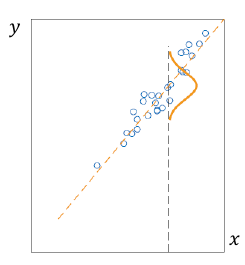
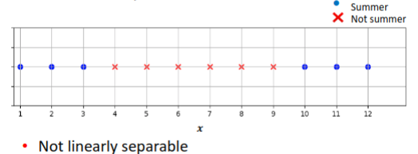
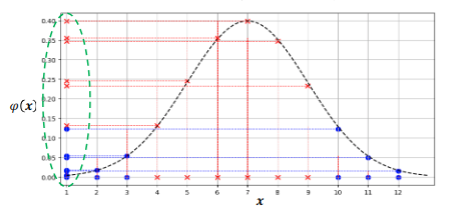

#  Linear Regression via Decision Theory
## Example: Predict Humidity
In regression, the task is to numeric response (aka dependent variable) from features (aka predictors or independent variables)
Assume a linear relation: $H = a + bT$
($H$ - humidity; $T$ - temperature; $a$, $b$, $b$ - parameters)

In this above example, we would iteratively change the slope and bias until we have the lowest possible sum of **squared errors**
## Example: Minimise Sum Squared Errors
To find $a$, $b$ that minimise $L = \sum^{10}_{i=1} (H_i - (a + bT_i))^2$ 
**set derivatives to zero**:

$\frac{\delta L}{\delta a} =2 \sum^{10}_{i=1}(H_i - a - bT_i) = 0$

if we know $b$, then $\hat{a} = \frac{1}{10} \sum^{10}_{i=1} (H_i - bT_i)$

$\frac{\delta L}{\delta b} = -2 \sum^{10}_{i=1}T_i (H_i - a - bT_i) = 0$  

if we know $a$, then $\hat{b} = \frac{1}{\sum^{10}_{i=1}T_i^2} \sum^{10}_{i=1}T_i(H_i - a)$  

## Example: Analytic Solution
- Now we put the two derivatives solved above and put them into a linear combination like that shown below, this is done by bringing out the $H_i$ from the equation
- We have two equations and two unknowns $a$, $b$
- Rewrites as a system of linear equations

$$ \begin{pmatrix}  
   10 & \sum^{10}_{i=1}T_i \\  
   \sum^{10}_{i=1}T_i & \sum^{10}_{i=1}T_i^2
\end{pmatrix}
\begin{pmatrix}  
   a \\  
   b
\end{pmatrix}
= 
\begin{pmatrix}  
   \sum^{10}_{i=1} H_i \\  
   \sum^{10}_{i=1} T_i H_i
\end{pmatrix}
$$

Now let's solve it:

$\sum^{10}_{i=1} T_i = 85 + 80 + 83 + 70 + 68 + 65 + 64 + 72 + 69 + 75 = 731$ 

$\sum^{10}_{i=1} H_i = 85 + 909 + 86 + 96 + 80 + 70 + 65 + 95 + 70 + 80 = 817$ 

$\sum^{10}_{i=1} T_i^2 =  85^2 + 80^2 + 83^2 + 70^2 + 68^2 + 65^2 + 64^2 + 72^2 + 69^2 + 75^2 = 53,929$ 

$\sum^{10}_{i=1} H_i T_i =  85 \times 85 + 80 \times 909 + 83 \times 86 + 70 \times 96 + 68 \times  80 + 65 \times 70+ 64 \times 65+ 72 \times 95+ 69 \times 70+ 75 \times 80$   

$\sum^{10}_{i=1} H_iT_i = 60,103$ 

$10a + \sum^{10}_{i=1}T_ib = \sum^{10}_{i=1}H_i \rightarrow 10a + 731b = 817$   

$a = 81.7 - 73.1b$ 

$\sum^{10}_{i=1}T_ia + \sum^{10}_{i=1}T_i^2b = \sum^{10}_{i=1}T_iH_i \rightarrow 731a + 53,929b = 60,103$  

$731(81.7-73.1b)  + 53,929b = 60,103$  

$b = 0.77$

$a = 81.7 - 73.1 \times 0.77 = 25.3$ 

Analytical solution: $a = 25.3$, $b=0.77$

## More General Decision Rule
- Adopt a linear relationship between response $y \in \mathbb{R}$ and an instance with features $x_1, ..., x_m \in \mathbb{R}$ 

$$
\hat{y} = w_0 +\sum^m_{i=1} x_iw_i
$$

Here $w_0, ..., w_m \in \mathbb{R}$ denote weights (models parameters)
- **Trick**: add a dummy feature $x_0 = 1$ and use vector notation $\hat{y} = \sum^m_{i=0}x_iw_i = x'w$ 

# Linear Regression via Frequentist Probabilistic Model
## Data is Noisy!
**Example**: predict mark for Statistical Machine Learning (SML) from mark for Intro ML (IML aka KT)

## Regression as a Probabilistic Model
- Assume a **probabilistic model**: $Y=X'w + \epsilon$ 
	- Here $X$, $Y$ and $\epsilon$ are random variables
	- Variable $\epsilon$ encodes noise
- Next, assume Gaussian noise (indep. of $X$):
	- $\epsilon \thicksim N(0, \sigma^2)$ 
- Recall that $N(x; \mu, \sigma^2) \equiv \frac{1}{\sqrt{2\pi \sigma^2}} \exp(-\frac{(x - \mu)^2}{2\sigma^2})$  
- Therefore

$$
p_{w,\sigma^2(y|x)} = \frac{1}{\sqrt{2\pi\sigma^2}}\exp(-\frac{(y-x'w)^2}{2\sigma^2})
$$

- Take note of the squared error in the numerator inside the exponential power!

## Derivation of Sum of Squared Errors

$$
p_{w,\sigma^2(y|x)} = \frac{1}{\sqrt{2\pi\sigma^2}}\exp(-\frac{(y-x'w)^2}{2\sigma^2})
$$

1. To simplify the calculations, we will take the negative log likelihood as the loss function.

$$
L = -\log(p_{w,\sigma^2(y|x)} )
$$

$$
L = \log(\frac{1}{\sqrt{2\pi\sigma^2}}) + \frac{1}{2\sigma^2}(y-x'w)^2
$$

2. We can now remove the constants, and what we're left with is the sum of squared errors loss function!

$$
L = (y-x'w)^2
$$

**Note**: Below has a more thorough derivation of this for the _sum_ part of this loss function
## Parametric Probabilistic Model
- Using simplified notation, discriminative model is:

$$
p(x|y) = \frac{1}{\sqrt{2\pi\sigma^2}}\exp(-\frac{(y - x'w)^2}{2\sigma^2})
$$

- Unknown parameters: $w$, $\not {\sigma^2}$ 

 

- Given observed data $\{(X_1, Y_1), ..., (X_n, Y_n)\}$, we want to find parameter values that "best" explain the data
- **Maximum-likelihood estimation**: choose parameter values that maximise the probability of observed data

## Maximum Likelihood Estimation
- Assuming independence of data points, the probability of data is

$$
p(y_1, ..., y_n|x_1, ..., x_n) = \prod^n_{i=1}p(y_i|x_i)
$$

- For $p(y_i|x_i) = \frac{1}{\sqrt{2\pi\sigma^2}} \exp(-\frac{(y_i-x_i'w)^2}{2\sigma^2})$ 
- "Log trick": instead of maximising this quantity, we can maximise its logarithm

$$
\sum^n_{i=1}\log p(y_i|x_i) = \frac{1}{2\sigma^2}\sum^n_{i=1} (y_i - x'_iw)^2 + C
$$

- Under this model, maximising log-likelihood as a function of $w$ is equivalent to minimising the sum of squared errors

## Method of Least Squares
- Training data: $\{(x_1, x_1), ..., (x_n, y_n)\}$. Note bold face in $x_i$ 
- For convenience, place instances in rows (so attributes go in columns), representing training data as an $n \times (m + 1)$ matrix $X$, and $n$ vector $y$ 
- **Probabilistic model**/**decision rule assumes** $y \approx Xw$ 
- To find $w$, minimise the **sum of squared errors**

 $$L = \sum^n_{i=1}(y_i - \sum^m_{j=0}X_{ij}w_j)^2$$  
 
 **Setting derivative to zero** and solving for $w$ yields
 
$$\hat{w} = (X'X)^{-1}X'y$$

- The system of equations called the **normal equations**
- System is well defined only if the inverse exists

# Basis Expansion
## Basis Expansion for Linear Regression
- Real data is likely to be non-linear
- What if we still wanted to use a linear regression?
	- Simple, easy to understand, computationally efficient, etc
- How to marry non-linear data to a linear method?
If you can't beat em, join em!

 

## Transform the Data
- The trick is to **transform the data**: Map data into another features space, s.t. data is linear in that space
- Denote this transformation $\varphi$: $\mathbb{R}^m \rightarrow \mathbb{R}^k$. If $x$ is the original set of features, $\varphi(x)$ denotes new feature set
- **Example**: suppose there is just one feature $x$, and the data is scattered around a parabola rather than a straight line

## Example: Polynomial Regression
- Define 
	- $\varphi_1(x) = x$
	- $\varphi_2(x) = x^2$ 
- Next, apply linear regression to $\varphi_1$, $\varphi_2$ 
 $$ y = w_0 + w_1\varphi_1(x) + w_2\varphi_2(x) = w_0 + w_1 + w_1x + w_2x^2  $$

and here you have quadratic regression - More generally, obtain **polynomial regression** if the new set of attributes are powers of $x$

## Example: Linear Classification
- Example binary problem: Dataset not linearly separable
- Define transformation as

$$
\varphi_i(x) = \lVert x - z_i \rVert
$$

Where $z_i$ some pre-defined constants
- Choose $z_1 = [0,0]' , z_2 = [0, 1]', z_3 = [1,0]', z_4 = [1,1]'$ 

In the above example, what is essentially done is that we find the Euclidean distance between the $x$ components of an instance and the 4 $z$ components. These distances will be used as the $\varphi(x)$ components, and then we will multiply these with 4 $w$ components, where the weights of one class will be much higher than the other class. Once we do the dot product, the output will be distinctly $2$ for one class and $\sqrt{2}$ for the other class, this is then used as a way to classify the dataset into the two linearly inseparable classes.

A demonstration is shown below:

$X = [0,0]$

$\varphi_1(x_1) = \lVert x - z_i \rVert = \sqrt{(0 - 0)^2 + (0 - 0)^2} = 0$

$\varphi_2(x_1) = \sqrt{(0 - 0)^2 + (0 - 1)^2} = 1$ 

$\varphi_3(x_1) = \sqrt{(0-1)^2+ (0-0)^2} = 1$ 

$\varphi_4(x_1) = \sqrt{(0 - 1)^2 + (0 - 1)^2} = \sqrt{2}$ 

$\varphi ' w = 1 \times 0 + 0 \times 1 + 0 \times 1 + \sqrt{2} \times 1 = \sqrt{2}$ 

Therefore, instance 1 is Class A because the dot product is $\sqrt{2}$ 

## Radial Basis Functions
- Previous example: motivated by approximation theory where sums of RBFs approx. functions
- A **radial basis function** is a function of the form $\varphi(x) = \psi(\lVert x - z \rVert)$, where $z$ is a constant
- Examples:
- $\varphi(x) = \lVert x - z \rVert$ 
- $\varphi(x) = \exp(\frac{1}{\sigma}\lVert x - z \rVert^2)$ 

- 

## Example
- Predict whether it is summer based on the month of the year

- Transform using $\varphi(x) = \exp(-\frac{1}{\sigma}\lVert x - 7 \rVert^2)$ 

- New features (points on $y$ axis) are linearly separable
- Could use $\varphi(x)$ and $x$ as features, or drop $x$ 
- Similar result could be achieved with the linear RBF: $\varphi(x) = \lVert x - 7 \rVert$ 

What this above example is basically showing is that you can transform this linearly inseparable data into a gaussian distribution around the mean value of (northern hemisphere) summer month, which in this case is July. This can then be linearly separable as the high $\varphi(x)$ values will imply summer and the very low values will imply winter. 
## Challenges of Basis Expansion
- Basis expansion can significantly increase the utility of methods, especially, linear methods
- In the above examples, one limitation is that the transformation needs to be defined beforehand
	- Need to choose the size of the new feature set
	- If using RBFs, need to choose $z_i$
- Regarding $z_i$ one can choose uniformly spaced points, or cluster training data and use cluster centroids
- Another popular idea is to use training data $z_i \equiv x_i$ 
	- E.g. $\varphi_i(x) = \varphi(\lVert x - x_i \rVert)$ 
	- However, for large datasets, this results in a large number of features $\rightarrow$ computational hurdle

## Exercises
### Exercise 1
If a training problem allows a _closed form solution_, would there be any advantage to using an _iterative gradient based optimisation_ method? Explain. 

- Closed form solution takes $O(n^3)$ while gradient descent is much smaller in time complexity. 

## Exercise 2
Consider a 2-dimensional _dataset_, where each point is represented by two _features_ and the _label_ $(x_1,x_2,y)$. The features are binary, the label is the result of XOR function, and so the data consists of four points $(0,0,0)$, $(0,1,1)$, $(1,1,0)$ and $(1,1,0)$. Design a _feature space transformation_ that would make the data _linearly separable_ 

Point 1: $x_3 = (0-0)^2 = 0$
Point 2: $x_3 = (1 - 0)^2 = 1$
Point 3: $x_3 = (0-1)^2 = 1$
Point 4: $x_3 = (1 - 1)^2 = 0$

We now have a new dimension that separates the four data points by class

## Exercise 3
Consider as an alternate to the popular square loss in supervised regression, the function $(y, \hat{y}) = (\hat{y} − y)^3$ measuring loss between label y and prediction ŷ. Is this loss a good idea or a bad idea? Why? 

This would not be a good loss function because the derivative has no global optimum