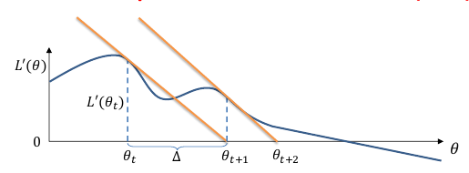

# Gradient Descent
## Optimisation Formulations in ML
- Training = Fitting = Parameter estimation
- Typical **formulation**
$$
\hat{\theta} \in \underset{\theta \in \varTheta}{\text{argmin}} L(data,\theta)
$$
- $\text{argmin}$ because we want a **minimiser** not the **minimum**
	- Note: $\text{argmin}$ can return a set (minimiser not always not **unique**!!)
- $\varTheta$ denotes a **model family** (including constraints)
- L denotes an **objective function** (including constraints)
	- E.g. MLE: (conditional) likelihood
	- E.g. Decision theory: (regularised) empirical risk

## Two Solution Approaches
- Analytic (aka closed form) solution
	- Known only in limited number of cases
	- Use 1st order necessary condition for optimality*:
$$
\frac{\delta L}{\delta \theta_1} = ... = \frac{\delta L}{\delta \theta_1}= 0
$$
- Approximate iterative solution
1. **Initialisation**: choose starting guess $\theta^{(1)}$, set $i = 1$ 
2. **Update**: $\theta^{(i+1)} \leftarrow SomeRule[\theta^{(i)}]$, set $i \leftarrow i + 1$ 
3. **Termination**: decide whether to stop
4. Go to **Step 2**
5. **Stop**: return $\hat{\theta} \approx \theta^{(i)}$ 

## Reminder: The Gradient
- Gradient at $\theta$ defined as $[\frac{\delta L}{\delta \theta_1}, ..., \frac{\delta L}{\delta \theta_p}]'$ evaluated at $\theta$ 
- The gradient points to the direction of maximal change $L(\theta)$ when departing from point $\theta$
- Shorthand notation
- $\nabla L \overset{\text{def}}{=} [\frac{\delta L}{\delta \theta_1}, \frac{\delta L}{\delta \theta_p}]'$ computed at point $\theta$ 
- Here $\nabla$ is the "nabla" symbol 
- **Hessian** matrix at $\theta$: $\nabla L_{ij} = \frac{\delta^2L}{\delta \theta_i \delta \theta_j}$ 

## Gradient Descent and SGD
1. Choose $\theta^{(1)}$ and some $T$
2. For $i$ from $1$ to $T^*$ 
	1. $\theta^{(i+1)} = \theta^{(i)} - \eta \nabla L(\theta^{(i)})$  
3. Return $\hat{\theta} \approx \theta^{(i)}$ 
- Note: $\eta$ dynamically updated per step
- Variants: Momentum, AdaGrad, ...
- Stochastic gradient: two loops
	- Outer for loop: each loop (called **epoch**) sweeps through all training data
	- Within each epoch, randomly shuffle training data; then for loop: do gradient steps only on batches of data. Batch might be 1 or few

## Convex Objective Functions
- 'Bowl shaped' functions
- Informally: if line segment between any two points on graph of function lies above or on graph
- Formally* $f: D \rightarrow \mathbb{R}$ is convex if $\forall a, b \in D, t \in [0,1]$: $f(ta + (1-t)b) \leq tf(a) + (1-t)f(b)$ 
- Strictly convex if inequality is strict (<)
- Gradient descent on (strictly) convex function guaranteed to find a (unique) global minimum!

In simpler terms:
1. **Domain (D)**: The function $f$ is defined on a certain domain $D$. This is the set of input values for which the function is defined.
2. **Convex Combination**: The term $ta+(1−t)b$ represents a convex combination of two points $a$ and $b$, where $t$ is a weight between 0 and 1. When $t=0$, you get point $b$, and when $t=1$, you get point $a$. For values of $t$ between 0 and 1, you get a weighted average between $a$ and $b$.
3. **Convexity Property**: The definition asserts that for any two points $a$ and $b$ within the domain $D$, the value of the function at the convex combination of $a$ and $b$ (i.e., $f(ta+(1−t)f(b)$) should be less than or equal to the weighted sum of the function values at $a$ and $b$ (i.e., $tf(a)+(1-t)f(b)$).

In even simpler terms, this property implies that the line segment connecting any two points on or above the graph of a convex function lies entirely above the graph itself. In other words, if you consider the chord connecting two points on a convex function's graph, the graph of the function does not dip above that chord.

This geometric interpretation is important because it has implications for optimisation. When dealing with convex optimisation problems (minimising convex functions), finding the minimum becomes much easier and well-behaved compared to non-convex functions. Convex optimisation has efficient algorithms that can guarantee finding the global minimum, and there are well-defined optimality conditions.

# Newton-Raphson

- Critical points of $L(\theta) = \text{} L'(\theta)$
- Crossing case of scalar $\theta$. Starting at given/random $\theta_0$, iteratively:
1. Fit tangent line to $L'(\theta)$ at $\theta_t$ 
2. Need to find $\theta_{t+1} = \theta_t +\Delta$ using linear approximation's zero crossing
3. Tangent line given by derivative: $rise/run = -L^"(\theta_t) = L'(\theta_t)/\Delta$ 
4. Therefore iterate is $\theta_{t+1} = \theta_t - L'(\theta_t)/L^"(\theta_t)$ 

## Newton-Raphson: General Case
- Newton-Raphson summary
	- Finds $L'(\theta)$ zero-crossings
	- By successive linear approximations to $L'(\theta)$ 
	- Linear approximations involve derivative of $L'(\theta)$, i.e. $L^"(\theta)$ 
- Vector-valued $\theta$:
- How to fix scalar $\theta_{t+1} = \theta_t - L'(\theta_t)/L^"(\theta_t)$???
	- $L'(\theta)$ is $\nabla L(\theta)$ 
	- $L^"(\theta)$ is $\nabla_2 L(\theta)$ 
	- Matrix division is matrix inversion
- General case: $\theta_{t+1} = \theta_t - (\nabla_2 L(\theta_t))^{-1}\nabla L(\theta_t)$   
	- Pro: May converge faster; fitting a quadratic with curvature information
	- Con: Sometimes computationally expensive, unless approximating Hessian

# Logistic Regression Model
## Binary Classification: Example
- Example: given body mass index (BMI) does a patient have type 2 diabetes (T2D)?
- This is (supervised) binary classification
- One could use linear regression
	- Fit a line/hyperline to data (find weights $w$)
	- Denoted $s \equiv x'w$ 
	- Predict "Yes" if $s \geq 0.5$ 
	- Predict "No" if $s < 0.5$ 
 

## Why Not Linear Regression
- Due to the square loss, points far from boundary have loss squared - even if they're confidently correct!
- Such "outliers" will "pull at" the linear regression
- Overall, the least-squares criterion looks unnatural in this setting

- Probabilistic approach to classification
	- $P(Y=1|x)=f(x)= ?$ 
	- Use a linear function? E.g., $s(x)=x'w$ 
- Problem: the probability needs to be between to be between 0 and 1.
- Logistic function $f(s) = \frac{1}{1+\exp(-s)}$ 
- Logistic regression model
	$P(Y=1|x) = \frac{1}{1+\exp(-x'w)}$ 
	

## How is Logistic Regression Linear?
- Logistic regression model:
$$
P(Y=1|x) = \frac{1}{1+\exp(-x'w)}
$$
- Classification rule:
	if ($P(Y=1|x)>\frac{1}{2}$) then class "1", else class "0"
- Decision boundary is the set of $x$'s such that:
$$
\frac{1}{1+\exp(-x'w)}=\frac{1}{2}
$$

A further note on what this means, basically we can classify a machine learning models as linear functions if they separate classes using a straight line or a hyperplane. Therefore if we can see if the decision boundary for logistic regression can be represented as the equivalent of something like $w'x + b$, then we can say that it is a linear function.

The decision boundary for the logistic function is 0.5, therefore we will solve the equation by substituting this into the equation.

$$
\frac{1}{1+\exp(-x'w)}=\frac{1}{2}
$$

This will give us this solution:
$$
x'w = 0
$$

Since this is a clear boundary that can classify classes that are $< 0$ and $> 0$, we can therefore conclude that logistic regression is indeed a linear classifier.

## Effect of Parameter Vector (2D problem)
- Decision boundary is the line where $P(Y=1|x) = 0.5$ 
	- In higher dimensional problems, the decision is a plane or hyperplane
- Vector $w$ is perpendicular to the decision boundary (see linear algebra review topic)
	- That is, $w$ is a normal to the decision boundary
	- Note: in this illustration we assume $w_0 = 0$ for simplicity

## Training as Max-Likelihood Estimation
- Assuming independence, probability of data
$$
p(y_1, ..., y_n|x_1, ..., x_n) = \prod^n_{i=1}p(y_i|x_i)
$$
- Assuming Bernoulli distribution we have
$$
p(y_i|x_i) = (\theta(x_i))^{y_i}(1-\theta(x_i))^{1-y_i}
$$
	where $\theta(x_i) = \frac{1}{1+\exp(-x_i'w)}$ 
- Training: maximise this expression this wrt weights $w$

## Apply Log Trick, Simplify
- Instead of maximising likelihood, maximise its logarithm

$\log(\prod^n_{i=1}p(y_i|x_i)) = \sum^n_{i=1}\log p(y_i|x_i)$

$= \sum^n_{i=1}\log((\theta(x_i))^{y_i}(1-\theta(x_i))^{1-y_i})$

$= \sum^n_{i=1}(y_i\log(\theta(x_i))+ (1-y_i)\log(1-\theta(x_i)))$  

Now substitute in the logistic function and simplify

$= \sum^n_{i=1}(y_i\log((1+\exp(-wx_i))^{-1}) + (1-y_i)\log(1 - (1+\exp(-wx_i))^{-1}))$   

$= \sum^n_{i=1}(-y_i\log((1+\exp(-wx_i))+ (1-y_i)\log(\frac{\exp(-wx_i)}{1+\exp(-wx_i)}))$  

$= \sum^n_{i=1}(-y_i\log((1+\exp(-wx_i))+ (1-y_i)(\log(\exp(-wx_i))-\log(1+\exp(-wx_i))))$

$= \sum^n_{i=1}(-y_i\log((1+\exp(-wx_i))+ (1-y_i)(-wx_i-\log(1+\exp(-wx_i))))$

$= \sum^n_{i=1}(-y_i\log((1+\exp(-wx_i))+ (1-y_i)(-wx_i-\log(1+\exp(-wx_i))))$ 

$= \sum^n_{i=1}(-wx_i-\log(1+\exp(-wx_i))) + y_iwx_i$) 

Therefore, we have the following equation as the simplification

$$\nabla L=\sum^n_{i=1}((y_i-1)x_i'w-\log(1+\exp(-x_i'w)))$$

# Logistic Regression: Decision-Theoretic View
## Background: Cross Entropy
- Cross entropy is an information-theoretic method for comparing two distributions
- Cross entropy is a measure of a divergence between reference distribution $g_{ref}(a)$ and estimated distribution $g_{est}(a)$. For discrete distributions:
$$
H(g_{ref},g_{est}) = -\sum_{a \in A} g_{ref}(a)\log g_{est}(a)
$$
$A$ is support of the distributions, e.g., $A=\{0,1\}$ 

## Training as Cross-Entropy Minimisation
- Consider log-likelihood for a single point
$$
\log p(y_i|x_i) = y_i\log(\theta(x_i)) +(1-y_i)\log(1-\theta(x_i))
$$
- Cross entropy $H(g_{ref}, g_{ref}) = -\sum_a g_{ref}(a) \log g_{est}(a)$ 
- If reference (true) distribution is
$$
g_{ref}(1) = y_i \text{ and } g_{ref}(0) = 1-y_i
$$
- With logistic regression estimating this distribution as
$$
g_{est}(1) = \theta(x_i) \text{ and } g_{est}(0) = 1 - \theta(x_i)
$$

- It finds $w$ that minimises sum of cross entropies per training point

To further explain on this, we will do an example. Say we have the following output from a logit function, $\theta (x_i) = 0.7$. If we plug this into the cross entropy function, it will look like this:
$$
L = 0.7\log(1) + 0.3\log(0)
$$

This is basically like saying compare the level of _surprise_ for both binary options, 0 and 1. And acts in much the same way as if we just took the logarithm of the joint probability of the **Bernoulli distribution**. So both cross-entropy and maximum-likelihood estimator have a similar relationship, it's just that the cross entropy wants to minimise the amount of **_surprise_** in the problem, and MLE wants to maximise the **_probability_** of an outcome - basically the same thing!!

# Training Logistic Regression: the IRLS Algorithm
## Iterative Optimisation
- Training logistic regression: $w$ maximising log-likelihood $L(w)$ or minimising cross-entropy loss
- **Bad news**: Problem is strictly convex, if no irrelevant features $\rightarrow$ convergence!

## Gradient Descent for Logistic Regression

$$u(z) = \frac{1}{1+\exp(-z)}$$
$$\frac{\delta \mu}{\delta z} = \mu(z)(1-\mu(z))$$
$$
L(w) = \log p(y_i|x_i) = y_i \log(\mu(x_i)) + (1-y_i) \log(1-\mu(x_i))
$$

Now let's find a derivative with respect to $w$

$\frac{\delta L(w)}{\delta w_j} = [\frac{y}{\mu(w^T x)} - \frac{1-y}{1-\mu(w^T x)}] \frac{\delta}{\delta w} \mu(w^Tx)$ 

$\frac{\delta L(w)}{\delta w_j} = [\frac{y}{\mu(w^T x)} - \frac{1-y}{1-\mu(w^T x)}] \mu(w^Tx)[1-\mu(w^Tx)]x_j$ 

$\frac{\delta L(w)}{\delta w_j} = [\frac{y-\mu}{\mu(1-\mu)}] \mu(w^Tx)[1-\mu(w^Tx)]x_j$ 

Therefore

$$
\nabla  L(w) = \sum^n_{i=1} (y_i - \mu(x_i))x_i
$$

$$
\nabla L(w) = X'(y-\mu)
$$

## Iteratively-R$x_i$eweighted Least Squares
- Instead of GD, let's apply Newton-Raphson $\rightarrow$ IRLS algorithm
- Recall: $\nabla L(w) = X'(y - \mu)$. Differentiate again for Hessian:
	$\nabla_2 L (w) = -\sum_i \frac{\delta \mu}{\delta z_i}x_i' = -\sum_i \mu(x_i) (1 - \mu(x_i))x_ix_i'$ 
	$\ \ \ \ \ \ \ \ \ \ \ \ \ \ =-X'MX$, where $M_{ii}=\mu_i(1-\mu)$ otherwise 0
- Newton-Raphson then says (now with $M_t$, $\mu_t$ dependence on $w_t$) 
$w_{t+1}=w_t-(\nabla_2L)^{-1}\nabla L = w_t + (X'M_tX)^{-1}X'(y-\mu_t)$ 

$\ \ \ \ \ \ \ \ = (X'M_tX)^{-1}[X'M_tXw_t + X'(y-\mu_t)]$

$\ \ \ \ \ \ \ \ = (X'M_tX)^{-1}X'M_tb_t$, where $b_t = Xw_t + M_t^{-1}(y-\mu_t)$ 

- If you can notice, the above equation looks just like the normal equation

- Each IRLS iteration solves a least problem weighted by $M_t$, which are reweighted iteratively!

## IRLS Intuition
IRLS: $w_{t+1} = (X'M_tX)^{-1}X'M_tb_t$ 
where $b_t = Xw_t + M_t^{-1}(y-\mu_t)$ 
and $M_{ii} = \mu_t(x_i)[1-\mu_t(x_i)]$ otherwise 0
and $\mu_t(x) = [1+\exp(-w_t'x)]^{-1}$ 

### Putting Labels on Linear Scale
- The $y$ are not on linear scale. Invert logistic function?
- The $b_t$ are a "linearised" approximation to these: the $b_t$ equation matches a linear approx. to $\mu_T^{-1}(y)$ 
- Linear regression on new labels!

### Equalising Label Variance
- In linear regression, each $y_i$ has equal variance $\sigma^2$ 
- Our $y_i$ are Bernoulli, variance: $\mu_t(x_i)[1-\mu_t(x_i)]$ 
- Our reweighted standardises, dividing by variances!!
