# Probability
## Axioms of Probability
Let $S$ be the sample space and $A_i$, $A_j$ be events in $S$, i.e. $A \in S$:
1. $P(A) \geq 0$
2. $P(S) = 1$
3. $\cap A_i = \emptyset \text{ then } \cup P(A_i) = P(A_i) + P(A_2) ...$ , _this can also be described as_: $A \cap B = \emptyset \text{ then } P(A \cup B) = P(A) + P(B)$

An example of this is demonstrated below, as it can be seen with the two sets below, there is no intersection between the two sets, therefore the probability of either event happening, i.e. _the joint probability_ $P(A \cup B)$, is simply equal to the probability of both events occurring.

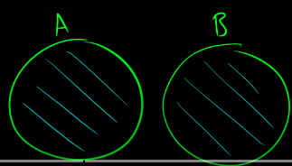

## Random Variables
**Random variables** map outcomes of random processes to numbers, in other words, a random variable $X$ is a numeric function of
outcome $X(\omega) ∈ R$. One example would be as shown below:

$$X = \begin{cases}
   1 &\text{if } heads \\
   0 &\text{if } tails
\end{cases}$$

Note that the random variable $X$ is **capitalised**, this is the common convention for random variables. The value of 1 was assigned to $heads$ and 0 to $tails$, these values can be anything in reality, even 100 and 703, it doesn't really matter. But conventionally, we will use 0 and 1.

The point of random variables is so that we can simplify the expressions in our probability equations, for example:
$$Y = \text{sum of upfacing die after 7 rolls}$$
This is a bit of a mouthful, so instead of writing: $$P(\text{sum of upfacing die after 7 rolls} \geq 30)$$
You could write it like: $$P(Y \geq 30)$$
## Discrete vs. Continuous Distributions
### Discrete Data
Discrete data is data that can be **counted** rather than measured, or having a discrete value (i.e. 0, 1, 2, etc) applied to it. Examples include:
- The number of doctors in a town
- The number of cats in a neighbourhood
- The number of heads landed when flipping a coin

Discrete data on a graph will also not be connected, it will show jumps in the data, as shown below:

### Continuous Data
Continuous data on the other hand, is data which can be **measured**, and can be a real number. Examples include:
- The body weight of a client
- The volume of gas in a car
- The total profit of a company

Continuous data on a graph is connected, as shown below:

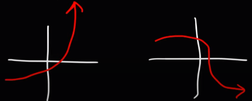

### Discrete Distribution Functions
Discrete data is described by the **probability mass function** (PMF), an example is shown below:

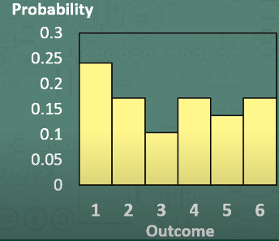

In this distribution, we would calculate probability in the following way: $$P(X \leq x) = \sum^x_{a=- \infty} P(a)$$
In the example above, if we wanted $P(X \leq 3)$, we would do the following:
$$P(X \leq 3) = P(X = 1) + P(X = 2) + P(X = 3)$$

Examples of discrete distribution functions include the following:
- Multinomial
- Poisson
- Bernoulli
- Binomial

### Continuous Distribution Function
Continuous data is described by the **probability density function** (PDF), an example is shown below:

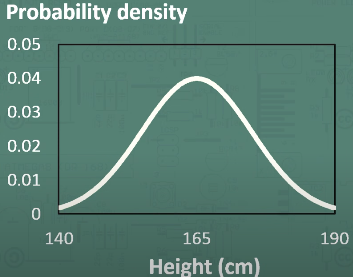

In this distribution, we could calculate the probability in the following way: $$P(X \leq x) = \int^x_{} P(a)\delta a$$
In the example above, if we wanted $P(X \leq 160)$, we would find the area under the curve, as shown in the picture below:

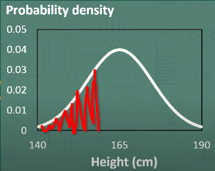

Examples of continuous distribution functions include the following:
- Uniform
- Normal
- Laplace
- Gamma
- Beta
- Dirichlet

## Expectation
An expected value $E[X]$ is simply the random variable that is expected to be the outcome from a probability distribution, which just so happens to be the mean value $\mu$. In a Gaussian distribution, as shown in the probability density function graph above, the mean is the centre of the distribution, which _just so happens to be_ the most likely outcome in that given probability space, a.k.a our **expected value**.

For discrete values, the way to calculate the expected value is as follows:
$$E[X] = \sum_x xP(X=x)$$
An example may be the following:
 $X = \text{no. of workouts in a week}$

| X | P(x) |
|---|------|
| 0 | 0.1  |
| 1 | 0.15 |
| 2 | 0.4  |
| 3 | 0.25 |
| 4 | 0.1  |

To calculate this, we will do the following:

$E[X] = \mu_X = 0 \times 0.1 + 1 \times 0.15 + 2 \times 0.4 + 3 \times 0.25 + 4 \times 0.1 = 2.1$
$E[X] = 2.1$

This means that it's _expected_ that the number of workouts that this person will do per week is 2.1.

For continuous values, the way to calculate the expected value is as follows: 
$$E[X] = \int_x xP(X=x) \delta x$$
An example for how we would calculate this is shown below, we calculate the areas under the curve for a set interval, by multiplying the height and width.

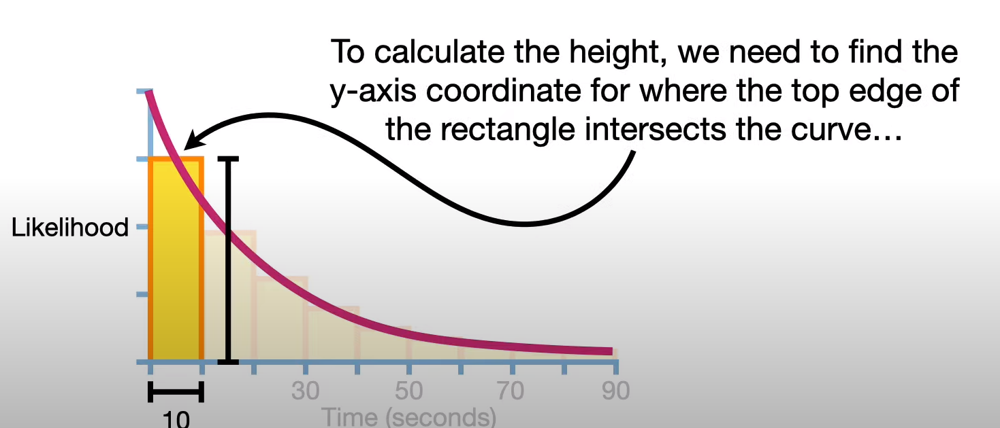

We do this for each interval as shown below, then we multiply each area by the value on the graph.

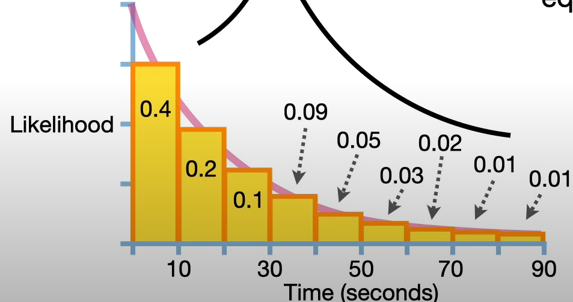

$E[X] = 0.4 \times 10 + 0.2 \times 20 + 0.1 \times 30 + 0.09 \times 40 + 0.05 \times 50 + 0.03 \times 60 + 0.02 \times 70 + 0.01 \times 80 + 0.01 \times 90$
$E[X] = 22$

### The Linearity Property of Expectation
Expectation has a linear property, meaning that if we have an expected value $E[X]$, and we want to increase the expected value by $aX + b$, then can calculate this by applying the following calculation:
$$E[aX+b] = aE[X] + b$$
Another instance of this rule can be if you want to increase the expected value $E[X]$ by $Y$, then we can calculate this by applying the following calculation:
$$E[X + Y] = E[X] + E[Y]$$
A simple example may be if you want to increase everyone's salaries by 2 with a bonus of $100, with a prior expected salary of $60,000, then we can calculate the expected salary after the raise as:

$Y = 2E[X] + 100$

$E[Y] = 2 \times 60,000 + 100$

$E[Y] = 120,100$

### The Monotonic Property of Expectation
This simply means that if a random variable $X$ is less than or equal to random variable $Y$, ($X \leq Y$), then $E[X]$ will also be less than or equal to $E[Y]$:
$$X \leq Y \mapsto E[X] \leq E[Y]$$
### Variance from Expectation
Variance can be calculated from expectation with the following formula:
$$Var(X) = E[(X) - E[X])^2]$$
This can be made even simpler with the following formula:
$$Var(X) = E(X^2) - E(X)^2$$
Now let's just take an example where we have data that 60% of Americans approve of the president's work, so you sample 2 people to see if they approve. You get a probability distribution for the outcome as follows:

| $X$    | 0    | 1    | 2    |
|------|------|------|------|
| $p(X)$ | 0.16 | 0.48 | 0.36 |

To calculate the **variance** we first calculate the **expected value**
$E[X] = 0 \times 0.16 + 1 \times 0.48 + 2 \times 0.36$
$E[X] = 1.2$

Now we calculate $E[X]^2$

$E[X]^2 = 1.2^2$

$E[X]^2 = 1.44$

Now we can calculate $E[X^2]$

$E[X^2] = 0^2 \times 0.16 + 1^2 \times 0.48 + 2^2 \times 0.36$

$E[X^2] = 1.92$

Now plug them into the formula:
$Var(X) = 1.92 - 1.44$

$Var(X) = 0.48$

## Multivariate Distributions
Much like the univariate cases for probability distribution, there exists probability distributions for multivariate cases. Below shows a Gaussian distribution, but in 3D.

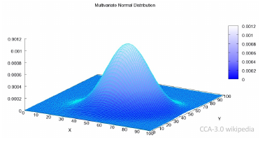

To calculate the joint probabilities from the probability mass function or probability density function, it is just like the univariate method, but we add an extra dimension. Imagine instead of taking the area under the graph, you now take the volume under the graph. The height will be $P(x,y)$, the width will be $x$, and the breadth will be $y$.

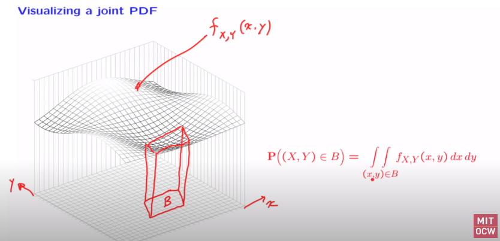

The formulas for calculating these probabilities are as shown below:
**Discrete**:  $P(X, Y \in A) = \sum_{(x,y)\in A} p(x,y)$
**Continuous**:  $P(X, Y \in A) = \int_A p(x,y)dx dy$

## Independence and Conditioning
$X$ and $Y$ are **independent** if:
- **Discrete**: $P(X \in A, Y \in B) = P(X \in A)P(Y \in B)$
- **Continuous**: $p_{x,y}(x,y) = p_x(x)p_y(y)$

What this means is that knowing $Y$ doesn't have any influence over $X$. Algebraically, this means that the joint on $X,Y$ factorises.

### Conditional Probability
In summary, conditional probability is calculated as follows:
- **Discrete**: $P(A|B) = \frac{P(A \cap B)}{P(B)}$
- **Continuous**: $p(y|x) = \frac{p(x,y)}{p(x)}$
What this means is that what is the probability of event $A$ given that we know that event $B$ has happened.

To calculate the **joint probability** given the **conditional probability**, we use the following formula:
$$P(A \cap B) = P(A|B)P(B)$$
Using conditional probabilities, we can tell if $X,Y$ are **independent** if $P(Y=y|X=x) = P(Y=y)$.

In the following graph, we can see that $x$ clearly influences $y$ given that the expected value of $x$ is proportional with the given values of $y$.

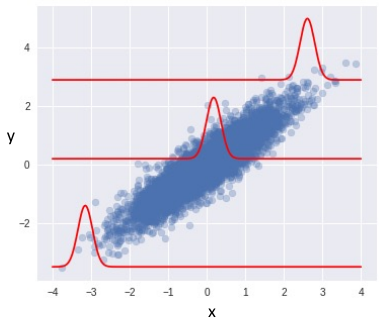

## Inverting Conditioning: Bayes' Theorem
Bayes Theorem defines the following formula:
$$P(A|B) = \frac{P(B|A)P(A)}{P(B)}$$
This rule allows us to swap between $P(A|B)$ and $P(B|A)$.
Probabilistic and Bayesian inference make heavy use of:
- **Marginals**: the probabilities of individual variables
- **The Sum Rule** of marginalisation: this sums away all but the random variable of interest. It uses the following formula:
$$P(A) = \sum_b P(A, B=b)$$
**Example**:
We want to know the probability of success of movies of a specific genre ($A=\{comedy, thriller, romance\}$). But we only have data on movie success probabilities in a specific market, namely ($\beta = \{EU, NA, AUS\}$).

$P(A) = \underset{b \in \beta} \sum P(A, B=b)$

# Vectors
## What are Vectors?
Suppose $u = [u_1, u_2]'$. What does $u$ really represent?
- **Ordered set of numbers**: 
	$\{u_1, u_2, u_3, u_4, u_5, u_6\}$ 
- **Cartesian coordinates of a point**:

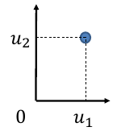

 - **A direction**:

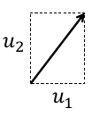

## Dot Product: Algebraic Definition
Given two $m$-dimensional vectors $u$ and $v$, their dot product is:
$$u \cdot v \equiv u'v \equiv \sum^m_{i=1}u_iv_i$$
$u'$ in this case means that $u$ has been transposed. We turn $u$ on its side and then move left to right across $u$ and top to bottom across $v$. An example is as follows:

$a = [2.0, 1.4, 4.6, 5.5]$, $b = [1.0, 2.4, 6.6, 2.5]$

Imagine that both are vertical, we now transpose $a$ and make it horizontal and do the dot product like below.

$a \cdot b = 2 \times 1 + 1.4 \times 2.4 + 4.6 \times 6.6 + 5.5 \times 2.5$

$a \cdot b = 49.47$

If $k$ is a scalar, $a, b, c$ are vectors then:

$(ka)'b = k(a'b) = a'(kb)$
$a'(b+c)=a'b+a'c$

This basically means that the constant will be broadcasted over the whole of one vector, and the dot product will apply be broadcasted over both vectors if the vectors are being added.

## Dot Product: Geometric Definition
Given two $m$-dimensional Euclidean vectors $u$ and $v$, their dot product is: 
$$u \cdot v \equiv u'v \equiv \lVert u \rVert \lVert v \rVert \cos \theta$$
$\lVert u \rVert$ and $\lVert v \rVert$ mean the $L_2$ norms for $u$, $v$, which is the like the right angle distance of a side on a triangle. 

$\theta$ is the angle between the vectors

For example the euclidean distance of the below vectors can be calculated as such:

$v = [2.0, 1.4, 4.6]$, $u = [1.0, 2.4, 6.6]$, $\theta = 60$ 

$\lVert v \rVert = \sqrt{2^2 + 1.4^2 + 4.6^2}$

$\lVert v \rVert = 5.21$

$\lVert u \rVert = \sqrt{1^2 + 2.4^2 + 6.6^2}$

$\lVert u \rVert = 7.09$

$u \cdot v = 5.21 \times 7.09 \times \cos(60)$

$u \cdot v = -35.18$

The **scalar projection** of $u$ onto $v$ is given by:
$$u_v = \lVert u \rVert \cos \theta$$

This visually can be seen below, which basically casts a shadow on the other vector.

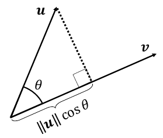

Thus dot product is:
$$u'v = u_v \lVert v \rVert = v_u \lVert u \rVert$$
## Geometric Properties of the Dot Product
