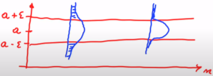

# Probability
## Axioms of Probability
Let $S$ be the sample space and $A_i$, $A_j$ be events in $S$, i.e. $A \in S$:
1. $P(A) \geq 0$
2. $P(S) = 1$
3. $\cap A_i = \emptyset \text{ then } \cup P(A_i) = P(A_i) + P(A_2) ...$ , _this can also be described as_: $A \cap B = \emptyset \text{ then } P(A \cup B) = P(A) + P(B)$

An example of this is demonstrated below, as it can be seen with the two sets below, there is no intersection between the two sets, therefore the probability of either event happening, i.e. _the joint probability_ $P(A \cup B)$, is simply equal to the probability of both events occurring.

## Random Variables
**Random variables** map outcomes of random processes to numbers, in other words, a random variable $X$ is a numeric function of
outcome $X(\omega) ∈ R$. One example would be as shown below:

$$X = \begin{cases}
   1 &\text{if } heads \\
   0 &\text{if } tails
\end{cases}$$

Note that the random variable $X$ is **capitalised**, this is the common convention for random variables. The value of 1 was assigned to $heads$ and 0 to $tails$, these values can be anything in reality, even 100 and 703, it doesn't really matter. But conventionally, we will use 0 and 1.

The point of random variables is so that we can simplify the expressions in our probability equations, for example:
$$Y = \text{sum of upfacing die after 7 rolls}$$
This is a bit of a mouthful, so instead of writing: $$P(\text{sum of upfacing die after 7 rolls} \geq 30)$$
You could write it like: $$P(Y \geq 30)$$
## Discrete vs. Continuous Distributions
### Discrete Data
Discrete data is data that can be **counted** rather than measured, or having a discrete value (i.e. 0, 1, 2, etc) applied to it. Examples include:
- The number of doctors in a town
- The number of cats in a neighbourhood
- The number of heads landed when flipping a coin

Discrete data on a graph will also not be connected, it will show jumps in the data, as shown below:

### Continuous Data
Continuous data on the other hand, is data which can be **measured**, and can be a real number. Examples include:
- The body weight of a client
- The volume of gas in a car
- The total profit of a company

Continuous data on a graph is connected, as shown below:

### Discrete Distribution Functions
Discrete data is described by the **probability mass function** (PMF), an example is shown below:

In this distribution, we would calculate probability in the following way: $$P(X \leq x) = \sum^x_{a=- \infty} P(a)$$
In the example above, if we wanted $P(X \leq 3)$, we would do the following:
$$P(X \leq 3) = P(X = 1) + P(X = 2) + P(X = 3)$$

Examples of discrete distribution functions include the following:
- Multinomial
- Poisson
- Bernoulli
- Binomial

### Continuous Distribution Function
Continuous data is described by the **probability density function** (PDF), an example is shown below:

In this distribution, we could calculate the probability in the following way: $$P(X \leq x) = \int^x_{} P(a)\delta a$$
In the example above, if we wanted $P(X \leq 160)$, we would find the area under the curve, as shown in the picture below:

Examples of continuous distribution functions include the following:
- Uniform
- Normal
- Laplace
- Gamma
- Beta
- Dirichlet

## Expectation
An expected value $E[X]$ is simply the random variable that is expected to be the outcome from a probability distribution, which just so happens to be the mean value $\mu$. In a Gaussian distribution, as shown in the probability density function graph above, the mean is the centre of the distribution, which _just so happens to be_ the most likely outcome in that given probability space, a.k.a our **expected value**.

For discrete values, the way to calculate the expected value is as follows:
$$E[X] = \sum_x xP(X=x)$$
An example may be the following:
 $X = \text{no. of workouts in a week}$

| X | P(x) |
|---|------|
| 0 | 0.1  |
| 1 | 0.15 |
| 2 | 0.4  |
| 3 | 0.25 |
| 4 | 0.1  |

To calculate this, we will do the following:

$E[X] = \mu_X = 0 \times 0.1 + 1 \times 0.15 + 2 \times 0.4 + 3 \times 0.25 + 4 \times 0.1 = 2.1$
$E[X] = 2.1$

This means that it's _expected_ that the number of workouts that this person will do per week is 2.1.

For continuous values, the way to calculate the expected value is as follows: 
$$E[X] = \int_x xP(X=x) \delta x$$
An example for how we would calculate this is shown below, we calculate the areas under the curve for a set interval, by multiplying the height and width.

We do this for each interval as shown below, then we multiply each area by the value on the graph.

$E[X] = 0.4 \times 10 + 0.2 \times 20 + 0.1 \times 30 + 0.09 \times 40 + 0.05 \times 50 + 0.03 \times 60 + 0.02 \times 70 + 0.01 \times 80 + 0.01 \times 90$
$E[X] = 22$

### The Linearity Property of Expectation
Expectation has a linear property, meaning that if we have an expected value $E[X]$, and we want to increase the expected value by $aX + b$, then can calculate this by applying the following calculation:
$$E[aX+b] = aE[X] + b$$
Another instance of this rule can be if you want to increase the expected value $E[X]$ by $Y$, then we can calculate this by applying the following calculation:
$$E[X + Y] = E[X] + E[Y]$$
A simple example may be if you want to increase everyone's salaries by 2 with a bonus of $100, with a prior expected salary of $60,000, then we can calculate the expected salary after the raise as:

$Y = 2E[X] + 100$

$E[Y] = 2 \times 60,000 + 100$

$E[Y] = 120,100$

### The Monotonic Property of Expectation
This simply means that if a random variable $X$ is less than or equal to random variable $Y$, ($X \leq Y$), then $E[X]$ will also be less than or equal to $E[Y]$:
$$X \leq Y \mapsto E[X] \leq E[Y]$$
### Variance from Expectation
Variance can be calculated from expectation with the following formula:
$$Var(X) = E[(X) - E[X])^2]$$
This can be made even simpler with the following formula:
$$Var(X) = E(X^2) - E(X)^2$$
Now let's just take an example where we have data that 60% of Americans approve of the president's work, so you sample 2 people to see if they approve. You get a probability distribution for the outcome as follows:

| $X$    | 0    | 1    | 2    |
|------|------|------|------|
| $p(X)$ | 0.16 | 0.48 | 0.36 |

To calculate the **variance** we first calculate the **expected value**
$E[X] = 0 \times 0.16 + 1 \times 0.48 + 2 \times 0.36$
$E[X] = 1.2$

Now we calculate $E[X]^2$

$E[X]^2 = 1.2^2$

$E[X]^2 = 1.44$

Now we can calculate $E[X^2]$

$E[X^2] = 0^2 \times 0.16 + 1^2 \times 0.48 + 2^2 \times 0.36$

$E[X^2] = 1.92$

Now plug them into the formula:
$Var(X) = 1.92 - 1.44$

$Var(X) = 0.48$

## Multivariate Distributions
Much like the univariate cases for probability distribution, there exists probability distributions for multivariate cases. Below shows a Gaussian distribution, but in 3D.

To calculate the joint probabilities from the probability mass function or probability density function, it is just like the univariate method, but we add an extra dimension. Imagine instead of taking the area under the graph, you now take the volume under the graph. The height will be $P(x,y)$, the width will be $x$, and the breadth will be $y$.

The formulas for calculating these probabilities are as shown below:
**Discrete**:  $P(X, Y \in A) = \sum_{(x,y)\in A} p(x,y)$
**Continuous**:  $P(X, Y \in A) = \int_A p(x,y)dx dy$

## Independence and Conditioning
$X$ and $Y$ are **independent** if:
- **Discrete**: $P(X \in A, Y \in B) = P(X \in A)P(Y \in B)$
- **Continuous**: $p_{x,y}(x,y) = p_x(x)p_y(y)$

What this means is that knowing $Y$ doesn't have any influence over $X$. Algebraically, this means that the joint on $X,Y$ factorises.

### Conditional Probability
In summary, conditional probability is calculated as follows:
- **Discrete**: $P(A|B) = \frac{P(A \cap B)}{P(B)}$
- **Continuous**: $p(y|x) = \frac{p(x,y)}{p(x)}$
What this means is that what is the probability of event $A$ given that we know that event $B$ has happened.

To calculate the **joint probability** given the **conditional probability**, we use the following formula:
$$P(A \cap B) = P(A|B)P(B)$$
Using conditional probabilities, we can tell if $X,Y$ are **independent** if $P(Y=y|X=x) = P(Y=y)$.

In the following graph, we can see that $x$ clearly influences $y$ given that the expected value of $x$ is proportional with the given values of $y$.

## Inverting Conditioning: Bayes' Theorem
Bayes Theorem defines the following formula:
$$P(A|B) = \frac{P(B|A)P(A)}{P(B)}$$
This rule allows us to swap between $P(A|B)$ and $P(B|A)$.
Probabilistic and Bayesian inference make heavy use of:
- **Marginals**: the probabilities of individual variables
- **The Sum Rule** of marginalisation: this sums away all but the random variable of interest. It uses the following formula:
$$P(A) = \sum_b P(A, B=b)$$
**Example**:
We want to know the probability of success of movies of a specific genre ($A=\{comedy, thriller, romance\}$). But we only have data on movie success probabilities in a specific market, namely ($\beta = \{EU, NA, AUS\}$).

$P(A) = \underset{b \in \beta} \sum P(A, B=b)$

# Vectors
## What are Vectors?
Suppose $u = [u_1, u_2]'$. What does $u$ really represent?
- **Ordered set of numbers**: 
	$\{u_1, u_2, u_3, u_4, u_5, u_6\}$ 
- **Cartesian coordinates of a point**:

 - **A direction**:

## Dot Product: Algebraic Definition
Given two $m$-dimensional vectors $u$ and $v$, their dot product is:
$$u \cdot v \equiv u'v \equiv \sum^m_{i=1}u_iv_i$$
$u'$ in this case means that $u$ has been transposed. We turn $u$ on its side and then move left to right across $u$ and top to bottom across $v$. An example is as follows:

$a = [2.0, 1.4, 4.6, 5.5]$, $b = [1.0, 2.4, 6.6, 2.5]$

Imagine that both are vertical, we now transpose $a$ and make it horizontal and do the dot product like below.

$a \cdot b = 2 \times 1 + 1.4 \times 2.4 + 4.6 \times 6.6 + 5.5 \times 2.5$

$a \cdot b = 49.47$

It's also important to note that the output of the dot product is a **scalar**. Also, if $k$ is a scalar, $a, b, c$ are vectors then:

$(ka)'b = k(a'b) = a'(kb)$
$a'(b+c)=a'b+a'c$

This basically means that the constant will be broadcasted over the whole of one vector, and the dot product will apply be broadcasted over both vectors if the vectors are being added.

## Dot Product: Geometric Definition
Given two $m$-dimensional Euclidean vectors $u$ and $v$, their dot product is: 
$$u \cdot v \equiv u'v \equiv \lVert u \rVert \lVert v \rVert \cos \theta$$
$\lVert u \rVert$ and $\lVert v \rVert$ mean the $L_2$ norms for $u$, $v$, which is the like the right angle distance of a side on a triangle.  $\theta$ is the angle between the vectors. This can be simplified into this relationship:
$$\cos \theta  \equiv \frac{u \cdot v} {\lVert u \rVert \lVert v \rVert }$$

For example the euclidean distance of the below vectors can be calculated as such:

$v = [2.0, 1.4, 4.6]$, $u = [1.0, 2.4, 6.6]$, $\theta = 60$ 

$\lVert v \rVert = \sqrt{2^2 + 1.4^2 + 4.6^2}$

$\lVert v \rVert = 5.21$

$\lVert u \rVert = \sqrt{1^2 + 2.4^2 + 6.6^2}$

$\lVert u \rVert = 7.09$

$u \cdot v = 5.21 \times 7.09 \times \cos(60)$

$u \cdot v = -35.18$

The **scalar projection** of $u$ onto $v$ is given by:
$$u_v = \lVert u \rVert \cos \theta$$

This visually can be seen below, which basically casts a shadow on the other vector.

Thus dot product is:
$$u'v = u_v \lVert v \rVert = v_u \lVert u \rVert$$
## Geometric Properties of the Dot Product
- Since $\cos(90)$ is 0, if two vectors are orthogonal (perpendicular) then $u'v = 0$.  
- If two vectors are parallel then $u'v = \lVert u \rVert \lVert v \rVert$, if they are anti-parallel then $u'v = -\lVert u \rVert \lVert v \rVert$ 
- $u'u = \lVert u \rVert ^2$, so $\lVert u \rVert = \sqrt{u_1^2 + ... + u_m^2}$ defines the Euclidean vector length

## Hyperplanes and Normal Vectors
A **hyperplane** defined by parameters $w$ and $b$ is a set of points that satisfy $X'W + b = 0$. What this means can be seen in the following way:
- A 2D equation such as $ay + bx + c = 0$ which can be defined as $w_2x_2 + w_1x_1 + w_0 = 0$, we call a <u>line</u>.
- A 3D equation such as $az + by + cz + d = 0$ which can be defined as $w_3x_3 + w_2x_2 + w_1x_1 + w_0 = 0$, we call a <u>plane</u>.
- An $n$-dimensional plane such as $w_0 + w_1x_1 + w_2x_2 + ... + w_nx_n = 0$ is a called a <u>hyperplane</u>.

A normal vector is defined in the following way:
- Consider a line defined by $w_1$, $w_2$ and b
- Vector $w = [w_1. w_2]'$ is a normal vector

A visual demonstration of the difference between a **line** and a **hyperplane** are shown below.

## $L_1$ and $L_2$ Norms
- Intuitively, norms measure lengths of vectors in some sense
- Often component of objectives or stopping criteria in optimisation-for-ML
- $L_2$ norm is **Euclidean distance**:
$$\lVert a \rVert = \lVert a \rVert_2 \equiv \sqrt{a_1^2 + ... + a_n^2}$$
- $L_1$ norm is the **Manhattan distance**:
$$\lVert a \rVert_1 \equiv |a_1| + ... + |a_n|$$

# Vector Spaces and Bases
## Linear Combinations, Independence
A **linear combination** of vectors is simply just combining several vectors and applying a factor of each vector. A demonstration is shown below:

$v_1 = \begin{bmatrix} 1 \\ 2 \end{bmatrix}$ $v_2 = \begin{bmatrix} 0 \\ 3 \end{bmatrix}$

$c_1 = 3$, $c_2 = -2$

$c_1v_1 - c_2v_2 = \begin{bmatrix} 3 \times 1 - 2 \times 0 \\ 3 \times 2 - 2 \times 3 \end{bmatrix}$ 

$c_1v_1 - c_2v_2 = \begin{bmatrix} 3 \\ 0 \end{bmatrix}$ 

A more formal definition is a **linear combination** of vectors $v_1, ..., v_k \in V$ some vector space, is a new vector $\sum^k_{i=1} a_iv_i$ for some scalars $a_1, ..., a_k$

A set of vectors $\{v_1, ..., v_k\} \subseteq V$ is called **linearly dependent** if one element $v_j$ can be written as a linear combination of the other elements. A set that isn't linearly dependent is **linearly independent**.

## Spans, Bases
The **span** of vectors $v_1, ..., v_k \in V$ is the set of all obtainable linear combinations (ranging over all scalar coefficients) of the vectors. This can be explained with an example:

The below graph shows the plots for $v_1$ and $v_2$ in the vectors above. These two vectors can create a linear combination that can plot anything in this 2D space, you just simply adjust the weights applied to the vectors. Therefore for the **below graph** we can say that the **span** is $span(b_1, v_2) = \mathbb{R} ^2$. 

For the two vectors shown below, no matter what scalars you apply to either vector, the linear combination will only span along that single axis. Therefore we can say that the **span** is $c_1x + c_2x$ 

A set of vectors $B = \{v_1, ..., v_k\} \subseteq V$ is called a **basis** for a vector subspace $V' \subseteq V$ if
1. The set $B$ is linearly independent; and
2. Every $v \in V'$ is a linear combination of the set $B$ 

What this means is that $B$ is a basis if it has the minimum number of vectors to span across the whole vector space of some arbitrary set such as $V'$, therefore each vector must be linearly independent (much like how the vectors along the $x$, $y$ and $z$ axes are linearly independent and their linear combinations can span across any basis in the $\mathbb{R}^3$ space).

An **orthonormal** basis is a basis in which:
1. Each pair of basis vectors are orthogonal (zero dot prod); and 
2. Each vector has norm equal to 1.

# Basic Matrices
- A rectangular array, often denoted by upper-case, with two indices first for row, second for column
$$
basicMatrix = 
\begin{bmatrix} 
1 & 2 \\ 
3 & 4
\end{bmatrix}
$$
- **Square matrix** has equal dimensions (number of rows and columns)
- **Matrix transpose** $A'$ or $A^T$ of $m$ by $n$ matrix $A$ is an $n$ by $m$ matrix with entries $A'_{ij}=A_{ji}$. What this means is that the matrix will be flipped along the diagonal, and all the $x$ coordinates will become the $y$ coordinates and vice-versa.
- A square matrix $A$ with $A=A'$ is called **symmetric**
- The (square) **identity matrix** $l$ has 1 on the diagonal, 0 off-diagonal
$$
I = 
\begin{bmatrix} 
1 & 0 & 0 \\ 
0 & 1 & 0 \\
0 & 0 & 1
\end{bmatrix}
$$
- **Matrix inverse** $A^{-1}$ of square matrix $A$ (if it exists) satisfies $A^{-1}A=I$ 

## Matrix Eigenspectrum
Scalar, vector pair $(\lambda, v)$ are called an **eigenvalue-eigenvector** pair of a **square matrix** $A$ if $Av = \lambda v$. A demonstration is shown below for what this all means

You have a typical plane as shown below, with two vectors acting as axes as shown below.

Now we stretch it with a matrix as shown below, now the whole plane is distorted and stretched. The horizontal axis is now stretched 3 times longer, and the vertical axis is now slanted to the right and stretched out vertically.

Take note of what happens to the vector below, it currently spans out along the white line.

With this matrix distorting the plane, this vector has now been stretched and distorted along a different span, as most vectors would.

Some vectors, however remain in their same span, as can be seen from the horizontal vector in the picture below, it was stretched by a factor of 3, but it remained on its original span. This is an **eigenvector**. 

Another eigenvector in this space is shown below, as you can see, it is stretched but not moved off its span.

The eigenvalue is just merely the factor by which the eigenvectors are stretched by from the scalar factor matrix, as shown below.

So to find the eigenvectors and eigenvalues in a space, we can use the following formula:
$$A\vec{v} = (\lambda I) \vec{v} $$
Where $A$ is the scaling matrix that distorted the plane, and $\lambda$ is the eigenvalue, but in this case applied over an identity matrix $I$.  What this means is we can find the eigenvector and eigenvalue with the following formula:
$$(A - \lambda I) \vec{v} = \vec{0}$$
This essentially means we would subtract $\lambda$ along the diagonals of the matrix $A$ and the determinant of the matrix will equal zero. This will then provide the eigenvalues, which can be used to find the eigenvector.

What this essentially does is remove a dimension in the plane to become a single line, as shown below:

In the above case, the eigenvalue $\lambda$ equalled 1, so therefore the eigenvector for $A\vec{v}$ is $1\vec{v}$, as shown below.

## Spectra of Common Matrices
- Eigenvalues of **symmetric matrices** are always real (no imaginary component)
- A matrix with linear dependent columns has some zero eigenvalues (called rank deficient) $\rightarrow$ no matrix inverse exists

## Positive (semi)Definite Matrices
- A symmetric square matrix $A$ is called **positive semidefinite** if for all vectors $v$ we have $v'Av \geq 0$.
	- Then $A$ has non-negative eigenvalues
	- For example, any $A = X'X$ since: $v'X'Xv = \lVert Xv \rVert^2 \geq 0$ 
- Further if $v'Av \geq 0$ holds as a strict inequality then $A$ is called **positive definite**.
	- Then $A$ has (strictly) positive eigenvalues

# Sequence and Limits
## Infinite Sequences
- Written like $x_!, x_2, ... \text{ or } \{x_i\}_{i \in \mathbb{N}}$ 
- Formally: a function from the positive (from 1) or non-negative (from 0) integers
- Index set: subscript set e.g. $\mathbb{N}$ 
- Sequences allow us to reason about test error when training data grows indefinitely, or training error (or a stopping criterion) when training runs arbitrarily long

What this means is that we may define a sequence such as this:

$a_n = 2n$

$a_n = 2, 4, 6, 8, 10, 12, ..., 2\mathbb{N}$ 

Where $\mathbb{N}$ is an arbitrary non-negative integer. This is a sequence

## Limits and Convergence
- A sequence $\{ x_i \}_{i \in \mathbb{N}}$ **converges** if its elements become and remain arbitrarily close to a fixed **limit** point $L$.
- Formally: $x_i \rightarrow L$ if, for all $\epsilon > 0$, there exists $N \in \mathbb{N}$ such that for all $n \geq N$ we have $\lVert x_n - L \rVert < \epsilon$ 

**Notes**:
- Epsilon $\epsilon$ represents distance of sequence to limit point
- Distance can be arbitrarily small
- Definition says we eventually get that close (at some finite $N$) and we stay at least that close for ever more

What this means is that say we have this sequence:

$\underset{n \rightarrow \infty}{\lim} 2n$ 

If we substituted $\infty$ into this, it would give $\infty$, therefore this sequence diverges.

Now if we have a sequence like this:

$\underset{n \rightarrow \infty} {\lim} \frac{(5n + 3)}{7n -4}$ 

We can then divide both the numerator and denominator by $\frac{1}{n}$ 

$\underset{n \rightarrow \infty} {\lim} \frac{(5 + \frac{3}{n})}{7 - \frac{4}{n}}$  

Now if we substitute in $\infty$, we get this:

$\underset{n \rightarrow \infty} {\lim} \frac{(5 + \frac{3}{\infty})}{7 - \frac{4}{\infty}} = \frac{5}{7}$ 

This equals a constant, therefore this sequence converges

# Supremum
## When Does the Maximum Exist?
- Can you always take a **max of a set**?
- Finite sets: what's the max of $\{1, 7, 3, 2, 9\}$?
	- The max is 9, since that is the largest number in the closed set
- Closed, bounded, intervals: what's the max of $[0,1]$?
	- The max is 1, since that is the largest possible number in the closed set
- Open, bounded intervals: what's the max of $[0,1)$?
	- The max does not exist, since a number will always approach 1, but will never reach it.
- Open, unbounded intervals: what's the max of $[0, \infty )$?
	- The max does not exist, since a number will always approach $\infty$ but never reach it.

## What About "Least Upper Bound"?
- Can you always take a least-upper-bound of a set? (much more often!)
- Finite sets: what's the max of $\{1, 7, 3, 2, 9\}$?
	- The max is 9, and the LUB is 9, for the same reason as before
- Closed, bounded, intervals: what's the max of $[0,1]$?
	- The max is 1, and the LUB is 1, for the same reason as before
- Open, bounded intervals: what's the max of $[0,1)$?
	- The max does not exist like before, but the LUB is 1, since that is the lowest maximum number in the set.
- Open, unbounded intervals: what's the max of $[0, \infty )$?
	- The max does not exist like before, but the LUB is $\infty$, since that is the lowest maximum number of the set.

## The Supremum
- Consider any subset of $S$ of the reals
- **Upper bound** $u \in \mathbb{R}^+$ of the set $S$ has: $u \geq x$ for all $x \in S$. 
	- What this means is that upper bound $u$ must be a real number that belongs to a set and is greater than all other numbers in the set.
- If $u$ is not bigger than any other upper bound of $S$ then it's called a least upper bound or **supremum** of $S$, written as $sup(S)$ and pronounced "soup":
	- $z \geq u$ for all upper bounds $z \in \mathbb{R}^+$ of $S$.
		- What this means that the upper bound $u$ must be smaller than all other upper bounds to be considered a supremum
- When we don't know, or can't guarantee, that a set or sequence has a max, it is better to use its **sup**

# Stochastic Convergence
## Why Simple Limits Aren't Enough
- Consider running your favourite learner on varying numbers of $n$ training examples giving classifier $c_n$ 
- If your learner minimises training error, you'd wish its test error wasn't much bigger than its training error
- If $R_n = err_{test}(c_n) - err_{train}(c_n)$, you'd wish for $R_n \rightarrow 0$ as this would mean **eventually tiny test error** 
- But both training data and test data are random!
- Even if **$R_n \rightarrow 0$ usually happens**, it won't always!!

## Stochastic Convergence
- A sequence $\{X_n\}$ of random variables (CDFs $F_n$) **converges in distribution** to random variable $X$ (CDF $F$) if $F_n(x) \rightarrow F(x)$ for all constants $x$
- A sequence $\{X_n\}$ of random variables **converges in probability** to random variable $X$ if for all $\epsilon > 0$: $Pr(|X_n - X| > \epsilon) \rightarrow 0$ 
- A sequence $\{X_n\}$ of random variables **converges almost surely** to random variable $X$ if: $Pr(X_n \rightarrow X) = 1$ 
- Chain of implications:
	- Almost sure (strongest) $\implies$ in probability $\implies$ in distribution (weakest)

What this all means is that as our sequence approaches infinity, the sample mean of the data will reach the global mean, and your prediction accuracy will also converge. Therefore, the probability of our predictor predicting an appropriate random variable between a specified range $\epsilon$ will also reach 1, or in the inverse, the probability of predicting the appropriate random variable being outside this range will approach 0.

An example is shown below, for an ordinary convergence, there is a point where the numbers in sequence $a_n$ will converge between $a + \epsilon$ and $a - \epsilon$. In the plot below, that point in $n_0$.

For probability convergence, it's a similar concept, but we can think of it as the Gaussian distribution will eventually become confined between $a + \epsilon$ and $a - \epsilon$, meaning that the probability of a sequence number being outside of this range will approach 0.
 

