# Probabilistic Graphical Models
_Marriage of graph theory and probabilistic theory. Tool of choice for Bayesian statistical learning._

_We'll stick with easier discrete case, ideas generalise to continuous_

## Motivation by Practical Importance

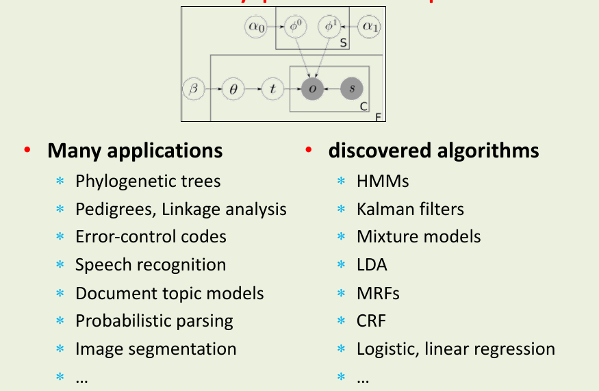

## Motivation by Way of Comparison

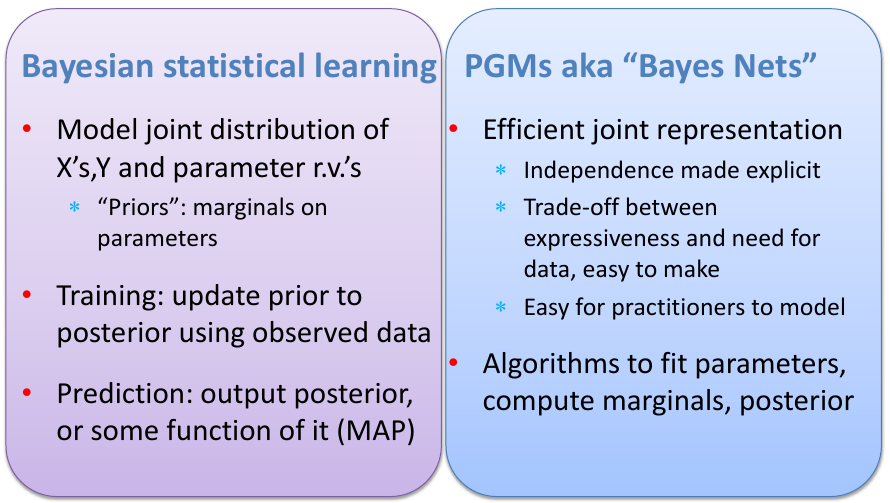

## Everything Starts at the Joint Distribution
- All joint distributions on discrete r.v.'s can be represented as tables
- #rows grow exponentially with #rv's
- Example: Truth Tables
	- $M$ Boolean r.v.'s require $2^M-1$ rows
	- Table assigns probability per row
 
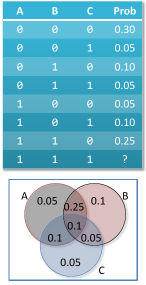

### My Explanation
We have $2^3$ combinations for this joint probability since our values are boolean. We do $2^3-1$ because we omit the last row, this is because if we know all the other combinations, then we will definitely know the last row. This is also so the sum of the column is equal to 1.

# The Good: What We Can Do with the Joint
- **Probabilistic inference** from joint on r.v.'s
	- Computing any other distributions involving our r.v.'s
- Pattern: want a distribution, have joint; use:

	$\textcolor{blue}{\text{Bayes rule}} + \textcolor{red}{\text{marginalisation}}$
 
- Example: **naive Bayes classifier**
	- Predict class $y$ of instance $x$ by maximising

$$
Pr(Y=y|X=x) = \textcolor{blue}{\frac{Pr(Y=y, X=x)}{Pr(X=x)}} = \frac{Pr(Y=y, X=x)}{\textcolor{red}{\sum_y Pr(X=x, Y=y)}}
$$

Recall: _integration (over parameters)_ continuous equivalent of sum (both referred to as marginalisation)

## The Bad & Ugly: Tables Waaaaaay Too Large!!
- **The Bad:** Computational complexity
	- Tables have exponential number of rows in number of r.v.'s
	- Therefore $\rightarrow$ poor space & time to marginalise
- **The Ugly**: Model complexity
	- Way too flexible
	- Way too many parameters to fit $\rightarrow$ needs lots of data OR will overfit
- Antidote: assume independence!

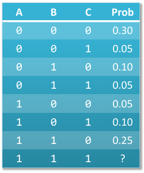

## Example: You're Late!
- Modelling a tardy lecturer. Boolean r.v.'s
	- $T$: Ben teaches the class
	- $S$: It is sunny (o.w. bad weather)
	- $L$: The lecturer arrives late (o.w. on time)

- Assume: Ben sometimes delayed by bad weather, Ben more likely late than other lecturers
	- $Pr(S|T) = Pr(S), \ Pr(S) = 0.3, \ Pr(T) = 0.6$
- Lateness not independent on weather, lecturer
	- Need $Pr(L|T=t, S=s)$ for all combinations
- Need just 6 parameters

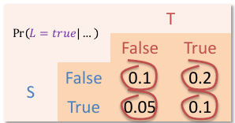

### My Explanation
We require 6 parameters since we know that we need a parameter each for $Pr(T)$ and $Pr(S)$, and for $Pr(L=true|T,S)$ as shown in the table above, we have $2^2$ combinations for $T$ and $S$ since each can be either true or false. Therefore when we sum this up we get $1 + 1 + 2^2 = 6$. We need to know the first two probabilities so we can choose True or False in the table above. 

Therefore, because we assume that $P(T)$ and $P(S)$ are independent, we saved on the number of parameters required for the model. If we didn't assume this independence, we would have $2^3 - 1$ parameters to consider, therefore this is much more efficient.

## Independence: Not a Dirty Word

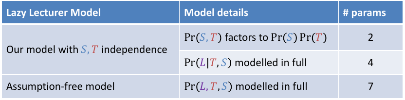

- Independence assumptions:
	- Can be reasonable in light of domain expertise
	- Allow us to factor $\rightarrow$ Key to tractable models

## Factoring Joint Distributions
- **Chain Rule**: for <u>any ordering</u> of r.v.'s can always factor:

$$
Pr(X_1, X_2, ..., X_k) = \prod^k_{i=1} Pr(X_i|X_{i+1}, ..., X_k)
$$

- Model's independence assumptions correspond to
	- Dropping conditioning r.v.'s in the factors!
	- Example **unconditional indep.**: $Pr(X_1|X_2) = Pr(X_1)$ 
	- Example **conditional indep.**: $Pr(X_1|X_2, X_3) = Pr(X_1|X_2)$
- Example: independent r.v.'s $Pr(X_1, ..., X_k) = \prod^k_{i=1}Pr(X_i)$ 
- Simpler factors: **speed up inference** and **avoid overfitting**

## Directed PGM
- **Nodes**
- **Edges** (acyclic)
- **Random variables**
- Conditional dependence
	- **Node table**: $Pr(child|parents)$
	- Child directly depends on parents
- **Joint factorisation**

$$
Pr(X_1, X_2, ..., X_k) = \prod^k_{i=1}Pr(X_i|X_j \in parents(X_i))
$$

_Tardy Lecturer Example_

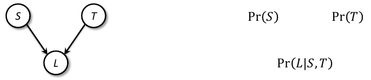

## Example: Nuclear Power Plant
- Core temperature
	- Temperature gauge
	- Alarm
- Model uncertainty in monitoring failure
	- GRL: gauge reads low
	- CTL: core temperature low
	- FG: faulty gauge
	- FA: faulty alarm
	- AS: alarm sounds
- PGMs to the rescue!

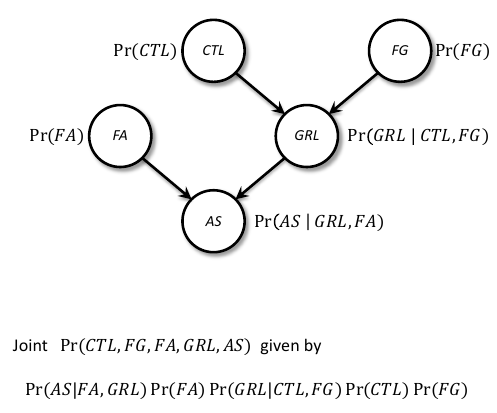

## Naive Bayes

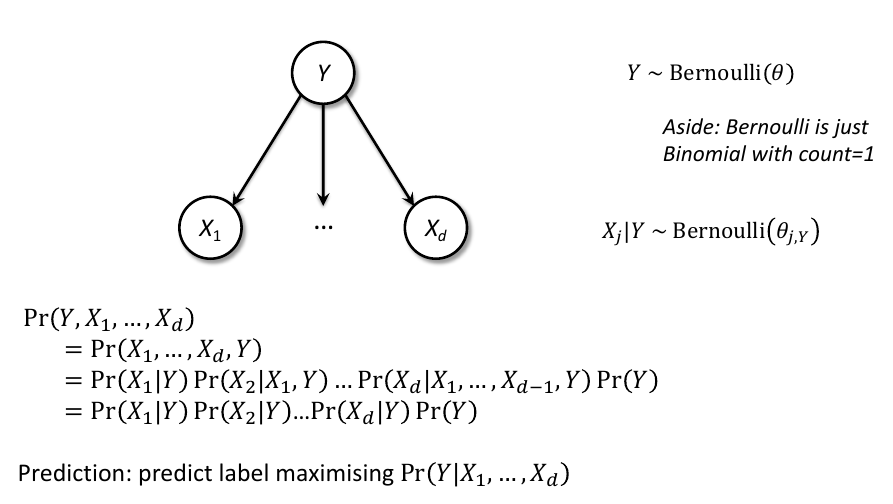

## Short-Hand for Repeats: Plate Notation

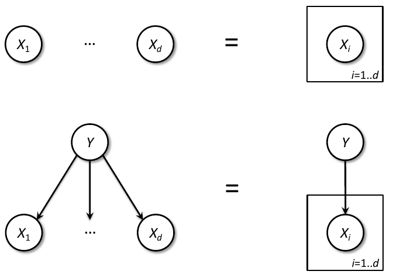

### My Explanation
The above diagram is just showing us that we can simply the Naive Bayes graph into a simple edge and two vertices plot as shown to the right.

## (from here) PGM's: Frequentist OR Bayesian
- PGMs represent joints, which are central to Bayes
- Catch is that Bayesians add: **node per parameters**, with table being the parameter's priors

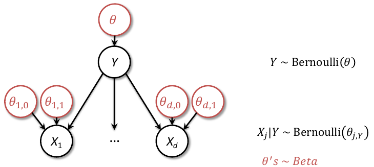

# Exercises
## Exercise 1
In words, what does $Pr(A,B|C) = Pr(A|C) Pr(B|C)$ say about the _dependence_ of $A,B,C$? 

$A$ and $B$ are conditionally independent given $C$

## Exercise 2
Considering we have 4 Boolean random variables $X,Y,Z,V$ (each of them can only take 0 or 1 as its value), if we do not assume any independence among them, how many rows do we have in the probability table regarding the joint distribution of these 4 random variables? 

$2^4 - 1$

## Exercise 3
Considering we have 4 Boolean random variables $X,Y,X,V$ (each of them can only take 0 or 1 as its value), if we assume $X,Y,Z$ are independent of each other and $V$ depends on $X,Y$, how many rows do we need to represent the probability table regarding the joint distribution of these 4 random variables? 

$X,Y,Z$ are independent and only require one row each. $Pr(V|X,Y)$ requires $2^2$ rows because it has two other random variables that it depends on. Therefore we have:

$1 + 1 + 1 + 2^2 = 7 \text{ random variables}$

## Exercise 4
Consider the following PGM

![[2023-sample-q4-pgm.png]]

where each random variable is Boolean-valued (True or False)

(a) Write the format (with empty values) of the _conditional probability tables_ for this graph 

| P(A = True) | ? |
|-------------|---|

| P(B = True) | ? |
|-------------|---|

| A | B | P(C = True\|A,B) |
|---|---|------------------|
| T | T | ?                |
| T | F | ?                |
| F | T | ?                |
| F | F | ?                |

(b) Suppose we observe $n$ sets of values $A,B,C$ (complete observations). The _maximum-likelihood principle_ is a popular approach to training a model such as above. What does it say to do? 

$\arg \max_{tables} \prod^{n}_{i=1}P(A=a_i)P(B=b_i)P(C=c_i|A=a_i,B=b_i)$

(c) Suppose we observe 5 training examples: for $(A, B, C)$ — $(F, F, F ); (F, F, T ); (F, T, F ); (T, F, T );(T, T ; T )$. Determine maximum-likelihood estimates for your tables. 

**Acceptable**: The MLE decouples when we have fully-observed data, and for discrete data as in this case — where the variables are all Boolean — we just count.  The $P r(A = T rue)$ is 2/5 since we observe $A$ as true out of five observations. Similarly for $B$ we have the probability of True being 2/5. Finally for each configuration $TT, TF, FT, FF$ of $AB$ we can count the times we see $C$ as True as a fraction of total times we observe the configuration. So we get for these probability of $C = T rue$ as $1.0, 1.0, 0.0, 0.5$ respectively

| A | B | P(C = True\|A,B) |
|---|---|------------------|
| T | T | 1                |
| T | F | 1                |
| F | T | 0                |
| F | F | 1                |
