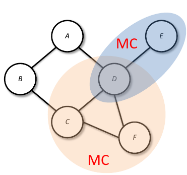
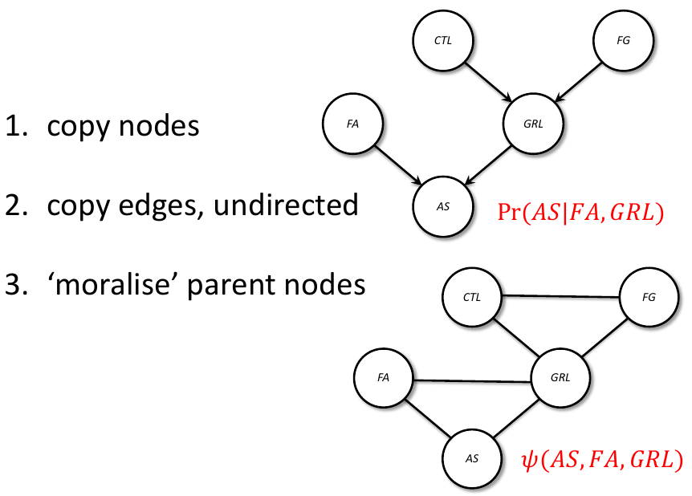
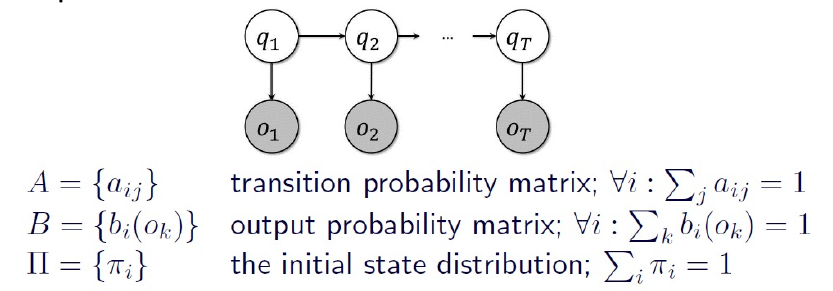
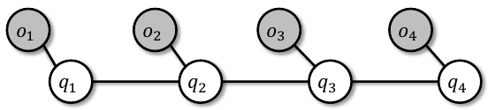
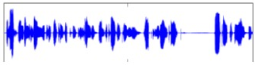
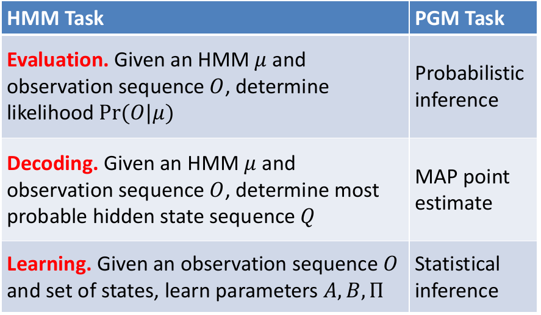
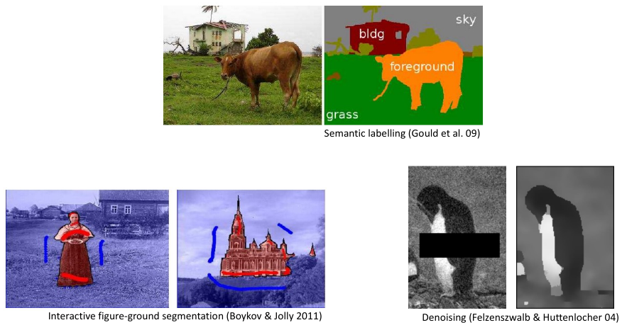
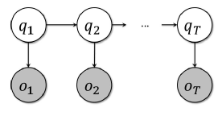
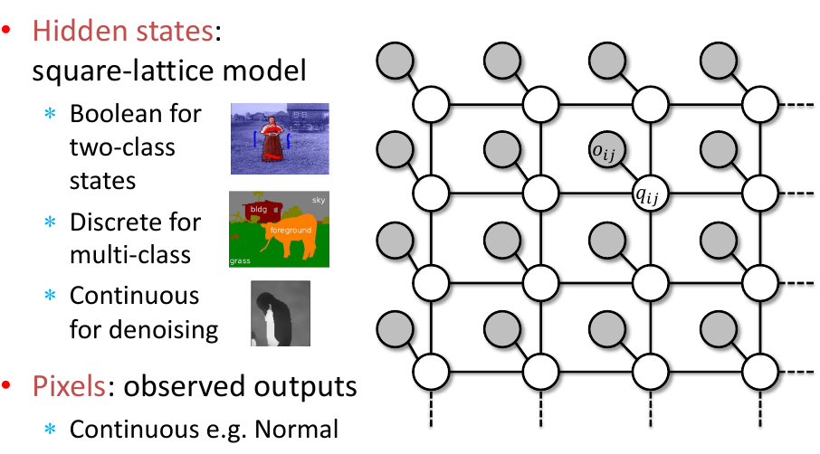
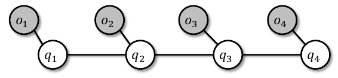

# Undirected PGMs
_Undirected variant of PGM, parameterised by arbitrary positive values functions of the variables, and global normalisation_

_A.K.A Markov Random Field_

## Undirected vs Directed
**Undirected PGM**
- Graph
	- Edges undirected
- Probability
	- Each node a r.v.
	- Each clique $C$ has "factor" $\psi_c(X_j:j \in C) \geq 0$ 
	- Joint $\propto$ product of factors
 
**Directed PGM**
- Graph
	- Edges directed
- Probability
	- Each node a r.v.
	- Joint = product of cond'ls
	- Each node has conditional $p(X_i|X_j \in parents(X_i))$ 

**Key difference = normalisation**

## Undirected PGM Formulation
- Based on notion of 
	- **Clique**: a set of _fully connected nodes_ (e.g., A-D, C-D, C-D-F)
	- **Maximal clique**: _largest cliques in graph (not C-D, due to C-D-F_)

- Joint probability defined as

$$
P(a,b,c,d,e,f) = \frac{1}{Z} \psi_1(a,b) \psi_2(b,c) \psi_3(a,d) \psi_4 (d,c,f) \psi_5(d,e)
$$

where each $\psi$ is a positive function and $Z$ is the normalising **'partition' function**

$$
Z = \sum_{a,b,c,d,e,f} \psi_1(a,b) \psi_2(b,c) \psi_3(a,d) \psi_4(d,c,f) \psi_5(d,e)
$$

## Directed to Undirected
- Directed PGM formulated as

$$
P(X_1, X_2, ..., X_k) = \prod^k_{i=1}Pr(X_i|X_{\pi_i})
$$

where $\pi$ indexes parents

- Equivalent to U-PGM with
	- Each conditional probability term is included in one factor function $\psi_c$ 
	- Clique structure links **_groups of variables_**, i.e., $\{\{X_i\} \cup X_{\pi_i}, \forall i\}$ 
	- Normalisation term trivial, $Z=1$

## Why U-PGM
- Pros
	- Generalisation of D-PGM
	- Simpler means of modelling without the need for per-factor normalisation
	- General inference algorithms use U-PGM representation (supporting both types of PGM)
- Cons
	- (slightly) weaker independence
	- Calculating global normalisation term ($Z$) intractable in general 

# Example PGMs
_The hidden Markov model (HMM);_ 
_lattice Markov random field (MRF);_
_Conditional random field (CRF);_

## The HMM (and Kalman Filter)
- Sequential observed **outputs** from hidden state

- The **Kalman filter** same with continuous Gaussian r.v.'s
- A **CRF** is the undirected analogue

## HMM Applications
- NLP - **part of speech tagging**: given words in sentence, infer hidden parts of speech

"I love Machine Learning $\rightarrow$ noun, verb, noun, noun"

- **Speech recognition**: given waveform, determine phonemes

- Biological sequences: classification, search, **alignment**
- Computer vision: identify who's walking in video, **tracking**

## Fundamental HMM Tasks

## Pixel Labelling Tasks in Computer Vision

## What These Tasks Have in Common
- Hidden state representation semantics of image
	- Semantic labelling: Cow vs. tree vs. grass vs. sky vs. house
	- Fore-back segment: Figure vs. ground
	- Denoising: Clean pixels
- Pixels of image
	- What we observe of hidden state
- Remind you of HMMs?

## A Hidden Square-Lattice Markov Random Field

## Application to Sequences: CRFs
- **Conditional Random Field: Same model applied to sequences**
	- Observed outputs are words, speech, amino acids etc
	- States are tags: part-of-speech, phone, alignment
- CRFs are discriminative, model $P(Q|O)$ 
	- Versus HMM's which are generative, $P(Q|O)$
	- Undirected PGM more general and expressive

## Exercises

### Exercise 1
Can the joint probability distribution described by any _undirected probabilistic graphical model_ be expressed as a _directed probabilistic graphical model_? Explain why or why not
- No, because we have no information about which is parent or child node

## Exercise 2
Consider the following undirected probabilistic graphical model (PGM) on four Boolean-valued variables, where the clique potentials $f (A, B, C)$ and $g(C, D)$ are unnormalised.

![[2019-q8-pgm.png]]

1. Using these tables, calculate the _normalising constant_ $Z = \sum_{A∈\{T,F \}} \sum_{B∈\{T,F \}} \sum_{C∈\{T,F \}} \sum_{D∈\{T,F \}}f(A,B,C)g(C,D)$ [2 marks]

$Z = 3 \times 3 + 1 \times 3 + 2 \times 3 + 4 \times 3 + 1 \times 3 + 6 \times 3 + 4 \times 3 + 0$

$Z=63$

2. Calculate $Pr (A = F, B = T, C = F )$. You may leave your answer as a fraction. (If you were unable to answer the previous part, leave the constant as Z in your workings here.) [2 marks]

$P(A=F, B=T, C=F) = \frac{1}{Z}P(A,B,C)P(C,D)$
$= \frac{1}{63} \times 4 \times 3$
$= \frac{12}{63}$

## Exercise 3
Consider the following undirected probabilistic graphical model (U-PGM) on five Boolean-valued variables, where the clique potentials $f (A, B, C)$ and $G(C, D, E)$ are shown below.

![[2021-s1-pgm-question.png]]

(a) Using the given clique potential tables, calculate the normalising constant (aka partition function) for the joint distribution on $A, B, C, D, E$. 

$Z = f(A,B,C) \cdot g(C,D,E)$

We need to do a dot product on the joints of the two tables, which in this case is on $C$, which is when $C=T$ and $C=F$. In this case, all cases in table 2 where $C=T$ are zero, so there's no point considering any cases in table 1 where $C=T$.

The sum of $C=F$ in table 2 is 11, so we do sum up the tables with that

$Z = 3 \times 11 + 3 \times 11 + \times 11 + 3 \times 11 = 132$ 

(b) Calculate $Pr(A = F, B = F, C = F )$. You may leave your answer as a fraction. (If you were unable to answer the previous part, leave the constant as Z in your workings here.) 

We sum up all the combinations in the above table where $A=F$, $B=F$ and $C=F$, and then use it in the below formula:

$$
P(a,b,c,d,e) = \frac{1}{Z} \psi_1(a,b,c) \psi_2(c,d,e) 
$$

$Pr(A = F, B = F, C = F ) = \frac{1}{132} \times ( + 3) \times (2 + 4 + 4 + 1)$ 

$Pr(A = F, B = F, C = F ) = \frac{3 \times 11}{352} = 0.25$
