## About Regularisation
Process of introducing additional information in order to solve an ill-posed problem or to prevent overfitting
- Major technique & theme, throughout ML
- Addresses one or more of the following related problems
	- Avoids ill-conditioning (a computational problem)
	- Avoids overfitting (a statistical problem)
	- Introduce prior knowledge into modelling
- This is achieved by augmenting the objective function
- <u>In this lecture</u>: we cover the first two aspects. We will cover more of regularisation throughout the subject 

# The Problem with Irrelevant Features
_Linear regression on rank-deficient data_

## Example 1: Feature Importance
- Linear model on three features
	- $X$ is matrix on $n = 4$ instances (rows)
	- Model: $y = w_1x_1 + w_2x_2 + w_3x_3 + w_0$
 
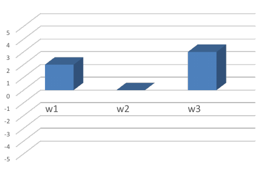

Question: Which feature is more important?
$x_3$ is more important, because it has the highest weight

Now consider this:
- First two columns of $X$ for the above weights are identical
- Feature 2 (or 1) is **irrelevant** 

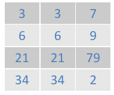

Now what is the effect of perturbations on model predictions?
- Add $\Delta$ to $w_1$ 
- Subtract $\Delta$ from $w_2$ 

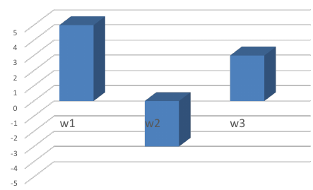

This is what we will explore now

## Problems with Irrelevant Features
- In example, suppose $[\hat{w_0}, \hat{w_1}, \hat{w_2}, \hat{w_3}]'$ is "optimal"
- For any $\delta$ new $[\hat{w_0}, \hat{w_1} + \delta, \hat{w_2} - \delta, \hat{w_3}]'$ get
	- _Same_ predictions!
	- _Same_ sum of squared errors!
- Problems this highlights
	- The solution is not **unique**
	- Lack of **interpretability** 
	- Optimising to learn parameters is **ill-posed problem**

What this basically means is that there is an infinite combination of weights that $\hat{w}_1$ and $\hat{w}_2$ could be, as we could just increasing one weight and decreasing the other weight by any number and it would still be the minimum. This means that our model has no clear solution and is an **ill-posed problem** that lacks **interpretability**. 
## Irrelevant (Co-linear) features in general
- Extreme case: features complete clones
- For linear models, more generally
	- Feature $X._{j}$ is irrelevant if
	- $X._{j}$ is a **linear combination** of other columns
 
$$X._{j} = \sum_{l \not = j} \alpha_l X._{l}$$

... for some scalars $\alpha_l$. Also called **multicollinearity**. Equivalently: Some eigenvalues of $X'X$ is zero
- Even **near-irrelevance**/colinearity can be problematic 
	- V small eigenvalues of $X'X$
- Not just a pathological extreme; **easy to happen!**

## Example 2: Lack of Data
- Extreme example:
	- Model has two parameters (slope and intercept)
	- Only one data point
- Undetermined system

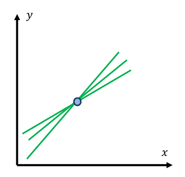

## Ill-Posed Problems
- In both examples, finding the best parameters becomes an **ill-posed problem**
- This means that the problem solution is not defined
	- In our case $w_1$ and $w_2$ cannot be uniquely identified
- Remember normal equations solution of linear regression:

$$
\hat{w} = (X'X)^{-1}X'y
$$

- With irrelevant/multicolinear features, matrix $X'X$ has **no inverse**

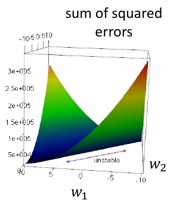

The above has a convex, but there is no strict convex. This means that the we could keep travelling to infinity, meaning there is no strict finite amount of solutions to this problem. This is a visual representation of the problem we mentioned in the example before, where there are an infinite number of solutions to reach the minimum for the objective function. We say that matrix $X'X$ has no inverse because it it has no eigenvalues, meaning there is no axis to rotate on.

# Regularisation in Linear Models
_Ridge regression and the Lasso_

## Re-Conditioning the Problem
- Regularisation: introduce an **additional condition** into the system
- The original problem is to minimise 

$$
\lVert y - Xw \rVert ^2_2 + \lambda \lVert w \rVert^2_2 \text{ for } \lambda > 0
$$

- The solution is now

$$
\hat{w} = (X'X + \lambda I)^{-1}X'y
$$

- This formulation is called **ridge regression** 
	- Turns the ridge into a deep, singular valley
	- Adds $\lambda$ to eigenvalues of $X'X$: makes invertible
 
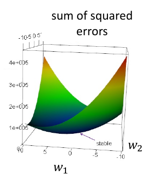

This above graph is now strictly convex.

What this all means is that we add a constraint to the objective function so it is now able to find a unique solution, much like the graph above showing only one single minimum point. We do this by adding an identity matrix of set value $\lambda$ to the **sum of least squares equation**.

## Regulariser as a Prior
- Without regularisation, parameters found based entirely on the information contained in the training set $X$ 
	- Regularisation introduces **additional information**
- Recall our probabilistic model $Y = x'w + \epsilon$ 
	- Here $Y$ and $\epsilon$ are random variables. where $\epsilon$ denotes noise
- Now suppose that $w$ is also a random variable (denoted as $W$) with a Normal **prior distribution**

$$
W \thicksim N(0,1/\lambda)
$$

- i.e. we expect small weights and that no one feature dominates
- Is this always appropriate? E.g. data centring and scaling
- We could encode much more elaborate problem knowledge

What this means as that we treat $w$ as a prior probability in terms of the Bayes Rule in order to derive the ridge regression equation. To do this, we consider $w$ to be a value between -1 and 1. To describe this, we can use a Gaussian distribution where $\mu$ is 0, and $\sigma^2$ is $1/\lambda$.
## Computing Posterior Using Bayes Rule
- The prior is then used to compute the posterior

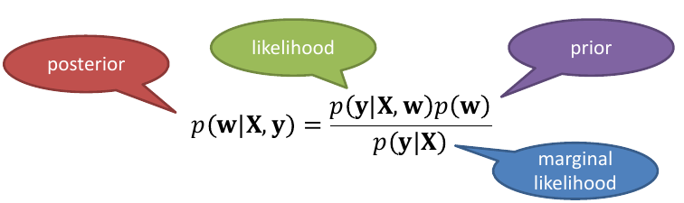

- Instead of maximum likelihood (MLE), take **maximum a posteriori** estimate (MAP)
- Apply log trick, so that

$$
\log(posterior) = \log(likelihood) + \log(prior) - \cancel{\log(marg))}
$$

_The last value can be not considered as it doesn't affect optimisation_
- Arrive at the problem of minimising 

$$
\lVert y - Xw \rVert^2_2 + \lambda \lVert w \rVert^2_2
$$

The first part of this derivation is obviously the derivation that we have proven previously in the linear regression section of the notes, which requires finding the log of the gaussian distribution of $y$ and $Xw$. The second part is derived from the explanation we provided in the previous section, we can say that the prior probability is equal to the following:

$$
p(w) = [\frac{\sqrt{\lambda}}{\sqrt{2\pi}} \exp(-\frac{\lambda w^2}{2})]
$$

Therefore, the log after pulling out irrelevant parts and sticking it into a constant value of this function will be:

$$
\log(prior) = \lambda w^2 + C
$$

This correlates with our above function of:

$$
\lVert y - Xw \rVert^2_2 + \lambda \lVert w \rVert^2_2
$$

## Regulariser as a Constraint
- For illustrative purposes, consider a modified problem:
	minimise $\lVert y - Xw \rVert^2_2$ subject to $\lVert w \rVert^2_2 \leq \lambda$ for $\lambda > 0$

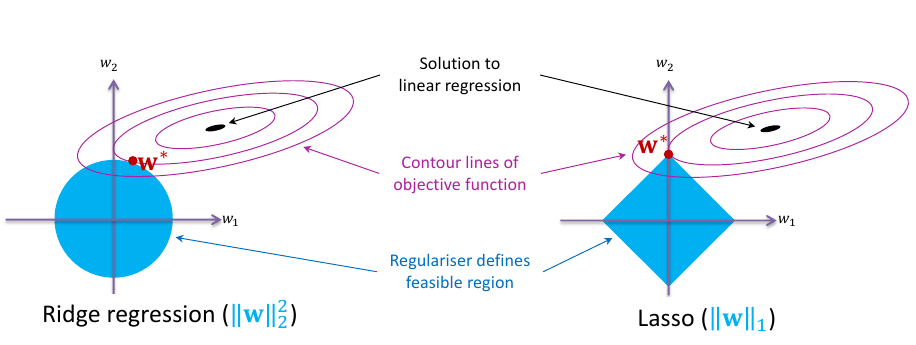

- **Lasso ($L_1$ regularisation)** encourages solutions to sit on the axes
	- Some of the weights are set to zero $\rightarrow$ **solution is sparse**

What this means is that we can consider ridge regression like constraining the loss function to find the minimum that is **only present in the circle present in $w^2$**. The contour lines in the above figure represent the minimum squares loss function, and the center is the minimum value for the function. Since the loss function is only allowed to find the minimum loss _within_ the circle, **it will find the minimum on the _ridge_ between the minimum squares loss function and the $w^2$ constraint**, as shown by $w^*$. 

For lasso regression, since it is the $L_1$ norm, it will form a diamond. The same logic applies to this function, it can only find the minimum loss function on the ridge of $\lVert w \lVert$ and the minimum squares loss function.

What this also means is that the larger we choose lambda to be, the larger the circle or diamond will be, which will take the loss function further from the true minimum of the sum of squares error. Meaning **the more we increase $\lambda$, the more we increase the bias in the model**.
## Regularised Linear Regression

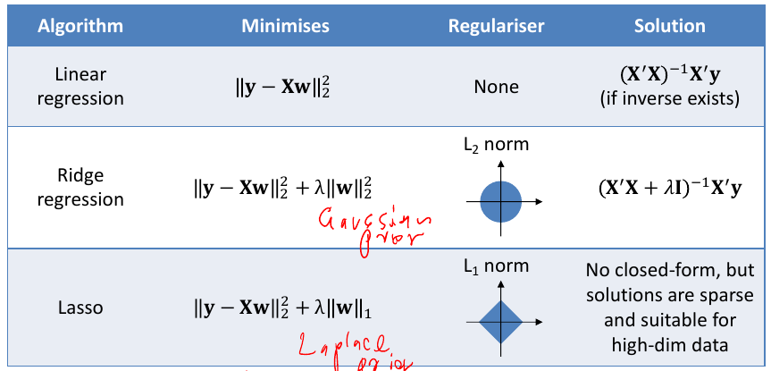

# Regularisation in Non-Linear Models
_Model selection in ML_

## Example Regression Problem
**How complex** should our model be for the below plot?

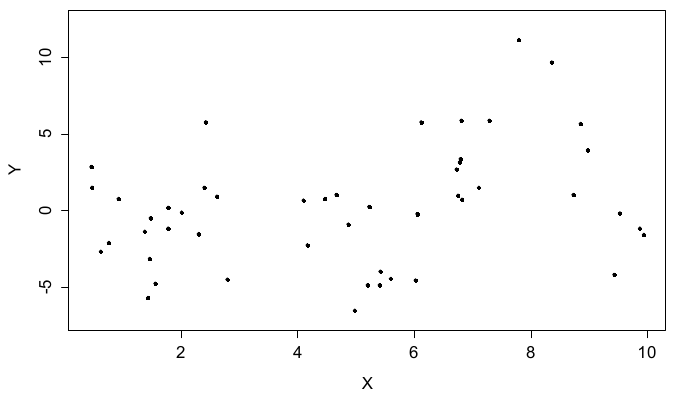

## Underfitting (Linear Regression)
Model class $\varTheta$ can be **too simple** to possibly fit true model.

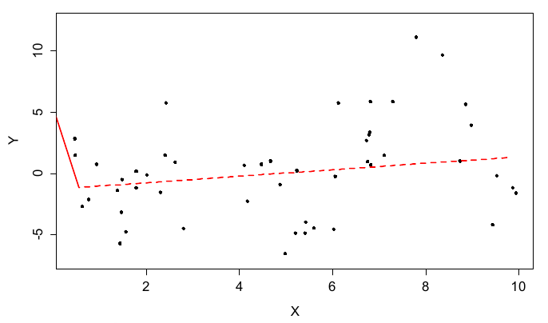

## Overfitting (Non-Parametric Smoothing)
Model class $\varTheta$ can be **so complex** it can fit true model + noise

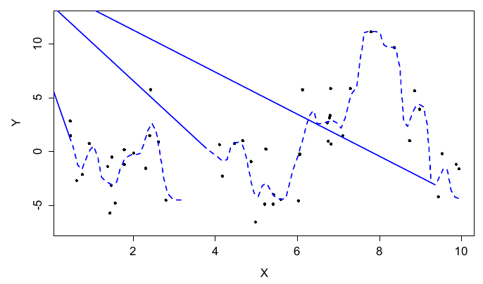

## Actual Model ($x\sin x$)
The **right model class** $\varTheta$ will sacrifice some training error, for test error.

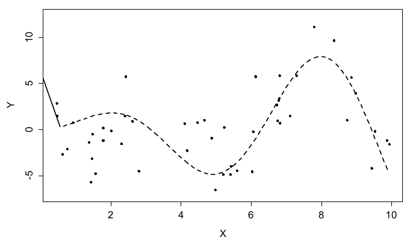

## Approach: Explicit Model Selection
- Try different classes of models. Example, try polynomial models of various degree $d$ (linear, quadratic, cubic, ...)
- Use <u>held out validation</u> (cross-validation) to select the model
1. Split training data into $D_{train}$ and $D_{validate}$ sets 
2. For each degree $d$ we have model $f_d$
	1. Train $f_d$ on $D_{train}$
	2. Test $f_d$ on $D_{validate}$
3. Pick degree $\hat{y}$ that gives the best test score
4. Re-train model $f_{\hat{d}}$ using all data

## Approach: Regularisation 
- Augment the problem:

$$
\hat{\theta} \in \underset{\theta \in \varTheta}{\text{argmin}} (L(data, \theta) + \lambda R(\theta))
$$

- E.g, ridge regression

$$
\hat{w} \in \underset{w \in W}{\text{argmin}} \lVert y - Xw \rVert^2_2 + \lambda \rVert w \lVert ^2_2
$$

- Note that regulariser $R(\theta)$ does not depend on data
- Use held out validation/cross validation to choose $\lambda$ 

## Example: Polynomial Regression
- 9th-order polynomial regression
	- Model of form
 
$$
\hat{f} = w_0 + w_1x + ... + w_9x^9
$$

regularised with $\lambda \lVert w \rVert ^2_2$ term
  
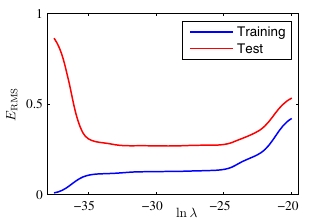

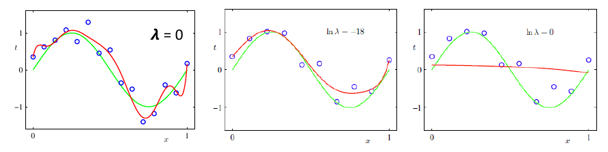

What these charts are showing that as the $\lambda$ value increases, so does the bias of the model. When $\lambda$ is 0, then the model is much more complex and thus has more variance, as the $\lambda$ value increases, we can see that the model captures less and less complexities in the data.

What we can also see is that there is a sweet spot with $\lambda$ where the training and testing error will converge to an acceptable level, which can be seen in the learning curve improving at around $\ln \lambda=-18$. 

# Bias-Variance Trade-Off
_Train error, test error and model complexity in **supervised regression**_ 

## Assessing Generalisation
- Supervised learning: train the model on existing data, then make predictions on <u>new data</u> 
- Training the model: ERM / minimisation of <u>training error</u>
- Generalisation capacity is captured by risk / test error
- <u>Model complexity</u> is a major factor that influences the ability of the model to generalise (vague still)

## Training Error and Model Complexity
- More complex model $\rightarrow$ training error goes down
- Finite number of points $\rightarrow$ usually can reduce training error to 0 (is it always possible?)

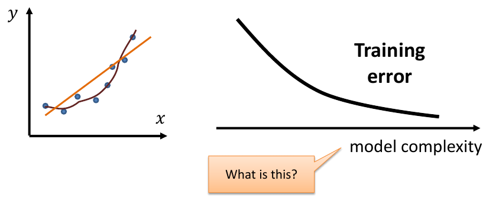

## (Another) Bias-Variance Decomposition
- Squared loss for **supervised-regression** predictions

$$
l(Y,\hat{f}(X_0)) = (Y-\hat{X_0})^2 
$$

- Lemma: Bias-variance decomposition

$$
E[l(Y,\hat{X_0})] = (E[Y] - E[\hat{f}])^2 + Var[\hat{f}] + Var[Y]
$$

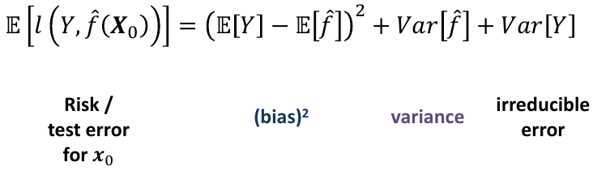

## Decomposition Proof Sketch
- Here ($x$) is omitted to de-clutter

$E[(Y-\hat{f})^2] = E[Y^2+\hat{f}^2-2Y\hat{f}]$

$= E[Y^2] + E[\hat{f}^2] - E[2Y\hat{f}]$ 

Now insert using $Var[Y] = E[Y^2] - E[Y]^2$  and $Var[\hat{f}] = E[\hat{f}^2] - E[\hat{f}]^2$ 

$= Var[Y] + E[Y]^2 + Var[\hat{f}] + E[\hat{f}]^2 - 2E[Y]E[\hat{f}]$  

$= Var[Y] + Var[\hat{f}] + (E[Y]^2 - 2E[Y]E[\hat{f}] + E[\hat{f}]^2)$ 

$= Var[Y] + Var[\hat{f}] + (E[Y] - E[\hat{f}])^2$ 

Therefore we can say that the test error of the model is  $\text{risk / test error} = \text{bias}^2 + \text{variance} + \text{irreducible error}$ 

## Training Data as a Random Variable

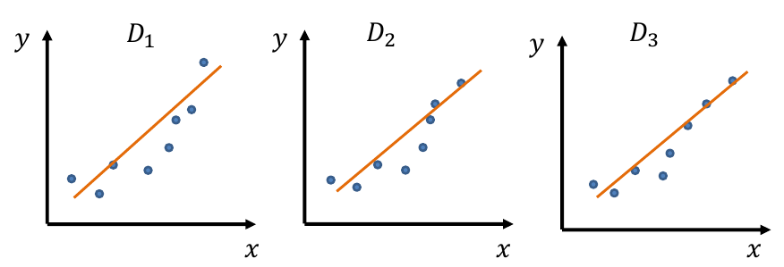

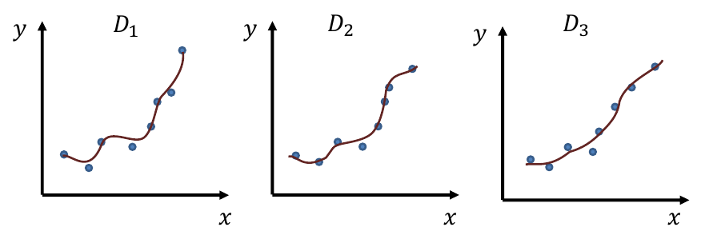

## Intuition: Model Complexity and Variance
- Simple model $\rightarrow$ low variance
-  Complex model $\rightarrow$ high variance

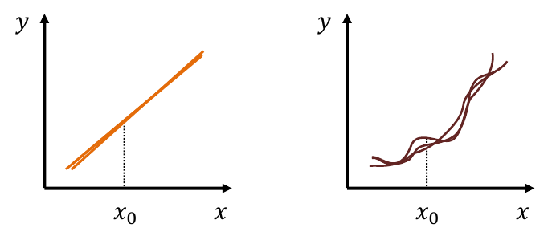

## Test Error and Training Error

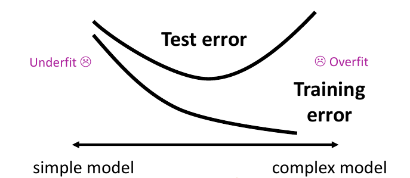

# Exercises
## Exercise 1
We’ve seen that the square-loss risk of a parameter estimate $θ̂$ is $E_θ [(θ− \hat{\theta})^2] = [B(\hat{\theta})]^2 +Var(\hat{\theta})$ while the square-loss risk of a supervised regression predictor is $E_{X,Y} [(Y − \hat{f}  (X))^2 ] = (E[Y ] − [\hat{f}  (X)])^2 + Var(\hat{f} (X)) + Var[Y ]$ where the last term is known as the irreducible error. Note that in these risks both $\hat{\theta}$ and $\hat{f}$ implicitly depend on a random training set. Why is there no irreducible error term in the first square-loss risk, even though it appears in the second risk? 

In the first equation, we are just trying to find the error between the true risk and our current model's risk. This has no data $Y$ to compare with as these $\theta$ parameters are constant.

## Exercise 2
With respect to the training of machine learning models, describe a situation where it would be desirable to use an estimator with high bias. 

The bias-variance tradeoff. There is a tug-of-war between both features in machine learning models, so having higher bias may make the model less complex, but it may reduce the variance that it has.

## Exercise 3
Write an expression relating expected squared loss, bias, and variance. 

$L = (E[Y] - E[\hat{f}])^2 + Var[\hat{f}] + Var[Y]$

## Exercise 4
We saw two bias-variance decompositions in the subject: (i) for parameter estimation and (ii) for supervised regression. Why was there a third irreducible error term in case (ii) but not in case (i)? 

Because the parameter estimation is independent of the data, therefore there is no irreducible noise to be generated.