# Recurrent Networks
_A DNN tailored to variable length sequential inputs_

## Sequential Input
- Until now, we have assumed fixed-sized input
	- Vectors of features $x$ in $d$ dimensions
	- Matrices of pixels in an image
- What if our input is a **sequence**?
	- Frames in a video clip
	- Time steps in an audio clip
	- Words in a sentence
	- A protein sequence
	- Stock prices over time
- How can we model this in a DNN?

## FCNNs are Poor for Sequences
- Consider classifying sentences
	- "This is the worst movie of all time, a real stinker" $\rightarrow$ :(
	- "The movie is a real stinker" $\rightarrow$ :(
- Issue: inputs are _**different lengths**_
	- **Pad** them with empty "words" to be a fixed size
- Issue: how do we _**represent words**_ as vectors?
	- Learn an "**embedding**" vector for each word
- Issue: phrases have _**similar meaning**_ even when at _different locations_
	- "a real stinker" is a key predictive feature
	- If we naively apply FCNN needs to learn this concept repeatedly

## ConvNets for Sequences
- Sequences are just rectangular shaped images (e.g., embedding dim. times length): apply CNNs
	- With **1D filters**
	- The filter parameters are shared across time, and can find patterns in the input
- This is called the _**time delay neural network_**
- Downside:
	- Receptive field of filters are limited to finite size, i.e., the width of the convolutional filters, which can be expanded with deeper networks

## Recurrent Neural Nets (RNNs)
- RNNs create networks dynamically, based on input sequence
	- Given sequence of inputs $x^{(1)}, x^{(2)}, ..., x^{(t)}$ 
	- Process each symbol from left to right, to form a sequence of hidden states $h^{(t)}$
	- Each $h^{(t)}$ encodes all inputs up to $t$

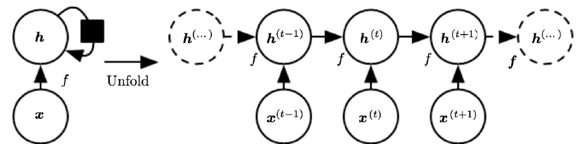

## RNN Applications: Seq. Classification
- Sequence classification: labelling sequence
	- Use last hidden state as input to linear model (classifier etc.)

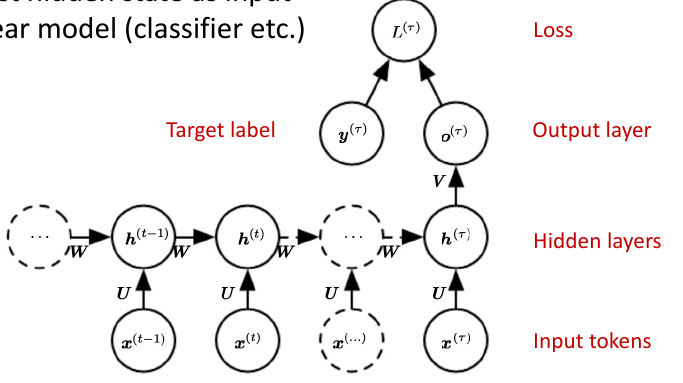

## Sequence Tagging RNN
- Assign each item/token a label in sequence
	- Given targets per item, can measure loss per item

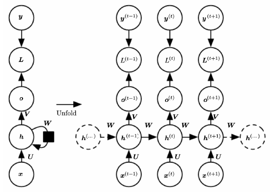

## Encoder-Decoder for Sequence Translation

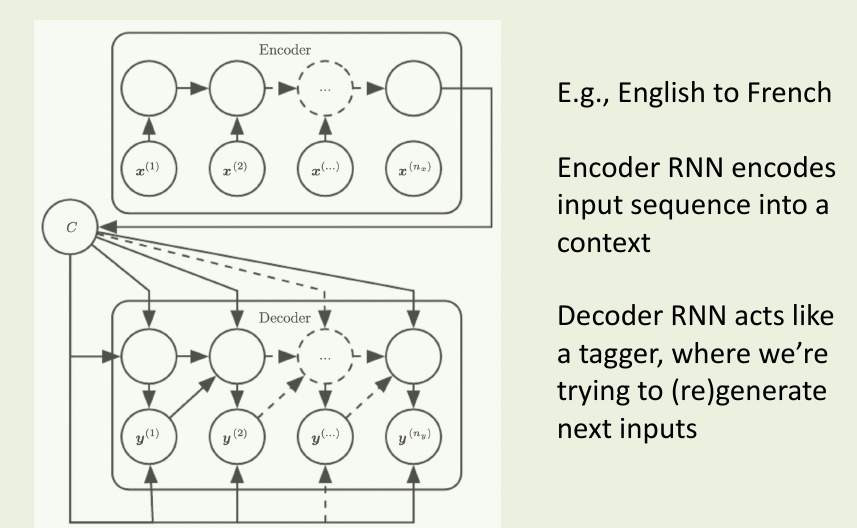

## RNN Parameterisation

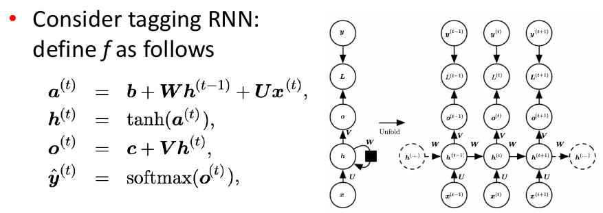

- Parameters are $b, W, U, c, V$
	- Not specific to timestep $t$, but shared across all positions
	- This "template" can get unrolled arbitrarily

## Training RNNs: Backprop. Thru. Time
- Backpropagation algorithms can be applied to network
	- Called **backpropagation through time (BPTT)**
	- Gradients from the loss at every position must be propagated back to the very start of the network
- Suffer from **gradient vanishing** problem
	- Consider linear RNN, gradients of $\frac{\delta g^{(T)}}{\delta h^{(1)}} = W^{T-1}$, thus can explode or vanish with large $T$, depending on largest eigenvalue of $W$ (i.e., greater than / less than one).
	- Can't _learn_ long distance phenomena (over 10+ steps)

### My Explanation
We require BPTT because we have sequential data, and therefore the typical feedforward network methods of training can't be applied. Each time step in the network has dependencies on the time step before it, and therefore these gradients need to be accumulated and propagated to the start of the network to learn these dependencies.

## Long Short-Term Memory (LSTM)
- In RNN, previous state is provided as an input
	- Multiplied by weight matrix, and non-linearity applied
- LSTM introduces state self-loop, based on copying
	- Takes **copy** of previous state, scaled by sigmoid **forget gate**
- Gradient magnitude now maintained
	- Can handled 100+ distance phenomena (vs 5-10 for RNN)

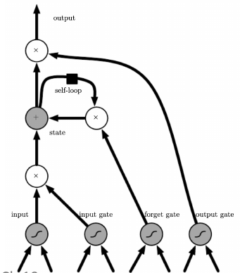

### My Explanation
Due to the transformation that the data goes through when traversing an RNN, some information is lost at each time step. After a while, the RNN's state contains virtually no trace of the first inputs. This can be a showstopper. Imagine Dory the fish trying to translate a long sentence; by the time she's finished reading it, she has no clue how it started. To tackle this problem, various types of cells with long-term memory have been introduced. They have been proven to be so effective that the basic cells are not used much anymore. Let's first look at the most popular of these long-term memory cells: the LSTM cell.

Essentially the utilises a system where a state traverses through the network from left to right and passes through a _forget gate_. This forget gate drops some information from the state. This output is then added with the input state to add new memories via the addition operator. This output then undergoes no more transformations and is added to the output from the output gate. This is how we add long term memory to the model.

# Transformers
_A method for processing sequence inputs in highly parallelisable manner, using **attention**_

## Attention
- **RNNs** over long sequences not too good at representing properties of the full sequence
	- **Biased** towards the end (or ends) of the sequence
	- Last hidden layer / context: A **bottleneck**!
- **Attention** averages over hidden sequence
	- $x = \sum_j \alpha_j h^{(j)}$ summary weighted average
	- $\alpha_j = \exp(e_j)/(\sum_{j'}\exp(e_{j'}))$ softmax
	- $e_j = f(h^{(j)})$ 
- E.g., key phrase in review

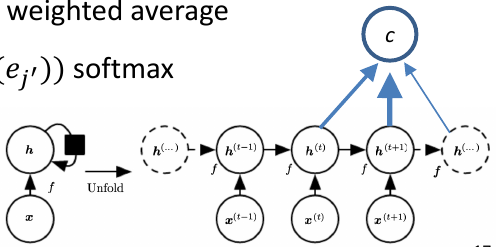

### My Explanation
Attention mechanisms allow a decoder to focus on the appropriate words (as encoded by the encoder) at each time step. For example, we want our decoder to focus more on the word "le football" at each time step if we output the word "soccer". It does this by taking the output of each sequence and performing a weighted sum over the outputs, allowing us to put more focus on certain words in the sequence. For the word "I like soccer", it is appropriate to expect that the verb "like" is very fitting with the noun "soccer". This solves the bottleneck formed when just looking at the output for the last part of the sequence.

## Repeated Attention in Seq2Seq Models
- Consider multiple sequential outputs
	- $s_i = f(s^{(i-1)}, y^{(i-1)}, c_i)$ 
	- $c_i = \sum_j \alpha_{ij}h^{(j)}$ 
	- $\alpha_{ij} = \exp(e_{ij})/\sum_{j'}\exp(e_{ij'})$ 
	- $e_{ij} = a(s^{i-1}, h^{(j)})$ 
- Avoids bottleneck, and uncovers meaningful structure

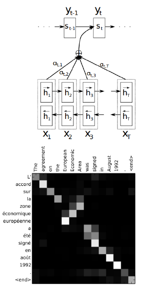

## Attention in Vision
- Can attend to other representations, e.g., images
	- Attention over matrix input
	- Roves during generation of caption

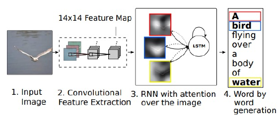

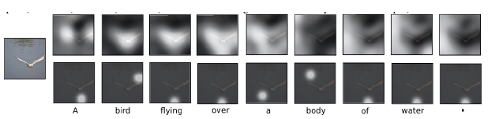

## Self-Attention
- **Transformers** use attention as means of representing sequences directly, instead of RNN
	- Representation of item $i$ is based on attention to the rest of the sequence
	- Use item $i$ as the query in attention against all items $j \not = i$ 
- Compared to RNNs
	- No explicit position information (add to each symbol position index)
	- Cheap: easily done in parallel

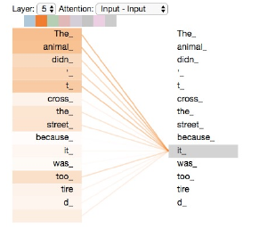

## Transformer

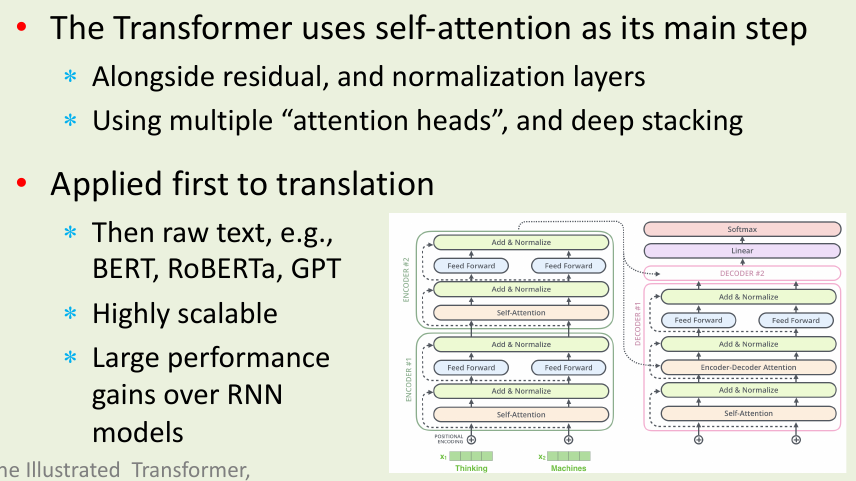

## Exercises

### Exercise 1
Why are _vanishing gradients_ a more pressing concern for _recurrent neural networks (RNNs)_ than for other neural architectures? 
- Because backpropagation through time means that it is backpropagating gradients through each time step, and as the gradients get exponentially small, it essentially loses memory of its relationships with previous time steps.

### Exercise 2
Both convolutional networks (CNNs) and recurrent networks (RNNs) can be applied to sequence inputs. Explain the key benefit that RNNs have over CNNs for this type of input. 

RNNs look at each individual token sequentially and process it as a hidden state, where it is fed to the next layer of the RNN with the subsequent token as a second hidden state until it reaches the end of the data input. This allows the neural net to learn patterns patterns in a dynamic, sequential manner which is important for time series forecasting and natural language processing. CNNs are limited by the fixed-width nature of their filters, which limits its applicability to inputs that vary in length.

### Exercise 2
Explain in words how Attention can be used to allow for neural models to process dynamic sized inputs. 

Attention can add more weight to certain words that hold important information in the sequence, i.e. "football" should be weighted highly after "I like". We do this by taking a weighted average over the outputs for each part of a dynamically sized sequence, which essentially removes the bottleneck of just using the output from the end of the sequence. 

## Exercise 3
For the recurrrent neural network (RNN) that takes a sequence as the input, explain why we need to use backpropogation through time to update weights. 

We require BPTT because we have sequential data, and therefore the typical feedforward network methods of training can't be applied. Each time step in the network has dependencies on the time step before it, and therefore these gradients need to be accumulated and propagated to the start of the network to learn these dependencies.

## Exercise 4
A recurrent neural network is as a type of deep artificial neural network. In what respect is it deep? 

It is deeper than 3 layers, as each time step in a sequence requires its own layer in a neural network.
