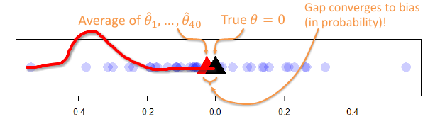
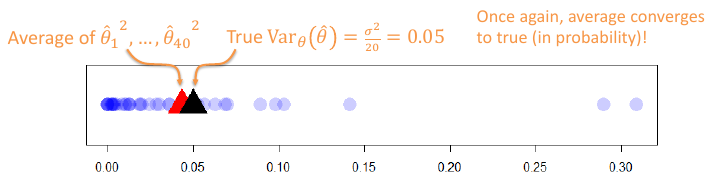

# Frequentist Statistics
Wherein unknown model parameters are treated as having fixed but unknown values.

## About Frequentist Statistics
- Abstract problem
	- Given: $X_1, X_2, ..., X_n$ drawn i.i.d* from some distribution
	- Want to: identify unknown distribution, or a property of it

- Parametric approach ("**parameter estimator**")
	- Class of models $\{p_{\theta}(x): \theta \in \varTheta\}$ indexed by **parameters** $\varTheta$ (could be a real number, or vector, or ...)
	 - **Point estimate** $\hat{\theta}^*$ $(X_1, ..., X_n)$ a function (or **statistic**) of data

  - Examples:
	  - Given $n$ coin flips, determine probability of landing heads
	  - Learning a classifier

Notes \*:
- i.i.d means **independent and identically distributed**
- The hat in $\hat{\theta}$ means that it is an estimate or estimator

What this basically means is that frequentist statistics will not consider prior knowledge to form its prediction, it will will rather form a model and do an arbitrary number of experiments to measure its model against the reality.

Take for example a coin being flipped, the frequentist will say that there is no point saying that there's X% probability that it is heads or tails since at this point in time it doesn't have the results to come to a conclusion of the probability. A frequentist will perform $n$ flips and then conclude that if heads occurred 50% of the time, then the probability of heads or tails occurring is 50%.

Frequentists have some ways of measuring the performance of their estimators, as shown with the following:

## Estimator Bias
Frequentists seek good behaviour, in ideal conditions
- **Bias**: $B_{\theta}(\hat{\theta}) = E_{\theta}[\hat{\theta}(X_1, ..., X_n)] - \theta$
	- What this means is that the bias is simply the difference between the actual value and the estimated value given a certain estimator and its parameters.

**Example**: $\text{for } i=1 ... 40$
- $X_{i, 1}, X_{i, 20} \thicksim p_{\theta} = Normal(\theta = 0, \sigma ^ 2)$
- $\hat{\theta}_i = \frac{1}{20} \sum^{20}_{j=1} X_{i,j}$  the sample mean, plot as a blue dot (as shown below)

What this example means is that a frequentist has essentially tried to predict the true $\theta$ value in the above probability distribution by sampling 20 instances, 40 times and taken the mean of the instances each time and recorded it with a blue dot on the above plot. The black triangle shows the true $\theta$ and the red triangle shows the mean from the estimator. The gap between the two triangle is the **bias** of the estimator.

As you can see by the gap, the bias of this mode is quiet low. If the model's probability distribution was more skewed away from the true mean, as shown below, then we would say that the bias is much higher. This would be considered a **bias** estimator.

## Estimator Variance
Frequentists seek good behaviour, in ideal conditions
- **Variance**: $Var(\hat{\theta}) = E_{\theta}[(\hat{\theta} - E_{\theta} [\hat{\theta}])^2]$

**Example** continued:
- Plot each $(\hat{\theta}_{i} - E_{\theta}[\hat{\theta}_i])^2 = \hat{\theta}_i^2$ as a blue dot as shown below

What the above is essentially asking is how much does the **estimator's** predictions vary from the mean predicted value, which basically means how stable is our estimator at predicting . This should not be mistaken with the variance of the data itself, this variance is focused on the estimator.

The example above follows the same method as the previous example, except this time it is measuring the average variance of the estimator's predictions and plotting it, then comparing the average variance of all the measurements with the variance of the data itself. As can be seen in the figure above, the variance of the estimator is similar to the true variance.
