# Maximum-Margin Classifier: Motivation
_A new twist to binary linear classification_

<iframe width="560" height="315" src="https://www.youtube.com/embed/ny1iZ5A8ilA?si=4i2PV52Toxyn0MZn" title="YouTube video player" frameborder="0" allow="accelerometer; autoplay; clipboard-write; encrypted-media; gyroscope; picture-in-picture; web-share" allowfullscreen></iframe>

## Beginning: Linear SVMs
- In the first part, we will consider a basic setup of SVMs, something called linear **_hard-margin SVM_** 
- Keep in mind: SVMs are more powerful than they initially appear
- For now, we model the data as **linearly separable**, i.e., there exists a hyperplane perfectly separating the classes

## SVM is a Linear Binary Classifier
- Predict class $A$ if $x \geq 0$ predict class $B$ if $s < 0$ where $s = b + \sum^m_{i=1}x_iw_i$ 
- SVM is a <u>linear classifier</u>: $s$ is a linear function of inputs, and the separating boundary is linear

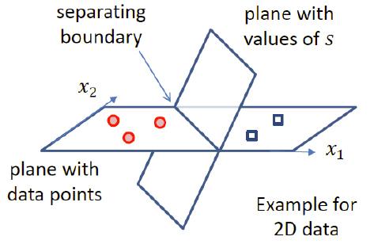

## Choosing Separation Boundary
- An SVM is a linear binary classifier: choosing parameters means choosing a separating boundary (hyperplane)
- In 2D:

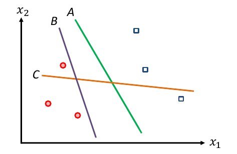

Which boundary would you choose?
- A (Green)
- B (Purple)
- C (Orange)

Answer: A, because it generalises the best.
## Which Boundary Should We Use?
- Provided the dataset is linearly separable, classifiers like logistic regression, Naive Bayes will find boundaries that separable classes perfectly. Many such boundaries exist (infinite!)
- If defining loss as 0-1 mistakes, $A$ and $B$ are equally good.
- But... line $A$ seems more reliable. When new data point arrives, line $B$ is likely to misclassify it

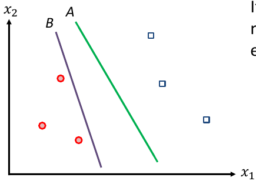

## Aiming for the Safest Boundary
- Intuitively, the most reliable boundary would be the one that is between the classes and as far away from both classes as possible
- SVM objective captures this observation
- SVMs aim to find the separation boundary that **maximises the margin** between the classes

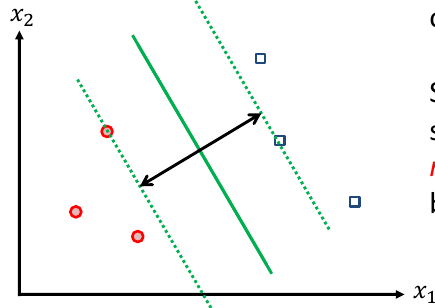

## Maximum-Margin Classifier
- An SVM is a linear binary classifier. SVM training aims to find the separating boundary that maximises margin
- For this reason, SVMs a.k.a **_maximum-margin classifiers_** 
- The training data is fixed, so the margin is defined by the location and orientation of the separating boundary
- Our next step is to formalise our objective by expressing **_margin width_** as a function of parameters (and data)

# Maximum-Margin Classifier: Derivation
_A geometric derivation of the (hard-margin) SVM's objective_

## Margin Width
- While the margin can be thought as the space between two dashed lines, it is more convenient to define **margin width** as the distance between the separating boundary and the nearest data point(s)
- Point(s) on margin boundaries called **_support vectors_** 
- We want to maximise the distance to support vectors

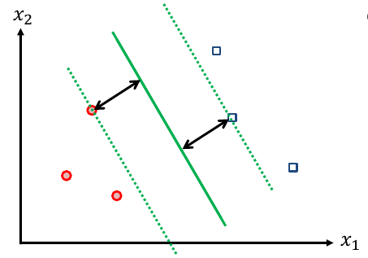

## Distance from Point to Hyperplane
- Consider an arbitrary point $x$ (from either of the classes, and not necessarily the closest one to the boundary), and let $x_p$ denote the **projection** of $x$ onto the separating boundary
- Now, let $r$ be a vector $x_p - x$. Note that $r$ is **perpendicular** to the boundary, and also that $\lVert r \rVert$ is the **required distance** 
- The separation boundary is defined by parameters $w$ and $b$
- From our linear algebra slides, recall that $w$ is a vector normal (perpendicular) to the boundary
- In the figure, $w$ is drawn from an arbitrary starting point on boundary

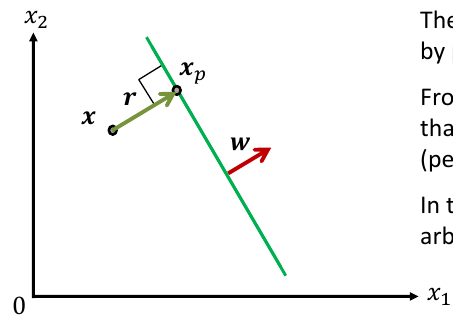

## Distance from Point to Hyperplane
- **Distance** is $\lVert r \rVert = \frac{w'x+b}{\lVert w \rVert}$, or more generally$\lVert r \rVert = \pm \frac{w'x + b}{\lVert w \rVert}$ 

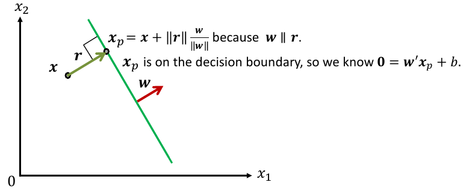

$\frac{\lVert r \rVert}{\lVert w \rVert}w$ is just a factor which equals the same as r, since they are parallel. Therefore, this plus $x$ will take us to $x_p$ 

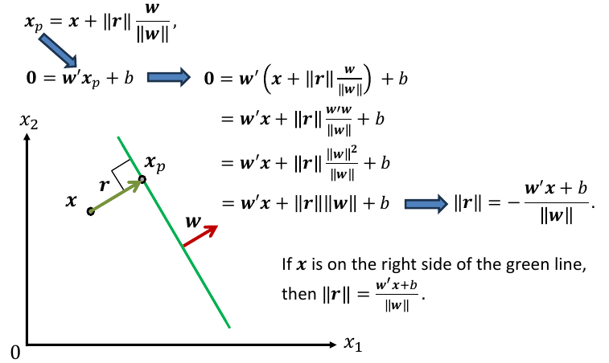

## Encoding the Side Using Labels
- Training data is a collection $\{x_i, y_i\}, i = 1, ... n,$ where each $x_i$ is an $m$-dimensional instance and $y_i$ is the corresponding binary label encoded as  -1, or 1
- Given a **perfect** separation boundary, $y_i$ will encode the side of the boundary each $x_i$ is on
- Thus the distance from the $i$-th point to a perfect boundary can be encoded as

$$
\lVert r_i \rVert = \frac{y_i(w'x_i+b)}{\lVert w \rVert}
$$

What this basically means is that $y_i$ will be either +1 or -1, therefore we can simply multiply $y_i$ by the original $\lVert r_i \rVert$ to classify the $x_i$ instance as either on one side of the decision boundary or on the other side (i.e., the negative side of the line or the positive side of the line). 

## Maximum Margin Objective
- The distance from the $i$-th point to a perfect boundary can be encoded as $\lVert r_i \rVert = \frac{y_i(w'x_i+b)}{\lVert w \rVert}$ 
- The margin width is the distance to the closest point
- Thus SVMs aim to maximise $(\underset{i=1,...n}{\min}\frac{y_i(w'x+b)}{\lVert w \rVert})$ as a function of $w$ and $b$ 
	- Do you see any problems with this objective?

## Non-Unique Representation
- A separating boundary (e.g., a line in 2D) is a set of points that satisfy $w'x + b = 0$ for some given $w$ and $b$
- However, the same set of points will also satisfy $\tilde{w}'x + \tilde{b} = 0$, with $\tilde{w} = \alpha w$ and $\tilde{b} = \alpha b$, where $\alpha > 0$ is arbitrary
- The same boundary, and essentially the same classifier can be expressed with **infinitely** many parameters combinations - that **diverge**!

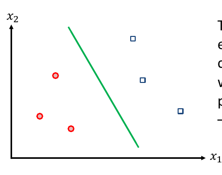

## Constraining the Objective for Uniqueness
- SVMs aim to maximise $(\underset{i=1,...,n}{\min} \frac{y_i(w'x_i + b)}{\lVert w \rVert})$ 
- Introduce (arbitrarily) extra requirement $\frac{y_{i^*}(w'x_{i^*}+b)}{\lVert w \rVert} = \frac{1}{\lVert w \rVert}$ 
	- $i^*$ denotes index of a closest example to boundary
- Instead of maximising margin, can minimise norm or $w$ 
- Ensure classifier makes no errors: constrain $y_i(w'x_i + b) \geq 1$ 

## Hard-Margin SVM Objective
We now have a major result: SVMs aim to find 

$$\underset{w,b}{\text{argmin}}\lVert w \rVert$$

s.t. $y_i(w'x_i+b) \geq 1\text{ for } i = 1, ..., n$ 

Note 1: parameters $b$ is optimised indirectly by influencing constraints
Note 2: all points are enforced to be on or outside the margin
Therefore, this version of SVM is called _hard-margin_ SVM

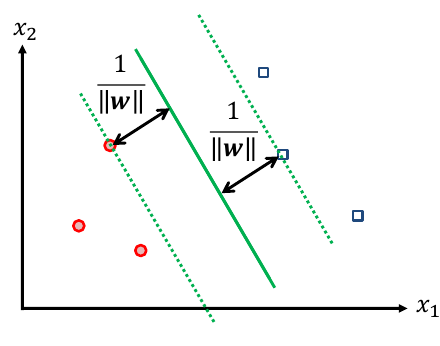

# SVM Objective as Regularised Loss
Relating the resulting objective functions to that of other machine learning methods

## Previously in COMP90051
1. Choose/design a model
2. Choose/design loss function
3. Find parameter values that minimise discrepancy on training data

How do SVMs fit this pattern

## SVM as Regularised ERM

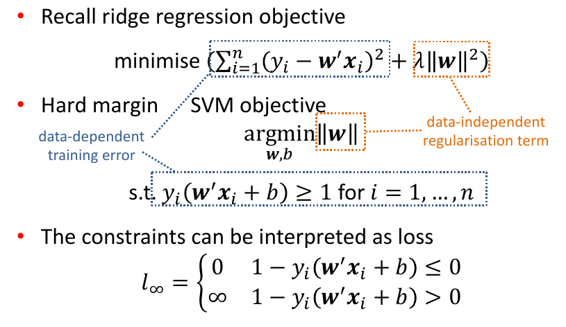
- Remember that $+\text{ve} \times \text{+ve} = \text{+ve} \text{ and } \text{-ve} \times \text{-ve} = \text{+ve}$ 
## Hard Margin SVM Loss
- The constraints can be interpreted as loss

$$
l_{\infty} = \begin{cases} 
   0 &1-y_i(w'x_i + b) \leq 0 \\
   \infty &1-y_i(w'x_i +b) > 0
\end{cases}
$$

- In other words, for each point:
	- If it's on the right side of the boundary and at least $\frac{1}{\lVert w \rVert}$ units away from the boundary, we're OK, the loss is 0
	- If the point is on the wrong side, we immediately give infinite loss thus prohibiting such a solution altogether

# Soft-Margin SVMs
Addressing linear inseparability

## When Data is not Linearly Separable
- Hard-margin loss is too stringent (_hard_!)
- Real data is unlikely to be linearly separable
- If the data is not separable, hard-margin SVMs are in trouble

SVMs offer 3 approaches to address this problem:
1. Still use hard-margin SVM, but _**transform** the data_ 
2. **Relax** the constraints 
3. The combination of 1 and 2

![[Images/linearly_separable.png]]

## Soft-Margin SVM
- Relax constraints to allow points to be **inside the margin** or even on the **wrong side** of the boundary
- However, we **penalise boundaries by the extent of "violation"**
- In the figure, the objective penalty will take into account the orange distances

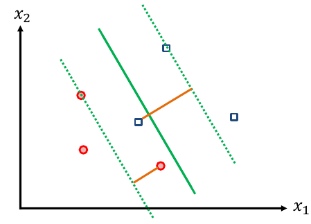

## Hinge Loss: Soft-Margin SVM Loss
- Hard-margin SVM loss

$$
l_{\infty} =  \begin{cases}
   0 & 1-y(w'x+b) \leq 0 \\
   \infty &\text{otherwise}
\end{cases}
$$

- Soft-margin SVM loss (**hinge loss**)

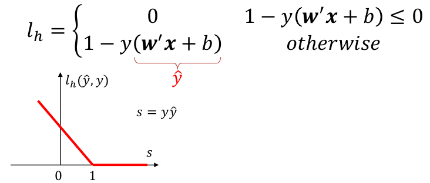

## Soft-Margin SVM Objective
- Soft-margin SVM **objective** 

$$
\underset{w,b}{\text{argmin}}(\sum_{i=1}^nl_h(x_i,y_i,w,b)+ \lambda \lVert w \rVert^2)
$$

- Reminiscent of ridge regression
- Hinge loss $l_h = \max(0,1 - y_i(w'x_i+b))$
- We are going to re-formulate this objective to make it more amenable to analysis

## Re-formulating Soft-Margin Objective
- Introduce **slack variables** as an upper bound on loss

$$
\xi_i \geq l_h = \max(0,1-y_i(w'x_i+b))
$$

or equivalently $\xi_i \geq 1 - y_i(w'x_i +b)$ and $\xi_i \geq 0$ 
- Re-write the soft-margin SVM objective as:

$$
\underset{w,b,\xi}{\text{argmin}}(\frac{1}{2}\lVert w \rVert^2 + C\sum_{i=1}^n\xi_i)
$$

$$s.t. \xi_i \geq 1 - y_i(w'x_i +b) \text{ for } i=1,..., n$$

$$\xi_i \geq 0 \text{ for } i = 1,...,n$$

- The larger you make $C$, the smaller the margin will be. Smaller $C$ will make the margin larger
## Side-by-side: Two Variations of SVM
- Hard-margin SVM objective:

$$
\underset{w,b}{\text{argmin}}\frac{1}{2}\lVert w \rVert^2
$$

$$
s.t. y_i(w'x+b) \geq 1 \text{ for } i = 1, ..., n
$$

- Soft-margin SVM objective:

$$
\underset{w,b,\xi}{\text{argmin}}\Big(\frac{1}{2}\lVert w \rVert^2+C\sum^n_{i=1}\xi_i \Big)
$$

$$
s.t. y_i(w'x_i +b) \geq 1 - \xi_i \text{ for } i = 1, ..., n
$$

$$
\xi_i \geq 0 \text{ for } i = 1, ..., n
$$

- In the second case, the constraints are **relaxed ("softened")** by allowing violations by $\xi_i$. Hence the name "soft margin" 

# Exercises
## Exercise 1
How does SVM handle data that is not linearly separable? List two possible strategies 

1. Soft-margin SVM
2. RBF kernel for SVM