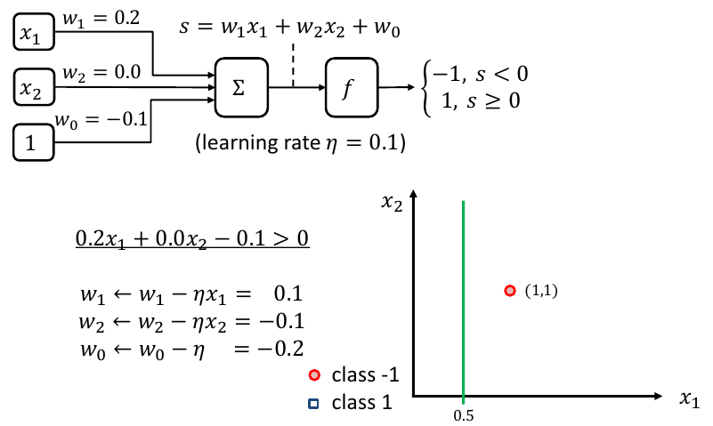
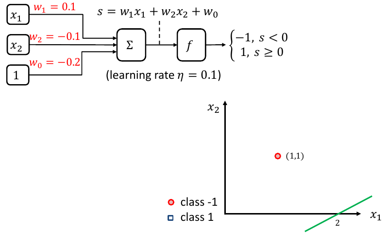

# The Perceptron Model
_A building block for artificial neural networks, yet another linear classifier_

## Biological Inspiration
- Humans perform well at many tasks that matter
- Originally neural networks were an attempt to mimic the human brain

## Artificial Neural Network
- As a _crude approximation_, the human brain can be thought as a mesh of interconnected processing nodes (neurons) that relay electrical signals
- **Artificial neural network** is a network of processing elements
- Each element converts inputs to output
- The output is a function (called **activation function**) of a weighted sum of inputs

## Outline
- In order to use an ANN we need (a) to design network topology and (b) adjust weights to given data
	- In this subject, we will exclusively focus on task (b) for a particular class of networks called **feed forward** networks
- Training an ANN means adjusting **weights** for training data given a pre-defined network **topology**
- First we will turn our attention to an individual network element, before building deeper architectures

## Perceptron Model

- $x_1, x_2$ - inputs
- $w_1, w_2$ - synaptic weights
- $w_0$ - bias weights
- $f$ - activation function

## Perceptron is a Linear Binary Classifier
- Perceptron is a binary classifier:
	- Predict class $A$ if $s \geq 0$ 
	- Predict class $B$ if $s < 0$ where $s = \sum^m_{i=0}x_iw_i$ 
- Perceptron is a <u>linear classifier</u>: $s$ is a linear function of inputs, and the decision boundary is linear

### Exercise
Find the weights of a perceptron capable of perfect classification of the following dataset

What we can do is think of a line that would separate the bottom instance from the rest. Since this point is sitting to the most top-right of the set at $[1,1]$. 

We can adopt the values $w_1=1,w_2=1,w_0=-1.5$ 

$s_1 = w_1 \times x_{11} + w_2 \times x_{12} + w_0$  

$s_1 = 0 \times 1 + 0 \times 1 -1.5$ 

$s_1 = -1.5$

Repeat for each and we get :

$s_2 = -0.5, s_3 = -0.5, s_4 = 0.5$

As we can see, the fourth instance is the only positive instance, therefore we can classify this one differently from the rest. Thus we have successfully made an accurate classifier for this problem.

# Perceptron Training Rule
_Gateway to stochastic gradient descent. Convergence guaranteed by convexity_

## Loss Function for Perceptron
- "Training": finds weights to minimise some loss. Which?
- Our task is binary classification. Encode one class as +1 and the other as -1. So each training example is now $\{x,y\}$, where $y$ is either +1 or -1.
- Recall that, in a perceptron, $s = \sum^m_{i=0} x_iw_i$, and the sign of $s$ determines the predicted class: +1 if $s > 0$, and -1 if $s <0$ 
- Consider a single training example.
	- If $y$ and $s$ have **same sign** then the example is classified correctly.
	- If $y$ and $s$ have **different signs**, the example is misclassified

- The perceptron uses a loss function in which there is no penalty for correctly classified examples, while the penalty (loss) is equal to $s$ for misclassified examples*
- Formally:
	- $L(s,y) = 0$ if both $s,y$ have the same sign
	- $L(s,y) = |s|$ if both $s,y$ have different signs
- This can be re-written as $L(s,y) = \max(0,-sy)$ 

* * This is similar, but not identical to SVM's loss function: the _**hinge loss**_ 

## Stochastic Gradient Descent
- Randomly shuffle/split all training examples in $B$ **batches**
- Choose initial $\theta^{(1)}$ 
- For $i$ from 1 to $T$ - _iterations over the entire dataset are called **epochs**_
	- For $j$ from 1 to $B$
		- Do gradient descent update <u>using data from batch j</u> 

- Advantage of such an approach: computational feasibility for large datasets

## Perceptron Training Algorithm
Choose initial guess $w^{(0)},k=0$ 
For $i$ from 1 to $T$ (epochs)
	For $j$ from 1 to $N$ (training examples)
		Consider example $\{x_j,y_j\}$
		<u>Update</u>*: $w^{(k++)}=w^{(k)}-\eta\nabla L(w^{(k)})$ 

## Perceptron Training Rule
- We have $\frac{\delta L}{\delta w_i} = 0$ when $sy > 0$ 
	- We don't need to do update when an example is correctly classified
- We have $\frac{\delta L}{\delta w_i} = -x_i$ when $y = 1$ and $s < 0$
- We have $\frac{\delta L}{\delta w_i} = x_i$ when $y = -1$ and $s > 0$ 
- $s=\sum^m_{i=0}x_iw_i$ 

## Perceptron Training Algorithm
When classified correctly, weights are unchanged

$$
\text{When misclassified: }w^{(k+1)}+=-\eta(\pm x)  
$$

$$
(\eta > 0 \text{ is called learning rate})
$$

_If $y = 1$, but $s < 0$_:

$w_i \leftarrow w_i +\eta x_i$ 

$w_0 \leftarrow w_0 + \eta$ 

_If $y=-1$, but $s \geq 0$_

$w_i \leftarrow w_i - \eta x_i$ 

$w_0 \leftarrow w_0 - \eta$ 

<u>Convergence Theorem</u>:
If the training data is linearly separable, the algorithm is guaranteed to converge to a solution. That is, there exist a finite $K$ such that $L(w^K) = 0$

## Pros and Cons of Perceptron Learning
- If the data is linearly separable, the perceptron training algorithm will converge to a correct solution
	- There is a formal proof $\leftarrow$ good!
	- It will converge to some solution (separating boundary), one of infinitely many possible $\leftarrow$ bad!
- However, if the data is not is not linearly separable, the training will fail completely than give some approximate solution
	- Ugly :(

## Perceptron Learning Example
 **Basic setup**

**Start with random weights**

**Consider training example 1**

**Update weights**

**Consider training example 2**

**Update weights**

**Further examples**

# Kernel Perceptron
_Another example of kernelisable learning algorithm (like the SVM)_

## Perceptron Training Rule: Recap
When classified correctly, weights are unchanged

$$
\text{When misclassified: }w^{(k+1)}+=-\eta(\pm x)  
$$

$$
(\eta > 0 \text{ is called learning rate})
$$

_If $y = 1$, but $s < 0$_:

$w_i \leftarrow w_i +\eta x_i$ 

$w_0 \leftarrow w_0 + \eta$ 

_If $y=-1$, but $s \geq 0$_

$w_i \leftarrow w_i - \eta x_i$ 

$w_0 \leftarrow w_0 - \eta$ 

Suppose weights are initially set to 0
First update: $w = \eta y_{i_1}x_{i_1}$ 
Second update: $w= \eta y_{i_1}x_{i_1}+\eta y_{i_2}x_{i_2}$ 
Third update: $w = \eta y_{i_1}x_{i_1}+\eta y_{i_2}x_{i_2}+\eta y_{i_3}x_{i_3}$ 
etc.

## Accumulating Updates: Data Enters via Dot Products
- Weights always take the form $w=\sum^n_{i=1}\alpha_i y_i x_i$, where $\alpha$ is some coefficients
- Perceptron weights always **linear comb.** of data!
- Recall that prediction for a new point $x$ is based on sign of $w_0+w'x$ 
- Substituting $w$ we get $w_0 + \sum^n_{i=1}\alpha_i y_i x_i'x$ 
- The dot product $x_i'x$ can be **replaced with a kernel** 

## Kernelised Perceptron Training Rule
Choose initial guess $w^{(0)},k=0$ 
Set $\alpha = 0$ 
For $t$ from 1 to $T$ (epochs)
	For each training example $\{x_i,y_i\}$ 
		Predict based on $w_0 + \sum^n_{j=1}\alpha_j y_j \textcolor{red}{x_i'x_j}$ 
		If misclassified, <u>update</u> each $\alpha_j \leftarrow \alpha_j + \eta y_j$ 

However for a kernelised method, we can transform the $x_i'x_j$ into a kernel matrix $k_{ij}$ like so:

Choose initial guess $w^{(0)},k=0$ 
Set $\alpha = 0$ 
For $t$ from 1 to $T$ (epochs)
	For each training example $\{x_i,y_i\}$ 
		Predict based on $w_0 + \sum^n_{j=1}\alpha_j y_j \textcolor{red}{K(x_i,x_j)}$ 
		If misclassified, <u>update</u> each $\alpha_j \leftarrow \alpha_j + \eta y_j$ 