# Training DNNs
_Techniques specific to non-convex objectives, largely based on gradient descent_

## How to Train Your Network?
- You know the drill: Define the loss function and find parameters that minimise the loss on training data
- In the following, we are going to use **stochastic gradient descent** with a **batch size** of one. That is, we will process training examples one by one

## Example: Univariate Regression
- Consider regression
- Moreover, we'll use identity output activation function

$$
z = h(s) = s = \sum^p_{j=0}u_jw_j
$$

- This will simplify description of backpropagation. In other settings, the training procedure is similar.

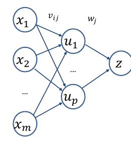

## Loss Function for NNet Training
- Need **loss** between training example $\{x,y\}$ & prediction $\hat{f}(x, \theta)=z$, where $\theta$ is parameter vector of $v_{ij}$ and $w_j$
- As regression, can use **squared error**

$$
L = \frac{1}{2}(\hat{f}(x,\theta)-y)^2=\frac{1}{2}(z-y)^2
$$

(the constant is used for mathematical convenience, see later)
- **Decision-theoretic** training: minimise $L$ w.r.t. $\theta$
	- Fortunately $L(\theta)$ is differentiable
	- Unfortunately no analytic solution in general

## Stochastic Gradient Descent for NNet
Choose initial guess $\theta^{(0)}, k=0$ 
	Here $\theta$ is a set of all weights form all layers
For $i$ from 1 to $T$ (**epochs**)
	For $j$ from 1 to $N$ (training examples - could **shuffle**)
		Consider example $\{x_j,y_j\}$
		<u>Update</u>: $\theta^{(k+1)}=\theta^{(k)}-\eta\nabla L(\theta^{(k)}); k \leftarrow k+1$ 

$$
L = \frac{1}{2}(z_j - y_j)^2
$$

Need to compute partial derivatives $\frac{\delta L}{\delta v_{ij}}$ and $\frac{\delta L}{\delta w_j}$ 

## Recap: Gradient Descent vs SGD
1. Choose $\theta^{(0)}$ and some $T$
2. For $i$ from 0 to $T-1$
	1. $\theta^{(i+1)} = \theta^{(i)} - \eta\nabla L(\theta^{(i)})$ 
3. Return $\hat{\theta} \approx \theta^{(T)}$ 

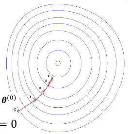

**Stochastic G.D.**
1. Choose $\theta^{(0)}$ and some $T$, $k=0$
2. For $i$ from 1 to $T$
	1. For $j$ from 1 to $N$ (in random order)
		1.  $θ^{(k+1)} = θ(k) − η∇L(y_j , x _j ; θ^ {(k)})$
		2. $k++$
3. Return $\hat{\theta} \approx \theta^{k}$ 

### My Explanation
What the above is saying is that gradient descent uses the whole dataset for weight updates, while stochastic gradient descent will either go by batch or by sample to update weights, choosing samples randomly.

## Mini-Batch SGD
- SGD works on single instances
	- High variance in gradients
	- Many, quick, updates
- GD works on whole datasets
	- Stable update, but slow
	- Computationally expensive
- Compromise: **mini-batch** (_often just called "SGD"_)
	- Process batches of size $1 < b < N$, e.g., $b=100$
	- Balances computation and stability
	- Parallelise over cluster of GPUs (size batch for GPU)

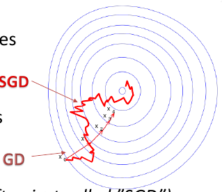

## (non-)Convex Objective Functions
- Recall linear regression, convex '**Bowl shaped**' objective
	- Gradient descent finds a **global** optimum

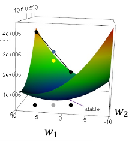

- In contrast, most DNN objectives are **not convex**
	- Gradient methods get trapped in **local optima** or **saddle points**

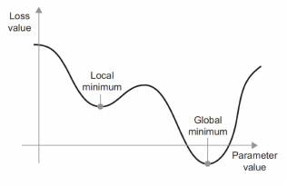

## Importance of Learning Rate
- Choice of $\eta$ has big effect on quality of final parameters
- Each SGD step:
	- $\theta^{(i)} = \theta^{(i-1)}-\eta\nabla L (\theta^{(i-1)})$ 
- Choosing $\eta$:
	- Large $\eta$ fluctuate around optima, even diverge
	- Small $\eta$ barely moves, stuck at local optima

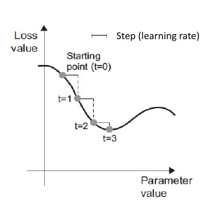

## Momentum as a Solution
- Consider a ball with some mass rolling down the objective surface
	- **Velocity** increases as it rolls downwards
	- Momentum can carry it past local optima
- Mathematically, SGD update becomes
	- $\theta^{(t+1)} = \theta^{(t)} - v^{(t)}$ 
	- $v^{(t)} = \alpha v^{(t-1)}+\eta\nabla L (\theta^{(t)})$ 
	- $\alpha$ decays the velocity, e.g., 0.9
- Less oscillation, more robust

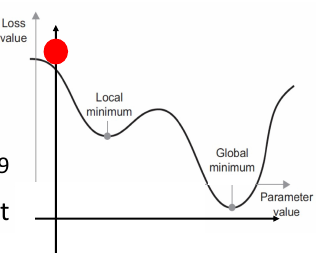

## Adagrad: Adaptive Learning Rates
- Why just one learning rate applied to _all_ params?
	- Some features (parameters) are used more frequently than others $\rightarrow$ smaller updates for common features vs. rare
- **Adagrad** tracks the sum of squared gradient per-parameter, i.e., for parameter $i$
	- $g_i^{(t)}=g_i^{(t-1)}+\nabla L (\theta^{(t)})^2_i$ 
	- $\theta_i^{(t+1)}=\theta_i^{(t)}-\frac{\eta}{g_i^{(t)}+\epsilon}\nabla L (\theta^{(t)})_i$ 
		- Typically $\epsilon=10^{-8}$ $n=0.01$ 
- No need to tune learning rate! But can be conservative

### My Explanation
Adagrad basically doesn't go down the steepest point which may be a longer path to the optimal value, rather what it does is find a shorter path by scaling down the gradient vector with the steepest dimensions.

It employs an adaptive learning rate, meaning that the learning rate decays more for steeper gradient dimensions than for more gradual ones. This is important as to reach the global optimum more quickly than following the steepest dimensions, which often takes longer to reach the optimal.

However, one downfall of AdaGrad is that it accumulates the gradients over the entire training process, which means that it can often never reach the global optimum because it slows down too early. RMSProp on the other hand only considers the most recent gradients, solving this problem

## Adam
- Combining elements of momentum and adaptive learning rates
	1. $m^{(t)}=\beta_1 m^{(t-1)}+(1-\beta_1)\nabla L (\theta^{(t)})$ 
	2. $v^{(t)}= \beta_2 v^{(t-1)}+(1-\beta_2)\nabla L (\theta^{(t)})^2$
	3. $\hat{s} = \frac{v^{(t)}}{1-\beta_2}$
	4. $\hat{m} = \frac{m}{1-\beta_1^t}$ 
	5. $\theta^{(t+1)}=\theta^{(t)}-\frac{\hat{m}\eta}{\sqrt{\hat{s}}+\epsilon}$  
		$\beta_1 = 0.9, \beta_2 = 0.999, \epsilon = 10^{-8}$ 
		2 and 5 are element-wise operations
 - Good work-horse method, current technique of choice for deep learning

## Zoo of Optimisation Algorithms
- Suite of batch-style algorithms, e.g., BFGS, L-BFGS, Conjugate Gradient, ...
- And SGD style:
	- Nesterov acc. grad.
	- Adadelta
	- AdaMax
	- RMSprop
	- AMSprop
	- Nadam
	- Adam
	- ...
 
 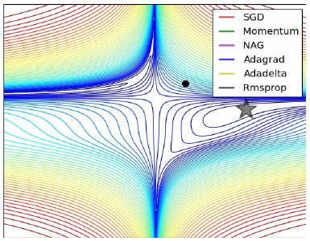
 
- Lots of choice, and rapidly changing as deep learning matures

# Regularising Deep Nets
_Best practices in preventing overfitting, a big problem for such high capacity and complex models._

## Some Further Notes on DNN Training
- DNNs are flexible (recall universal approximation theorem), but the flipside is over-parameterisation, hence tendency to **overfitting**
- Starting weights usually randomly distributed about zero
- Implicit regularisation: **early stopping**
	- With some activation functions, this **shrinks** the DNN towards a linear model
 
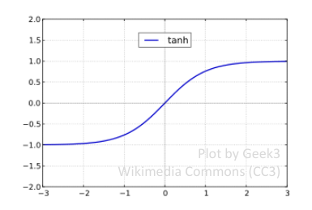

## Explicit Regularisation
- Alternatively, an **explicit regularisation** can be used, much like in ridge regression
- Instead of minimising the loss $L$, **minimise regularised function** $L + \lambda(\sum^m_{i=0}\sum^p_{j=1}v^2_{ij}+\sum^p_{j=0}w_j^2)$ 
- This will simply add $2\lambda v_{ij}$ and $2\lambda w_j$ terms to the partial derivatives (aka **weight decay**)
- With some activation functions (e.g. tanh / sigmoid) this also **shrinks** the DNN towards a linear function

## Dropout
- Randomly mask fraction of units during training
	- Different masking each presentation
	- Promotes **redundancy** in network hidden representation (a form of regularisation)
	- A form of **ensemble** of exponential space
	- No masking at testing (requires **weight adjustment**)
- Results in smaller weights, and less overfitting
- Used in most SOTA deep learning systems

# Autoencoders
_A DNN training setup that can be used for unsupervised learning, initialisation, or just efficient coding_

## Autoencoding Idea
- Supervised learning:
	- Univariate regression: predict $y$ from $x$
	- Multivariate regression: predict $y$ from $x$
- Unsupervised learning: explore data $x_1, ..., x_n$
	- No response variable
- For each $x_i$ set $y_i \equiv x_i$
- Train a NNet to predict $y_i$ from $x_i$ i.e., model $p(x|x)$
- Pointless?

## Autoencoder Topology
- Given data without labels $x_1, ..., x_n$, set $y_i \equiv x_i$ and train a DNN to predict $z(x_i) \approx x_i$ 
- Set **bottleneck** layer $u$ in middle "thinner" than input, and/or
	- Corrupt input $x$ with noise
	- Regularise s.t. $u$ is sparse
	- Regularise to contract inputs

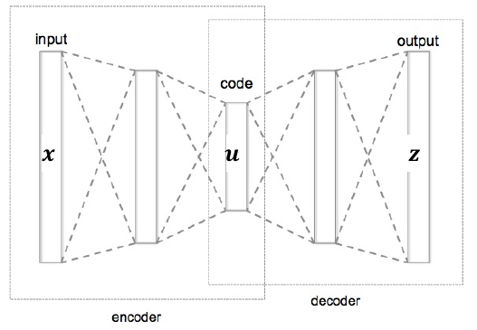

## Introducing the Bottleneck
- Suppose you managed to train a network that gives a good **restoration** of the original signal $z(x_i) \approx x_i$
- This means that the data structure can be effectively described (**encoded**) by a lower dimensional representational $u$

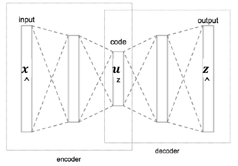

## Under-/Over-Completeness
- Manner of bottleneck gives rise to:
	- **Undercomplete**: model with thinner bottleneck than input forced to generalise
	- **Overcomplete**: wider bottleneck than input, can just "copy" directly to output
- Even undercomplete models can learn trivial codes, given complex non-linear encoder and decoder
- Various methods to ensure learning

## Dimensionality Reduction
- Autoencoders can be used for
	- **Compression**
	- **Dimensionality reduction**
	- **Unsupervised pre-training**
	- Finding **latent feature space**
	... via a non-linear transformation 
- Related to **principle component analysis** (PCA)

## Principal Component Analysis
- Principal component analysis (PCA) is a popular method for **dimensionality reduction** and data analysis in general
- Given a dataset $x_1, ..., x_n, x_i \in R^m$, PCA aims to find a new coordinate system that most of the **variance is concentrated** along the first coordinate, then most of the remaining variance along the second (**orthogonal**) coordinate, etc.
- Dimensionality reduction is then based on **discarding coordinates** except the first $l < m$. Coordinates = axes of data = **principal components**

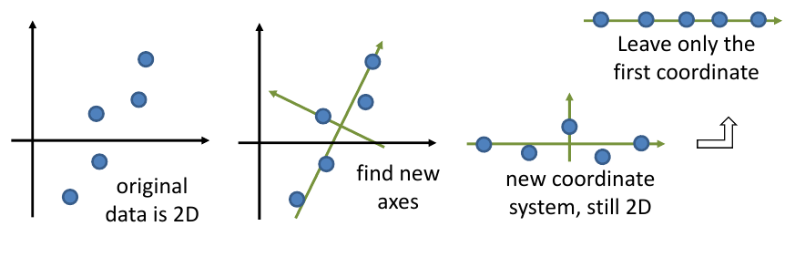

## PCA: Solving the Optimisation
- PCA aims to find **principal component** $p_1$ that maximises variance of data projected onto the PC, $p_1'\sum_X p_1$
	- Subject to $\lVert p_1 \rVert = p_1'p_1 = 1$ 
	- Have to first subtract the centre of the data from the data
 
	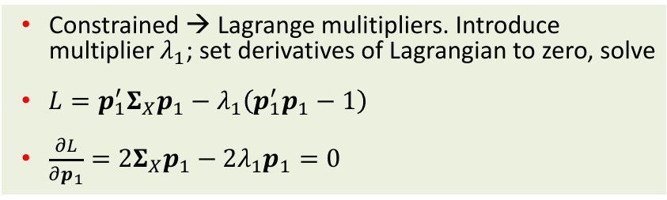

- $\sum_Xp_1 = \lambda_1 p_1$
- Precisely defines $p_1$ as an **eigenvector** of covariance $\sum_X$ with $\lambda_1$ being the corresponding **eigenvalue**

## PCA vs Autoencoding
- If you use linear activation functions and only one hidden layer, then the setup becomes almost that of **Principal Component Analysis** (PCA)
	- PCA finds orthogonal basis where axes are aligned to capture maximum data variation
	- NNet might find a fidderent solution, doesn't use eigenvalues (directly)

## Uses of Autoencoders
- Data visualisation & clustering
	- Unsupervised first step towards understanding properties of the data
- As a feature representation
	- Allowing the use of off-the-shelf ML methods, applied to much smaller and informative representations of input
- Pre-training of deep models
	- Warm-starting training by initialising model weights with encoder parameters
	- In some fields of vision, mostly replaced with supervised pre-training on very large datasets

### My Explanation
Autoencoders simply learn to copy the input to the output, however the bottleneck in the middle of the network forces the network to compress the input into a lower dimensional latent representation of the input given the constraint of having less dimensions to represent the data.

# Exercises:
## Exercise 1
Consider training a _deep neural network_ with _tanh activation functions_ using _backpropagatation_. Can this lead to the _vanishing gradient problem_? Why? 
-  Yes. The vanishing gradients problem is when the gradients of a loss function given the model's weights becomes so small that it propagates backwards through the network during training, greatly hampering the training time for convergence. Given that the tanh function is an S-shape curve, with most of the plot being approaching 1 or -1 on the y-axis, the activation function being stuck at a really small gradient which is so small that it will propagate backwards through the network during training.

## Exercise 2
How does the value of the learning rate, $\eta$ in _stochastic gradient descent_ affect the progress of training? 
- The learning rate affects the size that weights are adjusted during training. As shown by $\theta^{(i + 1)} = \theta^i + \eta \times \nabla L(\theta^i)$ 
- The size of the learning rate greatly affects the performance of the model during training:
	- Too large and the model's weights will adjust too greatly, and ultimately never converge to the true optimum point.
	- Too small and the model's weights will adjust too slowly, taking too long to reach to true optimum point, or may never converge at all.

## Exercise 3
The Adagrad optimiser is a variant of stochastic gradient descent with a dynamic learning rate. Explain how the dynamic learning rate operates, and why this is important during optimisation of machine learning models. 

Dynamic learning rates operate by adjusting the learning rate differently for different gradient dimensions in terms of their steepness. Steeper dimensions decay more than the more gradual dimensions. This is to steer the model to the global optimum faster than learning rates that follow the steepest gradient dimensions, which often takes longer to converge.

## Exercise 4
(b) Compared with the Root Mean Square Propagation (RMSProp) algorithm, what’s the main draw-back of the Adaptive Gradient (AdaGrad) algorithm? 

Because the weights accumulate from the start of training for AdaGrad, it often slows down too early to reach the global optimum. RMSProp on the other hand only accumulates the most recent gradients and therefore manages this fallback of AdaGrad.

## Exercise 5
What strategy makes the Variational Autoencoder (VAE) capable of applying gradient descent through the samples of latent representation $z$ to the encoder? 

By training the autoencoder to replicate the input using gradient descent, but by creating a bottleneck in the middle of the network, we are constraining the model to learn a lower-dimension latent representation of the input in this bottleneck.

## Exercise 6
Explain why the use of momentum in an optimiser can help avoid getting trapped at local optima or saddle points, with respect to the training of machine learning models with non-convex training objectives. 

It allows the model to accumulate velocity in gradients in dimensions it gained during training to overcome local minima and reach the global optimum.

## Exercise 7
With respect to learning an autoencoder, explain a failure case that can arise from the use of complex non-linear encoder and decoder components. 

May be overcomplete, where it is just learning to copy the input data to the output.

## Exercise 8
Describe something that can go wrong specifically with _gradient descent_ while training a learner. Describe one approach to mitigating the problem. 

Getting stuck in local minima, this can be mitigated with momentum

## Exercise 9
Explain why training examples are weighted within the _AdaBoost_ algorithm. 

To decay the dimensional gradients that are steeper so as to approach the global optimum faster than following the steepest gradients, which often takes longer to reach the global optimum

## Exercise 10
Suppose you are selecting parameter vector $\theta \in \mathbb{R}^d$ to minimise loss over a training set, with the loss from predicting with $\theta$ on the $i$th example written as $\mathbb{L}(\theta, x_i,y_i)$, for $i \in \{1,...,n\}$ 

(a) Write down the gradient descent algorithm for accomplishing this task. Explain any additional notation/variables you introduce. 

1. Choose $\theta^{(0)}$ and some $T$
2. For $i$ from 0 to $T-1$
	1. $\theta^{(i+1)} = \theta^{(i)} - \eta\nabla L(\theta^{(i)})$ 
3. Return $\hat{\theta} \approx \theta^{(T)}$ 

(b) Explain how stochastic gradient descent would differ in approximating this problem. 

Stochastic gradient descent would not use the whole dataset, rather use individual samples or batches to update the weights. It would pick samples randomly for this.

## Exercise 11
Melbourne airport security have the responsibility of screening incoming international visitors flying into Melbourne from overseas. They wish to develop a classifier that will predict the probability that a visitor currently has a serious infection that could be transmitted to others. This prediction will be available in real time to airport security as a visitor is having their passport checked. If the visitor is classified as having high probability of possessing a serious infection, they will be invited for a further health screening. Otherwise they will be allowed to enter the country. Airport security have access to training data that records the historical health outcomes (class labels) for 5 million previous international visitors to Melbourne (i.e. whether or not they had a serious infection on entry). This training data also records the following information about passengers:
- Personal details from their passport.
- Visa application information (declared reason for travel, health status, health history, ...).
- Body temperature (captured via hidden thermal cameras at Melbourne airport).
- The date and time of arrival
- Previous travel history (all their international flight details for previous 3 years).
- Names of other passengers who entered Australia on the same flight.

You with developing an accurate classifier for this task. You have access to the training data described above and intend to use a deep neural network (DNN) as the classification algorithm. Based on this scenario, answer the following questions:

(a) What features will you use and not use, and how will you construct features from the data? State any assumptions made. 

I would include all information except for the date and time of arrival, since modelling the time sequences will make the modelling too complex, and in this instance will not provide as much meaningful information as other features
for accuracy. Personal history as these will not have much correlation in a training dataset

(b) What parameters need to be tuned when using a DNN model? Describe the steps needed for tuning these parameters, whilst avoiding overfitting. 

The last layer can be tuned, or the last two layers. To ensure that overfitting does not occur, we will use early stopping with a patience of $X$ epochs to constrain the model from overfitting. For each batch of sample data, we will calculate the loss of the predicted values and the ground truths to reweight the parameters. To ensure we overcome being stuck in a local minima and make sure that we reach the global optimum fast, we will use Adam optimizer. For number of epochs we will pick something high like 400, as it will stop before it overfits. For batch size, we will use 32 to ensure a smooth training of weights and not experience memory errors with our GPUs.

(c) How can you obtain an unbiased assessment of the accuracy of your DNN model? Describe the steps needed. 
We will compare recall, precision and F1 score for a held out validation set, ratio of about 85:15. This will give us an accurate measure for accuracy.

## Exercise 12
To balance economic recovery with public health safety, the City of Melbourne has decided to have an automatic system to count the number of _customers in Melbourne restaurants_. They have installed surveillance cameras in some cafes and now they wish to have an algorithm to count the number of people who are in these businesses, measure when they are using the facilities, and to categorise users by age, gender and other demographic variables. The City also has access to other real-time data sources, such as the parking meters, and traffic detectors on nearby main roads.

(a) Based on what you learned in this subject, which techniques would you suggest that could be useful in the implementation of this system and why? 

Convolutional neural networks that use a binary cross entropy as loss for one classifying head. This classifying head will classify if a person is present in the image. Another head to determine the coordinates of the people in the images, which will use linear regression to train the model to fit the box around the person. Within the box, we will extract an embedding using another CNN trained on extracting features such as race, gender, age and other demographic variables. We can then use a Gaussian mixture model to cluster these embeddings together where we set a certain number of cluster centers.

(b) Describe the steps in the design and implementation of your method focusing on:

(i) What features you would use? How you construct them from the data? 

Still images, where each RBG array for a pixel will be treated as features. Embeddings of these images will also be used as features

(ii) What are the different sections in your system? 

One section is for classifying if a person is in the image, another is for box bounding, another is for extracting embeddings, and another is for clustering the embeddings

(iii) Any model hyperparameters that you need to tune in your system development. 

Learning rate, momentum, patience for early stopping, dropout rate, kernel sizes, number of clusters, output size of embedding, number of kernels, stride length

(iv) What challenges you expect to face and how you would overcome them 

Exploding/vanishing gradients problem - can add batch normalisation or add output from previous layers for training to allow model to remember previous knowlege.

Overfitting - Can get more data, use more regularisation, use more dropout, reduce the patience for early stopping, data augmentation